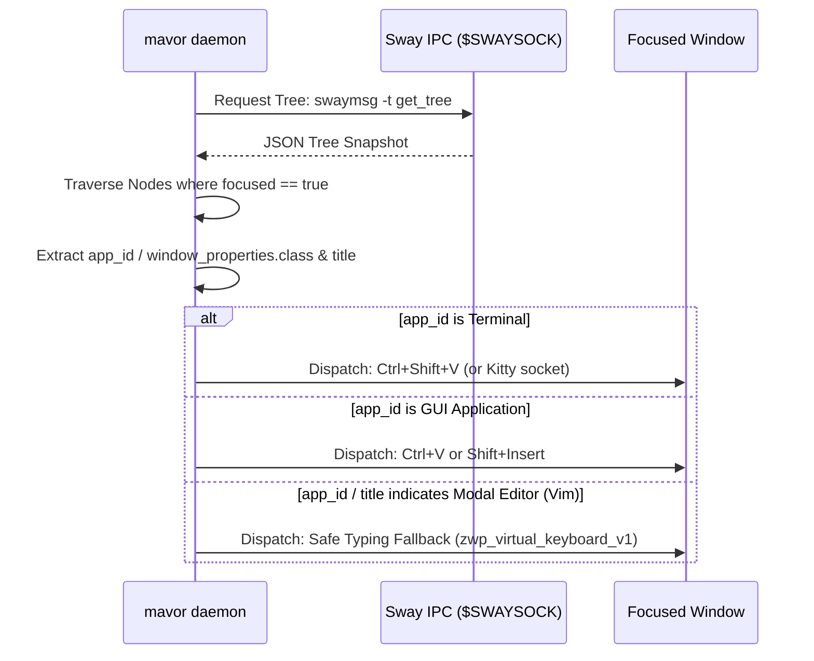
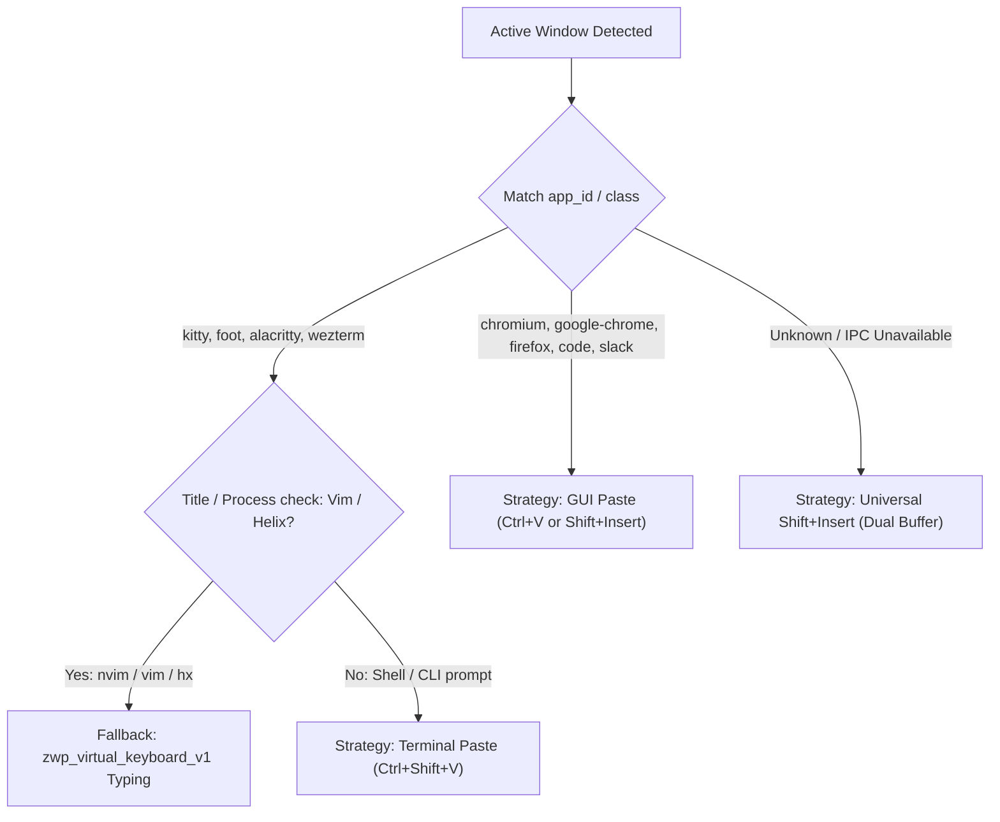

# Active Application Detection & Contextual Output Routing

**Status:** IN-REVIEW (2026-09-18). Design specification for application-aware output routing on Sway/wlroots Wayland compositors. Awaiting implementation.

**The short version.** Dictated text cannot be dispatched identically to all desktop windows. Terminal emulators require `Ctrl+Shift+V` (or Bracketed Paste) to avoid per-keystroke TUI redraw loops; graphical applications require `Ctrl+V` or `Shift+Insert`; and modal text editors (such as terminal Neovim, Vim, or Helix) will execute destructive normal-mode commands if a synthetic paste or raw typing sequence arrives while the editor is not in insert mode. While universal defaults (`Shift+Insert` paired with dual-buffer clipboard population) resolve simple cases, full desktop harmony requires `mavor` to **detect the focused application** and select the optimal dispatch strategy dynamically. This document specifies active-window inspection via Sway IPC (`swaymsg -t get_tree`), defines an application routing table, establishes safety fallbacks for modal editors, and outlines user-configurable application overrides in `config.toml`.

**Reads with:** [`paste-based-output-dispatch.md`](./paste-based-output-dispatch.md) (paste driver and Wayland clipboard semantics), [`active-window-context-and-vocabulary-prompting.md`](./active-window-context-and-vocabulary-prompting.md) (Sway IPC tree traversal for vocabulary biasing), [`how-mavor-works.md`](../reference/how-mavor-works.md) (daemon architecture).

---

## 1. The Need for Application-Aware Routing

No single output mechanism satisfies every Wayland window:

| Target Application Type | Examples | Preferred Mechanism | Failure Mode of the Wrong Mechanism |
|---|---|---|---|
| **Terminal Emulators** | `kitty`, `foot`, `alacritty`, `wezterm` | `Ctrl+Shift+V` (or `Shift+Insert` if dual-buffered) | Virtual keystrokes trigger $>1,000$ TUI redraws ($10–16\text{ s}$ lag); `Ctrl+V` sends raw control characters (`\x16`). |
| **GUI Desktop Apps** | `chromium`, `code`, `firefox`, `slack` | `Ctrl+V` or `Shift+Insert` | `Ctrl+Shift+V` is either unmapped or invokes "paste without formatting" or dev tools. |
| **Modal Terminal Editors** | `nvim`, `vim`, `helix` | Fallback to Virtual Typing (`output.Native`) or Escape-to-Insert | Blind paste chords in Normal mode trigger navigation, deletion, or record macros instead of inserting text. |

Relying on a static global chord forces users into manual compromise. Dynamic detection allows `mavor` to tailor its output driver to the focused window in under a millisecond.

---

## 2. Sway IPC Tree Inspection

`mavor` runs on wlroots-based Wayland compositors (Sway, Hyprland, river, Wayfire). Under Sway, the compositor maintains a Unix domain socket at `$SWAYSOCK`.



### Tree Traversal & Identifier Extraction
Querying `swaymsg -t get_tree` returns the full compositor container hierarchy. Traversal recursively searches for the container where `focused == true`:

1. **Native Wayland Clients:**
   The container exposes the **`app_id`** string (e.g. `"kitty"`, `"foot"`, `"firefox"`, `"chromium"`, `"code"`).
2. **XWayland Clients:**
   If running under XWayland, `app_id` is null; the container exposes **`window_properties.class`** and **`window_properties.instance`**.
3. **Window Title:**
   The `name` field contains the window title (e.g. `"nvim: ~/code/mavor/main.go"` or `"fish /home/matt"`).

### Performance Considerations
- A local IPC round-trip over `$SWAYSOCK` takes $<0.8\text{ ms}$.
- Tree traversal over 10–50 windows in Go takes $<50\ \mu\text{s}$.
- The detection check executes immediately after transcription finishes and adds zero perceptible latency to output dispatch.

---

## 3. Application Routing Matrix

The daemon maps detected window properties against a routing table:



### 1. Terminal Category
- **Matching `app_id`:** `kitty`, `foot`, `alacritty`, `wezterm`, `gnome-terminal`, `rio`.
- **Strategy:**
  - Copy transcript to `CLIPBOARD` via `wl-copy --paste-once`.
  - Inject **`Ctrl+Shift+V`**.
  - For Kitty with socket access, optionally send directly via `kitty @ send-text`.

### 2. GUI Application Category
- **Matching `app_id`:** `code`, `chromium`, `google-chrome`, `firefox`, `brave-browser`, `slack`, `discord`.
- **Strategy:**
  - Copy transcript to `CLIPBOARD` via `wl-copy --paste-once`.
  - Inject **`Ctrl+V`**.

### 3. Modal Editor Safety Fallback
When a developer is editing in Neovim, Emacs, or Helix inside a terminal, `app_id` reports `"kitty"`, but the process inside the PTY is modal.
- If the window title starts with or contains `nvim`, `vim`, `helix`, or `hx`:
  `mavor` falls back to **`output.Native` (`zwp_virtual_keyboard_v1`)** to prevent accidental command-mode keystroke execution.

### 4. IPC Failure / Unrecognized Window
If `$SWAYSOCK` is unavailable or the window is unrecognized:
- Fall back to universal **`Shift+Insert`** with dual-buffer copy ([`paste-based-output-dispatch.md`](./paste-based-output-dispatch.md#4-universal-paste-architecture-dual-buffer-copy--shiftinsert)).

---

## 4. Proposed Configuration Schema

Users can override or extend application routing in `~/.config/mavor/config.toml`:

```toml
[output]
driver = "auto" # "auto" (detect app) | "paste" | "typing"
default_paste_chord = "shift+insert"

# Optional per-application rules
[output.app_rules]
"kitty" = { method = "paste", chord = "ctrl+shift+v" }
"foot" = { method = "paste", chord = "ctrl+shift+v" }
"code" = { method = "paste", chord = "ctrl+v" }
"nvim*" = { method = "typing" }
```

---

## 5. Open Questions & Decision Ledger

### Open Questions

1. 💬 **OQ-ROUT1: Title inspection reliability for modal editors.** Window titles can be customized by shells or Neovim plugins. Should `mavor` rely on window title matching for modal editors, or should modal editors be configured explicitly by the user?

   <!-- vantage: oq id=OQ-ROUT1 leaning="Title matching as a heuristic with explicit config overrides — covers the 90% case out of the box." -->

   _Leaning:_ Title matching as a heuristic with explicit config overrides — covers the 90% case out of the box.

   **Answer:**
   > _(empty — fill in when decided)_

2. 💬 **OQ-ROUT2: Hyprland IPC parity.** While Sway uses `$SWAYSOCK`, Hyprland uses `$HYPRLAND_INSTANCE_SIGNATURE`. Should active window routing support Hyprland IPC in the initial release?

   <!-- vantage: oq id=OQ-ROUT2 leaning="Sway first, Hyprland in a follow-up — Sway is mavor's primary tier-1 target." -->

   _Leaning:_ Sway first, Hyprland in a follow-up — Sway is `mavor`'s primary tier-1 target.

   **Answer:**
   > _(empty — fill in when decided)_
