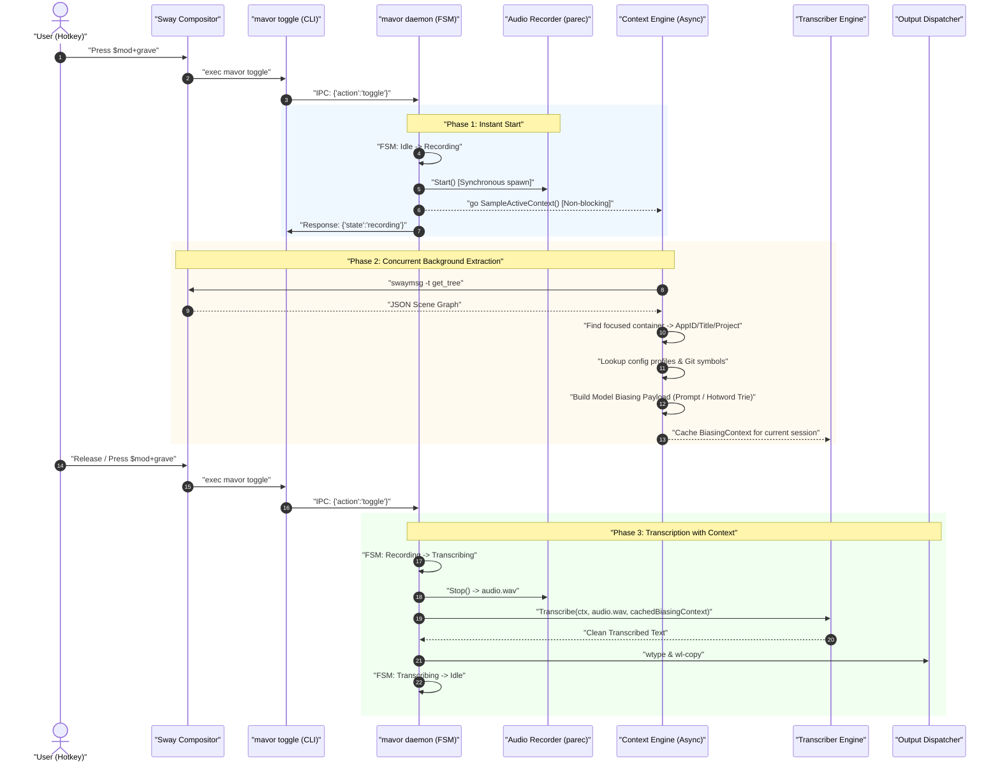

# Active Window Context & Vocabulary Prompting Across ASR Models

**Status:** IN-REVIEW (2026-08-16). Design document for application-aware vocabulary biasing and compositor context extraction.

**The short version.** General-purpose automatic speech recognition (ASR) models frequently misrecognize domain-specific technical terms, function identifiers, CLI flags, and project jargon when used for desktop voice dictation. This document specifies an application-aware context extraction engine for `mavor` on Linux Wayland (Sway/wlroots) using asynchronous compositor IPC (`swaymsg -t get_tree`) combined with a comparative architectural evaluation of vocabulary biasing techniques across four model families: **Whisper** (prompt prefix conditioning), **NVIDIA Parakeet-TDT** (transducer shallow fusion / hotword boosting), **Conformer-CTC / Zipformer** (WFST dynamic phrase biasing), and **Moonshine** (prompt conditioning vs. constrained beam search).

**Reads with:** [`how-mavor-works.md`](./how-mavor-works.md) (internal daemon architecture), [`model-benchmarks.md`](../reports/model-benchmarks.md) (measured engine and model benchmarks), [`../research/wayland-dictation-stack.md`](../research/wayland-dictation-stack.md) (Wayland desktop plumbing), [`../research/open-weight-models-and-runtimes.md`](../research/open-weight-models-and-runtimes.md) (open-weight models and runtimes), [`../roadmap.md`](../roadmap.md) (active roadmap).

---

## 1. The Domain Problem: Out-of-Vocabulary (OOV) Jargon & Phonetic Drift

When developers and power users dictate into technical applications (e.g., code editors, terminal emulators, chat channels, issue trackers), the spoken acoustic stream is densely populated with **domain-specific terminology, code identifiers, and acronyms**:

- **System & Plumber Jargon:** `wlroots`, `wtype`, `swaymsg`, `PipeWire`, `parec`, `Vulkan`, `Neovim`, `cgroups`, `gRPC`, `CGO`, `systemd`.
- **Code Identifiers & Casing:** `handleRequest`, `Transcriber`, `state.Machine`, `snake_case`, `camelCase`, `k8s_cluster_id`.
- **CLI Commands & Flags:** `git rebase -i`, `cargo clippy --fix`, `kubectl get pods -n kube-system`, `rg --no-heading`.
- **Project & Teammate Names:** Specialized internal library names, microservice handles, coworker first/last names.

Standard open-weight acoustic models are trained on general conversational and audiobook corpora (e.g., LibriSpeech, Common Voice, VoxPopuli, internet video transcriptions). When presented with technical phonetic sequences, these models minimize loss by mapping the phonemes to high-frequency natural language words.

### 1.1 Mathematical Formulation of Phonetic Drift

In standard maximum a posteriori (MAP) speech decoding, the model seeks the token sequence $$\hat{W} = (w_1, w_2, \dots, w_n)$$ that maximizes the joint posterior probability given acoustic feature vectors $$X = (\mathbf{x}_1, \mathbf{x}_2, \dots, \mathbf{x}_T)$$:

$$\hat{W} = \arg\max_{W} P(W \mid X) = \arg\max_{W} \underbrace{P(X \mid W)}_{\text{Acoustic Model}} \cdot \underbrace{P(W)}_{\text{Language Model Prior}}$$

When an acoustic segment $$X_{\text{seg}}$$ corresponds to a rare or out-of-vocabulary term $$W_{\text{jargon}}$$ (such as *"swaymsg"* or *"parec"*), the acoustic evidence $$P(X_{\text{seg}} \mid W_{\text{jargon}})$$ may be high for individual phonemes ($$/s w eɪ m ɛ s ɪ dʒ/$$ or $$/p ɑː r ɛ k/$$), but the general language model prior $$P(W_{\text{jargon}})$$ is near zero ($$P(W_{\text{jargon}}) \approx 0$$).

Consequently, the product is dominated by phonetic neighbors with high general priors $$P(W_{\text{common}})$$:

$$P(X \mid \text{"sway message"}) \cdot P(\text{"sway message"}) \gg P(X \mid \text{"swaymsg"}) \cdot P(\text{"swaymsg"})$$
$$P(X \mid \text{"pair rack"}) \cdot P(\text{"pair rack"}) \gg P(X \mid \text{"parec"}) \cdot P(\text{"parec"})$$
$$P(X \mid \text{"double you type"}) \cdot P(\text{"double you type"}) \gg P(X \mid \text{"wtype"}) \cdot P(\text{"wtype"})$$

To overcome this prior bias without computationally expensive acoustic model fine-tuning, the ASR system must dynamically condition the decoding pipeline with **context-specific priors and vocabulary prompts** derived from the user's active desktop environment.

---

## 2. Linux Wayland Context Extraction via Compositor IPC

Under modern Linux Wayland desktop environments, individual client applications run in strict sandbox isolation. Unlike legacy X11 (where any client could query `_NET_ACTIVE_WINDOW` or inspect root window properties via `XGetInputFocus`), Wayland clients have no direct protocol access to inspect peer surfaces or global keyboard focus.

However, desktop compositors provide privileged control interfaces over UNIX domain sockets. Under Sway and wlroots-based compositors, the compositor exposes the complete scene graph over the `sway-ipc` socket.

### 2.1 Sway Scene Graph Query (`swaymsg -t get_tree`)

The `mavor` daemon can inspect the active desktop context by executing a JSON-over-socket query to the Sway IPC socket:

```
$SWAYSOCK -> swaymsg -t get_tree -> JSON Desktop Scene Graph
```

The returned tree is a recursive hierarchy: `root -> output -> workspace -> container -> sub-container / view`.

```json
{
  "id": 42,
  "name": "daemon.go - mavor - Visual Studio Code",
  "type": "con",
  "focused": true,
  "app_id": "code-oss",
  "window_properties": {
    "class": "Code",
    "instance": "code",
    "title": "daemon.go - mavor - Visual Studio Code"
  }
}
```

### 2.2 Focused Container Discovery Algorithm

To extract context with minimal overhead ($$< 5\text{ ms}$$), the daemon performs a depth-first traversal of the JSON tree searching for the unique node where `focused == true`:

```go
type WindowContext struct {
    AppID        string // Native Wayland app ID (e.g. "foot", "code-oss", "firefox")
    WindowClass  string // XWayland fallback class (e.g. "Slack", "Code")
    WindowTitle  string // Full active title bar string
    Workspace    string // Name/number of the containing workspace
    ActiveFile   string // Parsed from editor title (e.g. "daemon.go")
    FileExt      string // File extension (e.g. ".go")
    ProjectRoot  string // Deduced workspace root directory (e.g. "mavor")
}
```

```
Algorithm: Focused Container Extraction
Input: Root node R of Sway JSON tree
Output: WindowContext struct C

1. Initialize stack S with [R].
2. While S is not empty:
     a. Pop node N from S.
     b. If N.focused is true:
          i. Extract C.AppID = N.app_id
         ii. If N.window_properties is present:
               C.WindowClass = N.window_properties.class
               C.WindowTitle = N.window_properties.title
             Else:
               C.WindowTitle = N.name
        iii. Return C
     c. For each child in N.nodes and N.floating_nodes:
          Push child to S.
3. Return empty WindowContext.
```

### 2.3 Application Profiling & Context Classification Matrix

Once the active window identity is resolved, `mavor` maps the metadata against specialized context extractors:

| Target Application | `app_id` / `WindowClass` | Title Bar Pattern Example | Extracted Context & Heuristics | Injected Vocabulary Payload |
|---|---|---|---|---|
| **VS Code / Codium** | `code-oss`, `Code` | `"state.go - mavor - Visual Studio Code"` | Active file: `state.go`, Lang: `Go`, Project: `mavor` | Go syntax keywords, package names (`state`, `daemon`, `overlay`), local struct/function symbols (`Machine`, `Apply`, `handleRequest`). |
| **Neovim / Vim (in Terminal)** | `foot`, `kitty`, `Alacritty` | `"nvim internal/audio/audio.go"` | Active file: `audio.go`, Working Dir: `~/src/mavor` | Target language keywords, project file list, current git branch identifiers. |
| **Terminal / Shell** | `foot`, `kitty`, `Alacritty`, `org.gnome.Terminal` | `"agent@nixos: ~/src/mavor (zsh)"` | Working directory: `~/src/mavor`, Shell: `zsh` | CLI commands (`git`, `cargo`, `docker`, `kubectl`, `systemctl`, `swaymsg`, `parec`, `wtype`), directory basenames, flag syntax. |
| **Slack / Discord** | `Slack`, `discord` | `"#general - Acme Workspace - Slack"` | Channel: `#general`, Workspace: `Acme` | Team member first/last names, company acronyms, project code names, issue prefixes (`PROJ-`). |
| **Web Browser** | `firefox`, `chromium`, `google-chrome` | `"PR #14: Add VAD Gate · GitHub - Mozilla Firefox"` | Site: `GitHub`, Entity: `PR #14` | Git terminology (`rebase`, `cherry-pick`, `merge conflict`), issue titles, web domain terms. |

### 2.4 Multi-Compositor Abstraction Layer

To ensure portability across Linux Wayland desktop environments, context extraction is isolated behind a pluggable `CompositorContextExtractor` interface:

```go
type CompositorContextExtractor interface {
    GetActiveWindow(ctx context.Context) (*WindowContext, error)
    Name() string
}
```

1. **Sway / wlroots (`swaymsg`):** Native UNIX domain socket query (`swaymsg -t get_tree`). Default, sub-5ms latency.
2. **Hyprland (`hyprctl`):** Native UNIX socket query (`hyprctl activewindow -j`).
3. **GNOME Shell (Mutter):** DBus method call over `org.gnome.Shell` (requires optional GNOME extension for window title inspection).
4. **KDE Plasma (KWin):** DBus scripting interface over `org.kde.KWin`.

---

## 3. Model Vocabulary & Biasing Capabilities Matrix

Different speech recognition model architectures support fundamentally different mechanisms for vocabulary biasing, ranging from natural language prompt conditioning to formal grammar finite-state transducer (WFST) composition.

```
┌─────────────────────────────────────────────────────────────────────────────┐
│ 1. AUTOREGRESSIVE PROMPT PREFIX (Whisper, Moonshine)                        │
│    • Injects text prompt tokens into decoder initial context.               │
│    • Soft guidance; limited token budget ($$N_{\text{prompt}} \le 224$$);   │
│      risk of repetition loops on silence.                                   │
├─────────────────────────────────────────────────────────────────────────────┤
│ 2. TRANSDUCER SHALLOW FUSION / HOTWORD TRIE (NVIDIA Parakeet-TDT)           │
│    • Dynamically boosts log-probabilities of phrases matching a Prefix Trie │
│      during beam search decoding.                                           │
│    • Non-autoregressive; zero hallucination loops; handles 1000+ phrases.   │
├─────────────────────────────────────────────────────────────────────────────┤
│ 3. WFST DYNAMIC PHRASE COMPOSITION (Conformer-CTC, Zipformer)               │
│    • Composes a dynamic phrase grammar FST ($$T_{\text{bias}}$$) with the   │
│      lexicon and search graph ($$H \circ C \circ L \circ G$$).              │
│    • Exact phrase constraint; mathematical guarantee against hallucinations.│
└─────────────────────────────────────────────────────────────────────────────┘
```

### 3.1 Whisper Family (OpenAI / `whisper.cpp` / `faster-whisper`)

Whisper uses an encoder-decoder transformer architecture. It supports vocabulary prompting via the `--prompt` argument (or `initial_prompt` in API bindings).

#### How It Works
The prompt text (e.g., `"wlroots, swaymsg, parec, wtype, Vulkan, handleRequest"`) is tokenized into BPE tokens $$P = (p_1, p_2, \dots, p_k)$$ and prepended directly to the decoder's sequence history before the start-of-transcript (`<|startoftranscript|>`) token. During autoregressive decoding, the self-attention heads attend to the prompt tokens:

$$\text{Attention}(Q, K, V) = \text{softmax}\left(\frac{Q [K_P; K_T]^T}{\sqrt{d_k}}\right) [V_P; V_T]$$

#### Capabilities & Critical Limitations
- **Token Budget Limit ($$N_{\text{prompt}} \le 224$$):** Whisper's total positional embedding context is fixed at 448 tokens. The prompt prefix is strictly capped at 224 tokens ($$N_{\text{prompt}} \le 224$$). Any prompt tokens consume sequence space that would otherwise be available for the spoken transcription.
- **Repetition Hallucination Loops:** If an audio clip contains trailing silence, hesitation, or ambient background noise, the autoregressive decoder frequently degenerates into cyclic repetition loops, echoing the prompt verbatim (e.g., *"wlroots swaymsg wlroots swaymsg wlroots..."*).
- **Soft Prior Only:** The prompt functions as a soft language model prior; the model may still ignore prompt words if acoustic clarity is low.

#### Mitigation Strategy in `mavor`
1. Strictly combine `--prompt` with **Silero VAD pre-filtering** so silent frames never reach the Whisper decoder.
2. Cap active prompt size to $$\le 64$$ high-value tokens.
3. Structure prompts as natural prose rather than naked keyword lists (e.g., `"Dictating Go code for the mavor daemon covering wlroots, swaymsg, and PipeWire."`).

---

### 3.2 NVIDIA Parakeet-TDT (`sherpa-onnx`)

NVIDIA Parakeet-TDT (Token-and-Duration Transducer) uses a FastConformer acoustic encoder paired with a joint prediction network that predicts both output phoneme/BPE tokens **and** duration integer skips $$\Delta t$$:

$$\mathbf{h}_t^{\text{enc}} = \text{FastConformer}(X), \quad \mathbf{h}_u^{\text{pred}} = \text{PredictionNet}(y_{1:u-1})$$
$$P(y_{u}, \Delta t \mid \mathbf{h}_t^{\text{enc}}, \mathbf{h}_u^{\text{pred}}) = \text{JointNet}(\mathbf{h}_t^{\text{enc}}, \mathbf{h}_u^{\text{pred}})$$

#### Hotword Biasing via Shallow Fusion
In `sherpa-onnx`, Parakeet-TDT supports dynamic **Shallow Fusion Hotword Biasing**. Target technical phrases are compiled in memory into a Trie data structure.

During beam search decoding, as hypothesis paths progress through prefix matches in the Trie, a biasing reward $$\beta_{\text{hotword}}$$ (typically $$1.5 \le \beta_{\text{hotword}} \le 3.0$$) is added directly to the beam score:

$$\text{Score}_{\text{biased}}(y_u) = \log P_{\text{TDT}}(y_u \mid \mathbf{h}_t, \mathbf{h}_u) + \beta_{\text{hotword}} \cdot \mathbb{I}_{\text{TrieMatch}}(y_u) - \gamma_{\text{penalty}} \cdot \mathbb{I}_{\text{Backoff}}(y_u)$$

#### Capabilities & Advantages
- **Zero Hallucination Loops:** Because Parakeet-TDT explicitly predicts time jumps $$\Delta t$$ and is non-autoregressive over long text, it cannot enter infinite repetition loops.
- **High Capacity:** Supports lists of **1,000+ hotword phrases** simultaneously with negligible ($$< 5\text{ ms}$$) search overhead.
- **Targeted Precision:** Biasing can be tuned per phrase with custom boost weights.

---

### 3.3 Conformer-CTC / Zipformer (`sherpa-onnx`)

Connectionist Temporal Classification (CTC) models (such as Conformer-CTC) and Zipformer models output frame-level token probabilities with blank symbols:

$$P(\pi \mid X) = \prod_{t=1}^T P(\pi_t \mid \mathbf{x}_t)$$

#### WFST Decoding Graph Biasing
In `sherpa-onnx`, CTC and Zipformer decoders construct a dynamic Weighted Finite-State Transducer (WFST) search graph:

$$S = H \circ C \circ L \circ G \circ T_{\text{bias}}$$

Where:
- $$H$$ is the HMM/transition transducer.
- $$C$$ is the context-dependency transducer.
- $$L$$ is the pronunciation lexicon mapping phonemes to words.
- $$G$$ is the grammar/language model.
- $$T_{\text{bias}}$$ is the dynamic phrase biasing FST constructed at runtime from the active window context.

#### Capabilities & Advantages
- **Mathematical Determinism:** Phrases matching $$T_{\text{bias}}$$ receive guaranteed weight bonuses during graph search without altering acoustic scores.
- **Exact Expansion:** Allows out-of-vocabulary acronyms to expand directly into precise orthographic casings (e.g., mapping phoneme string to `"gRPC"` or `"swaymsg"`).

---

### 3.4 Useful Sensors Moonshine (`sherpa-onnx`)

Useful Sensors Moonshine is an ultra-lightweight encoder-decoder model (27M to 130M parameters) designed specifically for live edge CPU inference.

#### Capabilities & Limitations
- **Variable-Length Processing:** Unlike Whisper's rigid 30-second spectrogram window, Moonshine processes variable-length audio chunks with compute scaling linearly with spoken audio length.
- **Prompt Conditioning:** Accepts prompt tokens in its decoder history, similar to Whisper.
- **Constrained Beam Search:** In `sherpa-onnx`, Moonshine can be paired with Trie-constrained beam search to force decoding paths along verified identifier vocabularies.
- **Footprint:** Extremely small memory footprint (~180 MB RSS), making it ideal for battery-constrained laptops or resource-limited daemons.

---

### 3.5 Biasing Capabilities Comparison Matrix

| Model Architecture | Runtime Engine | Biasing Mechanism | Maximum Vocab Capacity | Runtime Biasing Overhead ($$\Delta T_{\text{bias}}$$) | Repetition Hallucination Risk | OOV Technical Jargon Recall | Implementation Complexity |
|---|---|---|:---:|:---:|:---:|:---:|:---:|
| **Whisper Standard / Turbo** | `whisper.cpp` / `whisper-server` | Autoregressive text prefix (`--prompt`) | 224 tokens total ($$\approx 40\text{--}80$$ words) | $$+10\text{--}30\text{ ms}$$ (KV-cache prompt encoding) | **High** on silent/noisy audio | Moderate (Soft guidance) | **Low** (Pass string flag) |
| **Parakeet-TDT (0.6B / 1.1B)** | `sherpa-onnx` (In-process Go CGO) | Shallow Fusion Hotword Prefix Trie | **1,000+ phrases** | **$$< 3\text{ ms}$$** (Trie state lookup during beam search) | **Zero** (Transducer duration skipping) | **Very High** (Direct score boosting) | **Medium** (Trie build via CGO API) |
| **Conformer-CTC / Zipformer** | `sherpa-onnx` (In-process Go CGO) | Dynamic WFST Graph Biasing ($$T_{\text{bias}}$$) | **5,000+ phrases** | $$< 5\text{ ms}$$ (FST composition) | **Zero** (Acoustic frame alignment) | **Very High** (Deterministic graph bonus) | **Medium** (FST lexicon compilation) |
| **Useful Sensors Moonshine** | `sherpa-onnx` (In-process Go CGO) | Decoder prompt prefix & Constrained Beam | 128 tokens | $$< 5\text{ ms}$$ | Low (Linear decoder length) | High (With Trie beam constraint) | **Medium** (Trie constraint handler) |

---

## 4. Architecture & Pipeline: Asynchronous Context Sampling in `mavor`

### 4.1 The Concurrency Requirement

In desktop dictation, the user triggers recording via hotkey (`mavor toggle` or `mavor start`). At the instant the hotkey is pressed, the user's visual focus and cursor reside in the target window.

To ensure zero latency impact on audio capture:
1. **Audio recording must start immediately:** `parec` or the PipeWire stream must open within $$< 10\text{ ms}$$ of the IPC trigger.
2. **Context sampling must not block recording:** Querying the Sway IPC socket, traversing the JSON tree, reading local project git metadata, and assembling the vocabulary list must execute **concurrently** in a background goroutine.

### 4.2 Asynchronous State Machine Dispatch Pipeline



### 4.3 Context Provider Interface Design

The context engine resides in a new internal Go package `internal/context/`:

```go
package context

import (
    "context"
    "time"
)

// BiasingPayload contains prepared context ready for engine consumption.
type BiasingPayload struct {
    WhisperPrompt string   // Formatted natural prompt string for Whisper (--prompt)
    Hotwords      []string // Hotword phrase list for Parakeet-TDT / sherpa-onnx
    HotwordBoost  float32  // Biasing weight multiplier (e.g. 2.0)
    SourceApp     string   // Active app_id or window class
    WindowTitle   string   // Active window title
}

// Extractor queries compositor and environment for active context.
type Extractor interface {
    // Sample asynchronously captures the active window context.
    Sample(ctx context.Context) (*BiasingPayload, error)
}
```

### 4.4 Static Configuration & Application Profiles

Users define per-application vocabulary lists and global jargon dictionaries in `~/.config/mavor/config.toml`:

```toml
[context]
enabled = true
sample_timeout_ms = 50
default_hotword_boost = 2.0

# Global technical jargon injected into all transcription sessions
global_vocabulary = [
    "wlroots", "swaymsg", "PipeWire", "parec", "wtype", "wl-copy",
    "Vulkan", "Neovim", "CGO", "gRPC", "Zipformer", "Parakeet",
]

# Application-specific profile matching app_id or window_properties.class
[context.apps.code]
match_app_ids = ["code-oss", "Code", "vscodium"]
inject_git_branch = true
inject_recent_commits = true
vocabulary = [
    "goroutine", "mutex", "struct", "interface", "chan", "defer",
    "handleRequest", "Transcriber", "Machine", "Apply",
]

[context.apps.terminal]
match_app_ids = ["foot", "kitty", "Alacritty", "org.gnome.Terminal"]
inject_cwd = true
vocabulary = [
    "kubectl", "systemctl", "journalctl", "docker", "cargo", "ripgrep",
    "pkill", "SIGINT", "SIGTERM", "tar", "gzip",
]

[context.apps.slack]
match_app_ids = ["Slack", "discord"]
vocabulary = [
    "standup", "sprint", "blocker", "retro", "incident", "on-call",
]
```

### 4.5 Dynamic Git & Workspace Symbol Extraction

When an IDE or terminal window is focused, the context engine extracts dynamic tokens directly from the underlying repository:

1. **Active Branch Name:** `git rev-parse --abbrev-ref HEAD` (e.g., `feature/vocab-prompting`).
2. **Recent Commit Identifiers:** Extracts nouns and identifiers from `git log -n 5 --oneline`.
3. **Workspace File Basenames:** Scans project root for active filenames (e.g., `state.go`, `ducking.go`, `overlay_wl.go`).
4. **Safety & Budget Controls:**
   - Git operations are executed with a strict 30 ms timeout budget: `context.WithTimeout(ctx, 30*time.Millisecond)`.
   - Extracted dynamic tokens are filtered through an alphanumeric identifier regex (`^[a-zA-Z0-9_\-\.]{3,30}$`).
   - Total prompt payload is truncated to model-specific limits (e.g., 64 tokens for Whisper, 500 phrases for Parakeet-TDT).

---

## 5. Non-Goals

- **Arbitrary Screen OCR or Full Buffer Scraping:** `mavor` will **not** attempt full-screen optical character recognition (OCR) or invasive memory scraping of editor processes. Context extraction is strictly limited to compositor metadata (`app_id`, title), local file system paths, and git metadata.
- **Persistent Keylogging / Text Monitoring:** `mavor` will **not** maintain a keylogger or continuously monitor user keystrokes. Context is sampled exclusively upon explicit user hotkey actuation (`EventToggle` / `EventRecordStart`).
- **Cloud-Based Vocabulary Synchronization:** All vocabulary dictionaries and profile rules remain 100% local on the user's filesystem.

---

## 6. Open Questions & Decision Log

1. **Dynamic Git & Language Symbol Extraction Depth**
   How deep should dynamic project scanning go when an editor window is focused? Should `mavor` strictly inspect git branch names and recent commit logs ($$< 10\text{ ms}$$), or should it integrate with `ctags` / LSP symbol indexes to extract in-scope function and struct names?

   _Leaning:_ Start with lightweight git branch, recent commit messages, and active file basenames ($$< 15\text{ ms}$$ total). Defer deep AST / symbol parsing to an optional background cache daemon.

   **Answer:**
   > _(empty — fill in when decided)_

2. **Built-in Application Presets vs. Explicit Configuration**
   Should `mavor` ship with built-in heuristic vocabulary profiles for ubiquitous developer tools (VS Code, Neovim, foot, Slack, Chrome), or require all profiles to be explicitly defined in `config.toml`?

   _Leaning:_ Ship built-in defaults for common developer applications with transparent override support in `config.toml`.

   **Answer:**
   > _(empty — fill in when decided)_

3. **Multi-Compositor IPC Support Matrix**
   Should Hyprland (`hyprctl`) and GNOME Shell DBus extractors be included in the initial implementation alongside Sway (`swaymsg`)?

   _Leaning:_ Implement the Sway/wlroots extractor first as the reference implementation, keeping the `CompositorContextExtractor` interface extensible for Hyprland and GNOME contributors.

   **Answer:**
   > _(empty — fill in when decided)_

4. **Whisper Prompt Token Budget & Hallucination Guardrails**
   For Whisper backends, what exact token budget ($$N_{\text{prompt}}$$) and formatting heuristic should be enforced to prevent autoregressive hallucination loops?

   _Leaning:_ Cap Whisper prompt prefix to $$\le 64$$ tokens formatted as a coherent natural sentence, and strictly gate Whisper execution behind Silero VAD.

   **Answer:**
   > _(empty — fill in when decided)_
