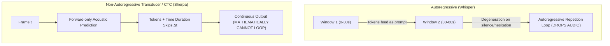

# LLM-Oriented Dictation: Model Selection & Paste-Based Output Dispatch

**Status:** IN-REVIEW (2026-09-18). Design document tracking model selection when dictating exclusively to LLM coding agents, specification for a new real-world benchmark audio fixture, and Wayland paste-based output dispatch.

**The short version.** Traditional speech-to-text benchmarks penalize models that omit punctuation and uppercase letters. When dictating prompts to an autonomous AI coding agent (such as Antigravity or Claude in a terminal), those cosmetic requirements disappear: LLM tokenizers parse unpunctuated lowercase text effortlessly. What becomes fatal instead are **autoregressive hallucination loops** and **dropped audio segments** caused by small Whisper models traversing 30-second window boundaries and mid-prompt hesitations. At the same time, typing 1,000+ character dictations via Wayland virtual keystrokes triggers per-keystroke terminal redraw loops, creating a 10–15 second visual "inching" delay. This document specifies the model selection criteria for LLM-targeted dictation, defines a new 50-second real-world acoustic stress fixture, details why `Shift+Insert` and `Ctrl+Shift+V` diverge in Kitty, and outlines a native paste-based output driver for `mavor`.

**Reads with:** [`active-window-context-and-vocabulary-prompting.md`](./active-window-context-and-vocabulary-prompting.md) (vocabulary biasing and hallucination analysis), [`how-mavor-works.md`](../reference/how-mavor-works.md) (daemon architecture and virtual keyboard), [`model-benchmarks.md`](../reports/model-benchmarks.md) (model performance report), [`wayland-dictation-stack.md`](../research/wayland-dictation-stack.md) (Wayland input protocols).

---

## 1. The Domain Shift: Human Prose vs. LLM Prompts

Previous model evaluations in `mavor` ([`choosing-a-model.md`](../choosing-a-model.md)) selected defaults based on human-facing prose: a model had to produce commas, periods, and proper capitalization to be considered usable.

When dictating instructions to an LLM agent, those criteria invert:

### What does not matter
- **Punctuation density:** Modern LLMs do not need commas or periods to infer sentence boundaries and clause structure.
- **Capitalization:** Lowercase text is tokenized with equal or higher fidelity than title case.
- **Minor phonetic misspellings:** An LLM seamlessly contextualizes `"opens horse"` as `"open source"` or `"yellow jail"` as `"YOLO Jail"` from surrounding technical context.

### What is critical
- **Zero dropped content:** If a model fails to transcribe the final 30 seconds of a 60-second prompt, the agent never receives the instruction.
- **Zero hallucination loops:** Autoregressive models entering cyclic degeneration corrupt the agent's conversation history and waste context budget.
- **Minimal post-speech latency:** The agent's reasoning turn should start the moment push-to-talk is released.
- **Hesitation and pause tolerance:** Speaking to an agent involves thinking aloud, mid-sentence restructuring, and multi-second pauses. The ASR engine must not degrade on trailing silence.
- **Technical jargon & flags:** Identifiers like `zwp_virtual_keyboard_v1`, `--no-gpu`, `swaymsg`, and `jsonl` must be recognized accurately.

---

## 2. Model Architecture Evaluation for LLM Input

The failure observed with `whisper-base.en` (repeating *"I want to make sure that there is a way to get more into the process of building a new tool"* three times across 64.6 seconds of audio while dropping the actual instructions) stems directly from **autoregressive window conditioning**.

Whisper processes audio in 30-second sliding windows. In recordings longer than 30s, tokens generated in previous windows are prepended as prompt tokens for subsequent windows. Small models ($39\text{M}$ parameters) have weak language model priors; encountering hesitation or ambient noise triggers a self-reinforcing fixed-point loop where the decoder repeats its own prompt verbatim ([`active-window-context-and-vocabulary-prompting.md`](./active-window-context-and-vocabulary-prompting.md#how-it-works)).

### Candidate Comparison under the LLM-Prompt Lens

| Model | Architecture | Engine | Speed (20s speech) | Post-Release Wait | Repetition Risk | Peak RAM | LLM Prompt Verdict |
|---|---|---|---:|---:|:---:|---:|---|
| **`nemotron-streaming-en-560ms`** | FastConformer RNN-T | sherpa (cgo) | 7.85 s (streaming) | **$\approx 0\text{ s}$** | **0%** | 964 MB | **Top Choice:** Transcribes live while speaking; zero post-utterance wait; immune to loops. |
| **`parakeet-ctc`** | FastConformer CTC | sherpa (cgo) | **2.84 s (RTF 0.14)** | $\approx 7\text{ s}$ (on 60s) | **0%** | 480 MB | **Fastest Batch:** $7\times$ real-time on CPU; lightweight; zero formatting overhead. |
| **`zipformer-ctc`** | Zipformer CTC | sherpa (cgo) | **1.39 s (RTF 0.07)** | $\approx 4\text{ s}$ (on 60s) | **0%** | 480 MB | **Speed Champion:** $14\times$ real-time on CPU; lowercase output; no loops. |
| **`parakeet-tdt-0.6b-v2`** | FastConformer TDT | sherpa (cgo) | 5.44 s (RTF 0.27) | $\approx 15\text{ s}$ (on 60s) | **0%** | 1.56 GB | **High Precision:** Non-autoregressive; best hotword Trie support for technical vocabulary. |
| `whisper-base.en` | Encoder-Decoder | whisper.cpp | 1.64 s (RTF 0.08) | $\approx 2.4\text{ s}$ (on 60s) | **High** | 308 MB | **Avoid:** Extreme risk of repetition degeneration on audio $>30\text{s}$ with pauses. |
| `whisper-small.en` | Encoder-Decoder | whisper.cpp | 4.89 s (RTF 0.24) | $\approx 14\text{ s}$ (on 60s) | Moderate | 775 MB | **Usable:** Larger capacity resists loops, but still autoregressive. |



---

## 3. Real-World Stress Benchmark Fixture

The current benchmark fixture ([`real_speech.wav`](../../test/fixtures/real_speech.wav)) is 20 seconds of cleanly read phonetics prose (*"Lux is in the pit. He cannot sit still..."*). It contains no technical terms, no multi-second hesitations, no microphone distance variation, and does not cross the 30-second window boundary.

### Fixture Requirements
- **Duration:** **45 to 55 seconds** (~110–130 words). Long enough to comfortably cross Whisper's 30-second receptive field and test window transitions, but short enough to keep benchmark sweeps fast.
- **Audio Format:** 16 kHz, 16-bit mono PCM WAV.
- **Stress Factors:**
  1. Multi-second hesitation (1.5–2.0 seconds of silence mid-prompt).
  2. Dense technical jargon, flags, and paths (`zwp_virtual_keyboard_v1`, `PipeWire`, `config.toml`, `jsonl`).
  3. Mid-utterance self-correction (*"actually, wait, let's not..."*).
  4. Acoustic variation: stepping back 2–3 feet from the microphone during the middle clause.
  5. Technical loanwords / non-English terms (`déjà vu`, `gopls`, `libonnxruntime`).

### Benchmark Prompt Script

The reference script to record:

> *"I want you to look at the repository structure for mavor, particularly under internal slash speech and internal slash output. We need to check how zwp_virtual_keyboard_v1 interacts with the Wayland compositor...*  
> *(pause 2 seconds)*  
> *...actually, wait, before doing that, let's verify if parec is dropping any buffers when PipeWire is under load. Run just check-ci with the integration tag enabled to see if swaymsg reports any unhandled XKB keycodes. I'm stepping away from the desk now, but make sure the jsonl history log records every turn without truncation or déjà vu repetition loops. If the gopls language server throws an error in the container, fall back to ripgrep with rg dash n and give me a summary of what broke."*

### Execution in `mavor-bench`
Save the recording to `test/fixtures/llm_prompt_50s.wav` and the reference text to `test/fixtures/llm_prompt_50s.wav.txt`. Rerun the benchmark suite:
```bash
go run ./cmd/mavor-bench --audio test/fixtures/llm_prompt_50s.wav
```

---

## 4. Output Dispatch: Why Typing Inches Across the Screen

When `mavor` finishes a transcription, [`internal/output/native.go`](../../internal/output/native.go) dispatches text via Wayland's `zwp_virtual_keyboard_v1`.

### The Mechanism
1. **Keystroke Burst:** For a 1,000-character utterance, `mavor` generates $>2,000$ individual `key_down` and `key_up` events via [`VirtualKeyboard.Type`](../../internal/wayland/virtualkbd.go#L68). While `mavor` flushes these to Sway in ~10–14 ms, they arrive in the focused terminal (**Kitty**) as thousands of sequential keyboard protocol events.
2. **Terminal PTY & TUI Redraw Loop:** Antigravity CLI runs its interactive prompt loop in raw terminal mode. On **every single keystroke**, the prompt editor:
   - Updates cursor position and line wrap calculations.
   - Re-evaluates syntax highlighting and ghost completion hints.
   - Emits ANSI escape sequences to redraw the prompt line.
3. **Framerate Throttling:** Terminal emulators render to the screen at display refresh rates (60–120 Hz). Processing 1,000 keystrokes through 1,000 prompt redraws takes:
   $$\frac{1000\text{ redraws}}{60\text{ frames/sec}} \approx 16.6\text{ seconds}$$
   This produces the visible effect of characters "inching across the screen".

### The Paste Solution: Bracketed Paste
When text is **pasted** into Kitty, the terminal wraps the entire text payload in **Bracketed Paste** escape codes:
$$\text{\textbackslash e[200\textasciitilde} + \text{entire 1,000 characters} + \text{\textbackslash e[201\textasciitilde}$$

Antigravity CLI detects bracketed paste, disables per-character handlers, buffers the input into memory, and performs **a single screen redraw**. The entire 1,000-character block renders instantaneously in $<15\text{ ms}$.

---

## 5. The Kitty Paste Sources: `Shift+Insert` vs. `Ctrl+Shift+V`

A user attempting to bypass virtual typing by pressing `Shift+Insert` in Kitty found that it did **not** produce the transcribed text, while `Ctrl+Shift+V` did.

### Root Cause: Two Separate Wayland Selections
In the X11 and Wayland architectures, there are two distinct selection buffers:
1. **`CLIPBOARD` Selection:** The standard desktop clipboard populated by explicit copy commands (`Ctrl+C`, `wl-copy`).
2. **`PRIMARY` Selection:** The mouse selection buffer populated automatically whenever text is highlighted on screen (`wl-copy --primary`).

### Default Keybindings in Kitty
Kitty configures these shortcuts to separate buffers:
- `ctrl+shift+v` $\to$ **`paste_from_clipboard`** (reads `CLIPBOARD`).
- `shift+insert` $\to$ **`paste_from_selection`** (reads `PRIMARY`).

`mavor`'s clipboard output helper calls:
```bash
wl-copy <text>
```
This sets the **`CLIPBOARD`** buffer, but leaves `PRIMARY` completely untouched.

Consequently:
- In GUI applications (GTK, Qt, Chromium), `Shift+Insert` is aliased to `paste_from_clipboard`.
- In Kitty, `Shift+Insert` attempts to paste whatever text was last highlighted with the mouse (often stale text or empty), while `Ctrl+Shift+V` pastes `mavor`'s transcript.

### Synchronizing Kitty
To make `Shift+Insert` behave identically to `Ctrl+Shift+V` in Kitty, add to `~/.config/kitty/kitty.conf`:
```conf
map shift+insert paste_from_clipboard
```

Alternatively, `mavor` can populate both buffers upon emission:
```bash
wl-copy <text> && wl-copy --primary <text>
```

---

## 6. Architectural Proposals for Paste-Based Dispatch in `mavor`

Because there is no single universal paste chord across all desktop applications (`Ctrl+Shift+V` in terminals, `Ctrl+V` in GUI apps, `p` in Vim), `mavor` currently only types via virtual keyboard.

To support instant paste dispatch without terminal redraw lag:

### Proposal A: Compositor-Aware Paste Chord Injection
`mavor` queries Sway IPC (`swaymsg -t get_tree`) to read the `app_id` of the focused container before emitting:
- If `app_id` is a terminal emulator (`kitty`, `foot`, `alacritty`):
  Populate clipboard via `wl-copy` and synthesize **`Ctrl+Shift+V`**.
- If `app_id` is a graphical application (`chromium`, `code`, `slack`):
  Populate clipboard via `wl-copy` and synthesize **`Ctrl+V`**.

### Proposal B: Dual Buffer Population + Universal `Shift+Insert`
`mavor` copies the transcript to both `CLIPBOARD` and `PRIMARY` selections via `wl-copy`. If the user maps Kitty's `Shift+Insert` or if `mavor` synthesizes `Shift+Insert`, it succeeds across both GUI and terminal contexts.

### Proposal C: Opt-In Configuration Table
Add a `driver` setting to the existing `[output]` table in `~/.config/mavor/config.toml`:
```toml
[output]
driver = "paste"            # "typing" (default) | "paste" | "clipboard-only"
paste_chord = "ctrl+shift+v" # custom keystroke chord if driver = "paste"
clipboard = true
```

---

## 7. Open Questions & Decision Ledger

### Open Questions

1. 💬 **OQ-LLM1: Default model recommendation for LLM users.** Should `mavor` document a dedicated `preset = "llm-agent"` that sets `model = "nemotron-streaming-en-560ms"`?

   <!-- vantage: oq id=OQ-LLM1 leaning="Yes — streaming transducer models eliminate both post-speech latency and repetition loops for agent prompts." -->

   _Leaning:_ Yes — streaming transducer models eliminate both post-speech latency and repetition loops for agent prompts.

   **Answer:**
   > _(empty — fill in when decided)_

2. 💬 **OQ-LLM2: Dual-buffer clipboard emission.** Should `mavor` populate both `CLIPBOARD` and `PRIMARY` selections when `output.clipboard = true`?

   <!-- vantage: oq id=OQ-LLM2 leaning="Populate both — populating PRIMARY makes Shift+Insert work in Kitty without requiring manual kitty.conf remapping." -->

   _Leaning:_ Populate both — populating `PRIMARY` makes `Shift+Insert` work in Kitty without requiring manual `kitty.conf` remapping.

   **Answer:**
   > _(empty — fill in when decided)_

3. 💬 **OQ-LLM3: Active window-aware paste driver.** Should `mavor` implement an automatic paste driver that switches chords based on the focused Wayland `app_id`?

   <!-- vantage: oq id=OQ-LLM3 leaning="Keep behind an opt-in config flag first (output.driver = 'paste'), with per-app chord detection defaulting to Ctrl+Shift+V for terminals." -->

   _Leaning:_ Keep behind an opt-in config flag first (`output.driver = "paste"`), with per-app chord detection defaulting to `Ctrl+Shift+V` for terminals.

   **Answer:**
   > _(empty — fill in when decided)_
