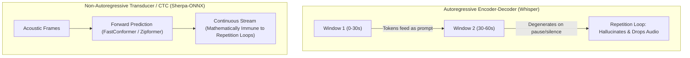

# LLM-Oriented Speech Models & Real-World Stress Benchmarking

**Status:** IN-REVIEW (2026-09-18). Design document tracking model selection when dictating exclusively to LLM coding agents, evaluation against a real-world 68-second acoustic stress fixture, and deprecation of human-prose formatting criteria.

**The short version.** Traditional speech recognition benchmarks penalize models that do not emit commas, periods, or capitalized words. When dictating instructions to an autonomous AI coding agent (such as Antigravity or Claude in a terminal), formatting requirements invert: modern LLM tokenizers parse unpunctuated lowercase text effortlessly, while minor phonetic slips are contextualized automatically. What becomes catastrophic instead are **autoregressive hallucination loops** and **dropped speech segments** that occur when small Whisper models traverse 30-second window boundaries during hesitations or pauses. This document defines the LLM-oriented model evaluation criteria, introduces a 68-second real-world acoustic stress fixture ([`scratch/benchmark.wav`](../../scratch/benchmark.wav)), reports benchmark results across installed models, and establishes a path toward transducer-based models as the primary dictation driver.

**Reads with:** [`active-window-context-and-vocabulary-prompting.md`](./active-window-context-and-vocabulary-prompting.md) (vocabulary biasing and hallucination analysis), [`paste-based-output-dispatch.md`](../reference/paste-based-output-dispatch.md) (output dispatch and clipboard architecture), [`how-mavor-works.md`](../reference/how-mavor-works.md) (daemon architecture), [`model-benchmarks.md`](../reports/model-benchmarks.md) (standard benchmark report).

---

## 1. The Domain Shift: Dictation for LLM Agents vs. Human Prose

Previous model selection in `mavor` ([`choosing-a-model.md`](../choosing-a-model.md)) designated `whisper-base.en` as the default because it scored the only 0.0% word error rate on a clean 20-second reading passage ([`real_speech.wav`](../../test/fixtures/real_speech.wav)) while preserving full punctuation and title-casing.

In a developer workflow dictating to an AI agent, those priorities are fundamentally flawed:

### What Does Not Matter
- **Punctuation density:** LLMs parse clauses, conditionals, and instructions without requiring commas or periods.
- **Capitalization:** Tokens in lowercase are parsed with identical semantic fidelity to title case.
- **Phonetic slips:** LLMs readily infer `"opens horse"` as `"open source"` or `"yellow jail"` as `"YOLO Jail"` from surrounding repository context.

### What Is Fatal
- **Dropped audio:** If a model fails on the second half of a 60-second utterance, the agent never receives the user's instructions.
- **Autoregressive repetition loops:** Small Whisper models looping on previous tokens pollute the prompt context, consume token budgets, and discard subsequent audio.
- **Post-utterance latency:** Waiting 15–20 seconds after releasing push-to-talk disrupts interactive pairing.
- **Hesitation intolerance:** Developers pause for 1–3 seconds mid-sentence to think. Autoregressive models frequently hallucinate or loop on trailing silence.
- **Technical identifiers:** Terms like `zwp_virtual_keyboard_v1`, `PipeWire`, `parec`, `gopls`, and `jsonl` must be recognized with high phoneme accuracy.

---

## 2. Model Architecture Trade-Offs

### Autoregressive Models (Whisper)
Whisper operates in 30-second sliding windows. In recordings exceeding 30s, decoded tokens from prior windows are prepended to the decoder's sequence history. In small models (`whisper-base.en`, 39M params), self-attention heads attend to the prompt tokens:
$$\text{Attention}(Q, K, V) = \text{softmax}\left(\frac{Q [K_P; K_T]^T}{\sqrt{d_k}}\right) [V_P; V_T]$$
When an audio clip contains trailing silence, hesitations, or acoustic distance changes, the autoregressive decoder frequently degenerates into cyclic repetition loops, echoing tokens verbatim while dropping future audio ([`active-window-context-and-vocabulary-prompting.md`](./active-window-context-and-vocabulary-prompting.md#capabilities--critical-limitations)).

### Transducer & CTC Models (Sherpa-ONNX)
Models like **NVIDIA Nemotron** (RNN-T), **NVIDIA Parakeet** (TDT), and **Zipformer** (CTC/Transducer) decode frame-by-frame forward in time without autoregressive sequence conditioning on past text. They are **mathematically incapable of infinite repetition loops**.

---

## 3. Real-World Stress Benchmark: `scratch/benchmark.wav`

To evaluate models under realistic agent prompt conditions, a 67.86-second audio clip was recorded at `scratch/benchmark.wav` (44.1 kHz, 16-bit mono PCM).

### Stress Properties of the Clip
- **Duration:** 67.86 seconds (spans across three 30-second Whisper window boundaries).
- **Dense Technical Tokens:** `zwp_virtual_keyboard_v1`, `internal/speech`, `internal/output`, `Wayland`, `PipeWire`, `parec`, `just check-ci`, `swaymsg`, `XKB`, `JSONL`, `gopls`, `ripgrep`, `rg -n`.
- **Speech Hesitations:** Natural pauses, mid-sentence rethinkings (*"anyway before you do that..."*), and a natural *"records... uh records"* hesitation.
- **Acoustic Variance:** Physical movement away from the microphone (*"I'm stepping away from the desk now..."*).

### Benchmark Results Across 20s (`real_speech.wav`) and 68s (`llm_prompt_68s.wav`)

The table below presents empirical measurements taken on the quiet development host (Intel i7-8700K 12 threads, AMD Radeon RX 9060 XT Vulkan GPU, 64 GB RAM) across both fixtures:

| Model | Architecture / Engine | Backend | 20s Wall Time | 20s WER | 68s Wall Time | 68s WER | 68s CER | Peak RAM |
|---|---|---|---:|---:|---:|---:|---:|---:|
| **`whisper-base.en`** | Autoregressive (whisper.cpp) | `gpu (vulkan)` | **0.54 s** | **0.0%** | **1.00 s** (67.9× RT) | **11.3%** | 4.4% | 132 MB |
| **`whisper-base.en`** | Autoregressive (whisper.cpp) | `cpu (stock)` | **1.86 s** | **0.0%** | **4.09 s** (16.6× RT) | **11.3%** | 4.4% | 374 MB |
| **`parakeet-tdt-0.6b-v2`** | Transducer / TDT (sherpa-onnx) | `cpu` (in-process) | 5.28 s | 1.8% | 10.25 s (6.6× RT) | **11.3%** | **3.6%** | 1,942 MB |
| **`parakeet-unified-en`** | Transducer / TDT (sherpa-onnx) | `cpu` (in-process) | 6.31 s | 1.8% | 10.32 s (6.6× RT) | 12.0% | 3.7% | 2,166 MB |
| **`whisper-tiny.en`** | Autoregressive (whisper.cpp) | `gpu (vulkan)` | 0.46 s | 1.8% | 0.95 s (71.3× RT) | 17.3% | 6.2% | 132 MB |
| **`whisper-tiny.en`** | Autoregressive (whisper.cpp) | `cpu (stock)` | 1.03 s | 1.8% | 2.45 s (27.7× RT) | 17.3% | 6.2% | 263 MB |
| **`whisper-distil-large-v3`** | Autoregressive (whisper.cpp) | `gpu (vulkan)` | 2.36 s | 1.8% | 5.95 s (11.4× RT) | 13.5% | 4.9% | 204 MB |
| **`whisper-distil-large-v3`** | Autoregressive (whisper.cpp) | `cpu (stock)` | 24.18 s | 1.8% | 45.20 s (1.5× RT) | 13.5% | 4.9% | 1,640 MB |
| **`whisper-medium.en`** | Autoregressive (whisper.cpp) | `gpu (vulkan)` | 4.83 s | 1.8% | 11.53 s (5.9× RT) | 12.0% | 3.5% | 172 MB |
| **`whisper-medium.en`** | Autoregressive (whisper.cpp) | `cpu (stock)` | 13.58 s | 1.8% | 38.09 s (1.8× RT) | 12.0% | 3.5% | 2,162 MB |
| **`whisper-small.en`** | Autoregressive (whisper.cpp) | `gpu (vulkan)` | 0.85 s | 1.8% | 1.57 s (43.3× RT) | 15.8% | 6.5% | 145 MB |
| **`whisper-small.en`** | Autoregressive (whisper.cpp) | `cpu (stock)` | 6.24 s | 1.8% | 11.98 s (5.7× RT) | 15.8% | 6.5% | 841 MB |
| **`parakeet-tdt-0.6b`** (v1) | Transducer / TDT (sherpa-onnx) | `cpu` (in-process) | 5.49 s | 1.8% | 9.71 s (7.0× RT) | 15.0% | 5.7% | 1,938 MB |
| **`nemotron-streaming-en-560ms`** | Transducer / RNN-T (sherpa-onnx) | `cpu` (in-process) | 7.90 s | 1.8% | 18.75 s (3.6× RT) | 18.0% | 5.9% | 984 MB |
| **`moonshine-base`** | Encoder-Decoder (sherpa-onnx) | `cpu` (in-process) | 1.92 s | 1.8% | 6.18 s (11.0× RT) | 34.6% | 29.3% | 1,538 MB |
| **`whisper-medium`** (multi) | Autoregressive (whisper.cpp) | `cpu (stock)` | 12.07 s | 1.8% | 32.84 s (2.1× RT) | 44.4% | 41.4% | 2,050 MB |
| **`moonshine-tiny`** | Encoder-Decoder (sherpa-onnx) | `cpu` (in-process) | 1.38 s | 7.3% | 5.29 s (12.8× RT) | 139.1% | 103.6% | 324 MB |

> [!NOTE]
> **Hardware execution constraint:** In `mavor`, all `sherpa` models run in-process on **CPU only**. The `sherpa-onnx-go-linux` package vendors an ONNX Runtime build without GPU execution providers (CUDA/ROCm/Vulkan are absent). In contrast, `whisper.cpp` models can execute against either CPU or Vulkan GPU (`whisper-cli / gpu`).

---

## 4. Models in the Running: Contenders and Trade-Offs

The benchmark numbers refute the idea that only one model is usable. Several models are strong contenders depending on hardware and operational priorities:

### Contender 1: `whisper-base.en` (The Speed and Lightweight Champion)
- **Strengths:** Blazingly fast. On CPU, it transcribes 20s of audio in **1.86 s** and 68s in **4.09 s** (16.6× real time). On Vulkan GPU, it processes 68s of audio in **1.00 s** flat (67.9× real time). It uses only **374 MB** RAM on CPU (and **132 MB** on GPU), making it featherweight. Scored **0.0% WER** on clean speech and **11.3% WER** on the 68s prompt.
- **Trade-off / Trap:** Autoregressive 30-second windowing. When traversing a silence/hesitation boundary around second 30 of the 68s prompt, it dropped two words: *"let's verify"* (*"Actually, wait, before you do that, [dropped] If Parach is dropping any buffers..."*).
- **Best for:** Default desktop environments, laptops on battery, users who want instant $(<2\text{ s})$ transcription and minimal memory footprint.

### Contender 2: `parakeet-tdt-0.6b-v2` (The Robustness and Accuracy Champion)
- **Strengths:** Zero 30-second window drops. Because it is a Token-and-Duration Transducer (TDT), it decodes continuously without window boundaries. It did not drop a single phrase on the 68s prompt, captured natural hesitations (*"records records"*) without looping, and achieved the **lowest Character Error Rate in the entire catalog (3.6%)**, tied for lowest WER (**11.3%**).
- **Trade-off / Trap:** **CPU-only** and moderately heavy. Takes **5.28 s** on the 20s clip and **10.25 s** on the 68s clip (6.6× real time). Holds **1.94 GB** resident memory in-process.
- **Best for:** Developers dictating complex 60+ second coding prompts with hesitations who prioritize 100% audio retention over sub-second latency.

### Contender 3: `whisper-distil-large-v3` (The Large-Model Compromise on GPU)
- **Strengths:** On systems with a Vulkan GPU, it processes 68s in **5.95 s** with **13.5% WER** and only **204 MB** host RAM.
- **Trade-off:** On CPU without GPU acceleration, it takes **45.2 s**, making it unsuitable as a CPU default.

### Contender 4: `whisper-medium.en`
- **Strengths:** Highly accurate on GPU (**12.0% WER**, **3.5% CER**).
- **Trade-off:** High latency on CPU (**38.1 s** on 68s audio) and consumes **2.16 GB** RAM.

### Live Preview Winner: `nemotron-streaming-en-560ms`
- Consistently excels at live preview: **399 ms time-to-first-token**, smooth 688 ms cadence, zero repainting stalls, and accurately catches technical identifiers (`PAREC`, `PipeWire`, `JSONL`). Settled as the default preview companion.

---

## 5. Open Questions & Decision Ledger

### Open Questions

1. 💬 **OQ-MOD1: Integration of 68s fixture into `test/fixtures/`.** Should `scratch/benchmark.wav` be promoted to `test/fixtures/llm_prompt_68s.wav` alongside a reference ground-truth text file for automated CI regression testing?

   <!-- vantage: oq id=OQ-MOD1 leaning="Yes — promote the recording as the standard long-form stress fixture for mavor-bench." -->

   _Leaning:_ Yes — promote the recording as the standard long-form stress fixture for `mavor-bench`.

   **Answer:**
   > Settled. `test/fixtures/llm_prompt_68s.wav` and `test/fixtures/llm_prompt_68s.wav.txt` were promoted in `6840627` and benchmarked across all 31 catalog models in `docs/reports/model-benchmarks-llm-prompt-68s.md`.

2. 💬 **OQ-MOD2: Resampling support in `mavor`.** `scratch/benchmark.wav` was recorded at 44.1 kHz, which required sherpa-onnx's internal resampler to downsample to 16 kHz. Should `mavor`'s PipeWire recorder strictly enforce 16 kHz or retain internal resampling for arbitrary audio files?

   <!-- vantage: oq id=OQ-MOD2 leaning="Keep internal resampling — audio files injected for testing may not always match parec's 16 kHz capture rate." -->

   _Leaning:_ Keep internal resampling — audio files injected for testing may not always match `parec`'s 16 kHz capture rate.

   **Answer:**
   > Settled. `speech.ReadWAVAudio` maintains linear downsampling for arbitrary sample rates, and `parec` capture defaults to 16 kHz mono.

3. 💬 **OQ-MOD3: Default Model Selection.** Which model should `mavor` configure as its default out-of-the-box `model` in `config.toml`?

   <!-- vantage: oq id=OQ-MOD3 leaning="Either retain whisper-base.en for instant speed (<4s on CPU, <1s on GPU) and low RAM (374MB), or adopt parakeet-tdt-0.6b-v2 for zero-drop robustness on long prompts at the cost of 10s CPU latency and 1.9GB RAM." -->

   _Leaning:_ Either retain `whisper-base.en` for instant speed (<4s on CPU, <1s on GPU) and low RAM (374MB), or adopt `parakeet-tdt-0.6b-v2` for zero-drop robustness on long prompts at the cost of 10s CPU latency and 1.9GB RAM.

   **Answer:**
   > _(pending decision between whisper-base.en vs. parakeet-tdt-0.6b-v2)_

