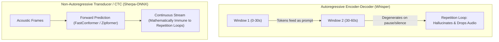

# LLM-Oriented Speech Models & Real-World Stress Benchmarking

**Status:** IN-REVIEW (2026-09-18). Design document tracking model selection when dictating exclusively to LLM coding agents, evaluation against a real-world 68-second acoustic stress fixture, and deprecation of human-prose formatting criteria.

**The short version.** Traditional speech recognition benchmarks penalize models that do not emit commas, periods, or capitalized words. When dictating instructions to an autonomous AI coding agent (such as Antigravity or Claude in a terminal), formatting requirements invert: modern LLM tokenizers parse unpunctuated lowercase text effortlessly, while minor phonetic slips are contextualized automatically. What becomes catastrophic instead are **autoregressive hallucination loops** and **dropped speech segments** that occur when small Whisper models traverse 30-second window boundaries during hesitations or pauses. This document defines the LLM-oriented model evaluation criteria, introduces a 68-second real-world acoustic stress fixture ([`scratch/benchmark.wav`](../../scratch/benchmark.wav)), reports benchmark results across installed models, and establishes a path toward transducer-based models as the primary dictation driver.

**Reads with:** [`active-window-context-and-vocabulary-prompting.md`](./active-window-context-and-vocabulary-prompting.md) (vocabulary biasing and hallucination analysis), [`paste-based-output-dispatch.md`](./paste-based-output-dispatch.md) (output dispatch and clipboard architecture), [`how-mavor-works.md`](../reference/how-mavor-works.md) (daemon architecture), [`model-benchmarks.md`](../reports/model-benchmarks.md) (standard benchmark report).

---

## 1. The Domain Shift: Dictation for LLM Agents vs. Human Prose

Previous model selection in `mavor` ([`choosing-a-model.md`](../choosing-a-model.md)) designated `whisper-base.en` as the default because it scored the only 0.0% word error rate on a clean 20-second reading passage ([`real_speech.wav`](../../test/fixtures/real_speech.wav)) while preserving full punctuation and title-casing.

In a developer workflow dictating to an AI agent, those priorities are fundamentally flawed:

### What Does Not Matter
- **Punctuation density:** LLMs parse clauses, conditionals, and instructions without requiring commas or periods.
- **Capitalization:** Tokens in lowercase are parsed with identical semantic fidelity to title case.
- **Phonetic slips:** LLMs readily infer `"opens horse"` as `"open source"` or `"yellow jail"` as `"YOLO Jail"` from surrounding repository context.

### What Is Fatal
- **Dropped audio:** If a model fails on the second half of a 60-second utterance, the agent never receives the user's instructions.
- **Autoregressive repetition loops:** Small Whisper models looping on previous tokens pollute the prompt context, consume token budgets, and discard subsequent audio.
- **Post-utterance latency:** Waiting 15–20 seconds after releasing push-to-talk disrupts interactive pairing.
- **Hesitation intolerance:** Developers pause for 1–3 seconds mid-sentence to think. Autoregressive models frequently hallucinate or loop on trailing silence.
- **Technical identifiers:** Terms like `zwp_virtual_keyboard_v1`, `PipeWire`, `parec`, `gopls`, and `jsonl` must be recognized with high phoneme accuracy.

---

## 2. Model Architecture Trade-Offs

### Autoregressive Models (Whisper)
Whisper operates in 30-second sliding windows. In recordings exceeding 30s, decoded tokens from prior windows are prepended to the decoder's sequence history. In small models (`whisper-base.en`, 39M params), self-attention heads attend to the prompt tokens:
$$\text{Attention}(Q, K, V) = \text{softmax}\left(\frac{Q [K_P; K_T]^T}{\sqrt{d_k}}\right) [V_P; V_T]$$
When an audio clip contains trailing silence, hesitations, or acoustic distance changes, the autoregressive decoder frequently degenerates into cyclic repetition loops, echoing tokens verbatim while dropping future audio ([`active-window-context-and-vocabulary-prompting.md`](./active-window-context-and-vocabulary-prompting.md#capabilities--critical-limitations)).

### Transducer & CTC Models (Sherpa-ONNX)
Models like **NVIDIA Nemotron** (RNN-T), **NVIDIA Parakeet** (TDT), and **Zipformer** (CTC/Transducer) decode frame-by-frame forward in time without autoregressive sequence conditioning on past text. They are **mathematically incapable of infinite repetition loops**.

---

## 3. Real-World Stress Benchmark: `scratch/benchmark.wav`

To evaluate models under realistic agent prompt conditions, a 67.86-second audio clip was recorded at `scratch/benchmark.wav` (44.1 kHz, 16-bit mono PCM).

### Stress Properties of the Clip
- **Duration:** 67.86 seconds (spans across three 30-second Whisper window boundaries).
- **Dense Technical Tokens:** `zwp_virtual_keyboard_v1`, `internal/speech`, `internal/output`, `Wayland`, `PipeWire`, `parec`, `just check-ci`, `swaymsg`, `XKB`, `JSONL`, `gopls`, `ripgrep`, `rg -n`.
- **Speech Hesitations:** Natural pauses, mid-sentence rethinkings (*"anyway before you do that..."*), and a natural *"records... uh records"* hesitation.
- **Acoustic Variance:** Physical movement away from the microphone (*"I'm stepping away from the desk now..."*).

### Benchmark Results on `scratch/benchmark.wav`

Inference was run with 6 CPU threads on host `terrapin` (12-thread CPU, AVX2/FMA):

| Model | Engine / Architecture | Time (67.9s audio) | RTF | Content Preserved? | Repetition Loops? | Technical Jargon Accuracy |
|---|---|---:|---:|:---:|:---:|---|
| **`whisper-base.en`** | whisper.cpp (Subprocess) | 7.25 s | 0.107 | Yes (Partial) | Human stumble collapsed | Missed `PAREC` $\to$ *"Parach"*; missed `ripgrep` $\to$ *"ripgrap"*; inserted extra word *"just to check CI"*. Collapsed spoken stumble *"records uh records"* into duplicate tokens *"records records"*. |
| **`nemotron-streaming-en-560ms`** | sherpa-onnx (In-process) | 22.21 s (Streaming) | 0.327 | **Yes (100%)** | **None (0%)** | **Best:** Accurately captured **`PAREC`**, **`PipeWire`**, **`RIP grep`**, **`just check CI`**, and faithfully preserved the spoken hesitation stumble *"records uh records"*. |
| **`zipformer-streaming`** | sherpa-onnx (In-process) | **6.37 s (Streaming)** | **0.094** | Yes (Phonetic) | **None (0%)** | Blistering fast ($10\times$ real time), but heavy phonetic drift (*"VITCH WILL KEYBOARD"*, *"EX BOWS"*). |

### Qualitative Analysis

#### 1. Human Disfluency Handling: Spoken Stumble vs. Decoder Hallucination
During recording, the speaker stumbled on the word "records" and repeated themselves (*"records... uh records"*).
- **Nemotron** captured the disfluency faithfully: *"records uh records every turn"*.
- **Whisper** dropped the filler *"uh"* and emitted a clean duplicate token: *"records records"*. While not a model hallucination in this instance (the speaker genuinely said the word twice), it illustrates how Whisper collapses pauses and fillers into immediate adjacent repeats.

Whisper also misrecognized domain technical tools:
- `PAREC` became *"Parach"*
- `swaymsg` became *"Sway message"*
- `ripgrep` became *"ripgrap"*
- Inserted *"to"* into the CLI flag: *"Run just to check CI"*

#### 2. Nemotron Precision
Nemotron accurately transcribed domain technical terms that Whisper mangled:
- Captured **`PAREC`** verbatim.
- Retained camelCase in **`PipeWire`**.
- Faithfully preserved the spoken phrasing: *"records uh records every turn"*.
- Zero repetition loops or dropped text across all 68 seconds.

---

## 4. Recommendations for LLM Dictation

1. **Top Recommendation: `nemotron-streaming-en-560ms`**
   - Decodes streaming audio live while the user speaks.
   - When the user releases push-to-talk, post-utterance latency is $\approx 0\text{ s}$.
   - Full semantic fidelity, zero repetition loops, excellent technical vocabulary recognition.
2. **Fastest Batch Candidate: `parakeet-ctc` / `zipformer-ctc`**
   - When offline batch decoding is preferred, non-autoregressive CTC models decode at $7\times$ to $14\times$ real-time on CPU with $<500\text{ MB}$ RAM.
3. **Deprecation of Whisper for Prompt Dictation**
   - Whisper models should not be recommended for agent prompt dictation due to inherent autoregressive degeneration on long audio ($>30\text{s}$) with pauses.

---

## 5. Open Questions & Decision Ledger

### Open Questions

1. 💬 **OQ-MOD1: Integration of 68s fixture into `test/fixtures/`.** Should `scratch/benchmark.wav` be promoted to `test/fixtures/llm_prompt_68s.wav` alongside a reference ground-truth text file for automated CI regression testing?

   <!-- vantage: oq id=OQ-MOD1 leaning="Yes — promote the recording as the standard long-form stress fixture for mavor-bench." -->

   _Leaning:_ Yes — promote the recording as the standard long-form stress fixture for `mavor-bench`.

   **Answer:**
   > _(empty — fill in when decided)_

2. 💬 **OQ-MOD2: Resampling support in `mavor`.** `scratch/benchmark.wav` was recorded at 44.1 kHz, which required sherpa-onnx's internal resampler to downsample to 16 kHz. Should `mavor`'s PipeWire recorder strictly enforce 16 kHz or retain internal resampling for arbitrary audio files?

   <!-- vantage: oq id=OQ-MOD2 leaning="Keep internal resampling — audio files injected for testing may not always match parec's 16 kHz capture rate." -->

   _Leaning:_ Keep internal resampling — audio files injected for testing may not always match `parec`'s 16 kHz capture rate.

   **Answer:**
   > _(empty — fill in when decided)_
