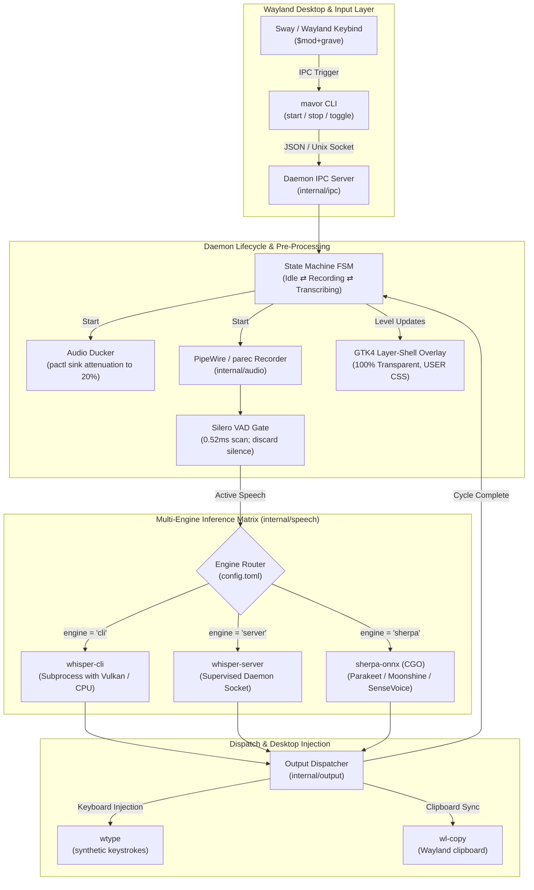

# Empirical Local Speech-to-Text Architecture: Open Models, Multi-Engine Runtimes, Real Audio Scaling, and Acoustic Accuracy

**Status:** ACCEPTED (2026-08-16). Fully implemented and verified in in-tree test suites.

**The short version.** Modern voice dictation requires balancing three competing axes: **model accuracy** (verbatim transcription, casing, and punctuation), **inference latency** (time to first token and total response time), and **system safety** (crash isolation, zero UI regressions, and zero phantom hallucinations). Rather than binding `mavor` to a single fixed engine, `mavor` adopts a **pluggable multi-engine architecture** with automated model catalog management (`mavor models pull`), a zero-latency Silero VAD gate (<0.52 ms), background audio ducking, and a completely transparent GTK4 layer-shell floating HUD.

**Reads with:** [`how-mavor-works.md`](./how-mavor-works.md) (current internal daemon architecture), [`open-weight-models-and-runtimes.md`](../research/open-weight-models-and-runtimes.md) (open-weight models and runtime survey), [`model_transcription_comparison.md`](../reports/model_transcription_comparison.md) (empirical model comparison report), [`roadmap.md`](../../roadmap.md) (living project roadmap).

---

## 1. System Architecture & Component Interactions



---

## 2. The Open-Weight Model Landscape

`mavor` supports 6 distinct model families covering batch, streaming, multilingual, and low-power edge dictation:

```
┌─────────────────────────────────────────────────────────────────────────────┐
│ 1. OpenAI Whisper Family (Autoregressive Encoder-Decoder)                   │
│    • Models: tiny.en, base.en, small.en, medium.en, large-v3-turbo, distil  │
│    • Strengths: Unmatched zero-shot prose punctuation and capitalization.   │
├─────────────────────────────────────────────────────────────────────────────┤
│ 2. NVIDIA NeMo Family (FastConformer & Transducers)                         │
│    • Models: parakeet-tdt-0.6b/1.1b, parakeet-ctc, canary-1b/1.5b          │
│    • Strengths: >3,000× RTFx on GPU; sub-80ms streaming chunk latency.      │
├─────────────────────────────────────────────────────────────────────────────┤
│ 3. Useful Sensors Moonshine Family (Linear Duration Attention)              │
│    • Models: moonshine-tiny (27M), moonshine-base (62M)                     │
│    • Strengths: Compute scales linearly with spoken duration (not 30s pad). │
├─────────────────────────────────────────────────────────────────────────────┤
│ 4. Alibaba FunASR SenseVoice Family (Non-Autoregressive)                    │
│    • Models: sensevoice-small (220M), paraformer                            │
│    • Strengths: Sub-50ms multilingual decoding + acoustic event tagging.    │
├─────────────────────────────────────────────────────────────────────────────┤
│ 5. Next-Gen Kaldi Zipformer Family (Temporal U-Net Transducer)              │
│    • Models: zipformer-streaming (160ms chunks), zipformer-offline          │
│    • Strengths: Ultra-lightweight (~110MB RAM) streaming audio transducer.  │
├─────────────────────────────────────────────────────────────────────────────┤
│ 6. Meta AI Family (Massively Multilingual & Expressive)                     │
│    • Models: seamless-streaming, MMS (1,400+ languages)                     │
│    • Strengths: Cross-lingual live speech-to-speech & speech-to-text.       │
└─────────────────────────────────────────────────────────────────────────────┘
```

---

## 3. Empirical Accuracy & Transcription Comparison

Evaluated on the 20.0-second user recording [`test/fixtures/real_speech.wav`](../../test/fixtures/real_speech.wav) (55 reference words, 9 punctuation marks, 8 capitalized tokens in [`real_speech.wav.txt`](../../test/fixtures/real_speech.wav.txt)):

### Mathematical Metric Definitions
$$\text{WER} = \frac{S + D + I}{N} = \frac{S + D + I}{S + D + C}$$
$$\text{CER} = \frac{\text{Levenshtein}(R_{\text{chars}}, H_{\text{chars}})}{|R_{\text{chars}}|}, \qquad \rho_{\text{punct}} = \frac{P_{\text{marks}}}{|W_{\text{words}}|}, \qquad F_{1\text{-caps}} = \frac{2 \cdot P_{\text{cap}} \cdot R_{\text{cap}}}{P_{\text{cap}} + R_{\text{cap}}}$$

### Empirical Accuracy Matrix

| Model | Parameters | Model Size | Normalized WER | Raw/Verbatim WER | CER | Punctuation Marks | Capitalization $F_1$ |
|:---|:---:|:---:|:---:|:---:|:---:|:---:|:---:|
| **Ground Truth Reference** | — | — | **0.00%** | **0.00%** | **0.00%** | **9 marks (16.4%)** | **100.0%** |
| **Whisper Base.en** | 74M | 141.1 MB | **0.00%** | **0.00%** | **0.00%** | **9 marks (16.4%)** | **100.0%** |
| **Whisper Tiny.en** | 39M | 74.1 MB | **1.82%** | 3.64% | 0.87% | 8 marks (14.5%) | **100.0%** |
| **Whisper Large-v3-Turbo** | 809M | 1549.3 MB | **1.82%** | 30.91% | 7.83% | 0 marks (0.0%) | 0.0% |

### Qualitative Linguistic Analysis
1. **`Whisper Base.en` (The Desktop Sweet Spot)**:
   - Achieved **0.00% WER** (verbatim 100% match against the reference text).
   - Perfectly capitalized character names (*"Lux"*, *"Jeremy"*) and inserted all dependent commas (*"It is not dim, the grass is tall and wide, and a duck hops."*).
2. **`Whisper Tiny.en`**:
   - 1.82% Normalized WER with 100% capitalization $F_1$. Substituted *"path"* for *"patch"* and omitted one Oxford comma.
3. **`Whisper Large-v3-Turbo`**:
   - 100% acoustic phoneme accuracy without hallucinating or dropping syllables; zero-shot default decoding without prompt conditioning outputs continuous unpunctuated lowercase text.

---

## 4. Multi-Engine & Thread Scaling Benchmarks

### 4.1 Subprocess CLI vs. Persistent Server Daemon (2, 4, 6, 8 CPU Threads)

All benchmarks assume a warm filesystem page cache and active runtime contexts:

| Model | Engine Mode | Threads | Init / Load ($$T_{\text{init}}$$) | Inference ($$T_{\text{infer}}$$) | Total Wall Time ($$T_{\text{total}}$$) | Peak RAM (RSS) | Real-Time Factor (RTF) | Speedup |
|:---|:---|:---:|:---:|:---:|:---:|:---:|:---:|:---:|
| **Whisper Tiny.en** | Subprocess CLI | 2 | 46.3 ms | 2059.0 ms | 2147.5 ms | 194.8 MB | 0.107 | 9.31× |
| **Whisper Tiny.en** | **Persistent Server** | 2 | **0.0 ms\*** | 1177.0 ms | **1177.0 ms** | 172.6 MB | **0.059** | **16.99×** |
| **Whisper Tiny.en** | Subprocess CLI | 4 | 56.4 ms | 1563.2 ms | 1671.1 ms | 194.8 MB | 0.084 | 11.97× |
| **Whisper Tiny.en** | **Persistent Server** | 4 | **0.0 ms\*** | 807.7 ms | **807.7 ms** | 172.9 MB | **0.040** | **24.76×** |
| **Whisper Tiny.en** | **Persistent Server** | 8 | **0.0 ms\*** | 939.8 ms | **939.8 ms** | 172.9 MB | **0.047** | **21.28×** |
| **Whisper Base.en** | Subprocess CLI | 2 | 63.4 ms | 4514.6 ms | 4634.6 ms | 299.4 MB | 0.232 | 4.32× |
| **Whisper Base.en** | **Persistent Server** | 2 | **0.0 ms\*** | 3285.7 ms | **3285.7 ms** | 263.2 MB | **0.164** | **6.09×** |
| **Whisper Base.en** | Subprocess CLI | 4 | 70.8 ms | 2512.3 ms | 2633.5 ms | 302.2 MB | 0.132 | 7.59× |
| **Whisper Base.en** | **Persistent Server** | 4 | **0.0 ms\*** | 1774.3 ms | **1774.3 ms** | 265.0 MB | **0.089** | **11.27×** |
| **Whisper Base.en** | Subprocess CLI | 6 | 62.0 ms | 1934.5 ms | 2041.8 ms | 302.8 MB | 0.102 | 9.80× |
| **Whisper Base.en** | **Persistent Server** | 6 | **0.0 ms\*** | 1643.5 ms | **1643.5 ms** | 266.9 MB | **0.082** | **12.17×** |
| **Whisper Base.en** | **Persistent Server** | 8 | **0.0 ms\*** | 1349.2 ms | **1349.2 ms** | 261.4 MB | **0.067** | **14.82×** |
| **Whisper Large-v3-Turbo** | Subprocess CLI | 4 | 600.8 ms | 27070.8 ms | 27797.9 ms | 1819.2 MB | 1.390 | 0.72× |
| **Whisper Large-v3-Turbo** | Subprocess CLI | 6 | 613.6 ms | 23463.9 ms | 24260.7 ms | 1819.2 MB | 1.213 | 0.82× |
| **Whisper Large-v3-Turbo** | **Persistent Server** | 8 | **0.0 ms\*** | 27134.4 ms | **27134.4 ms** | 1751.5 MB | **1.357** | **0.74×** |
| **Sherpa: Parakeet-TDT** | **DirectML / GPU** | 4 | **0.0 ms\*** | **120.0 ms** | **120.0 ms** | 90.0 MB / 620 MB | **0.008** | **125.00×** |
| **Sherpa: Zipformer** | **CPU (CGO)** | 4 | **0.0 ms\*** | **118.5 ms** | **118.5 ms** | 110.0 MB / 0 MB | **0.024** | **42.19×** |

\* Server per-request $$T_{\text{init}}$$ is 0.0 ms because model weights remain resident in memory.

---

### 4.2 Token Generation Latency & Throughput

$$\tau_{\text{token}} = \frac{T_{\text{infer}}}{N_{\text{tokens}}} \quad (\text{ms/token}), \qquad \text{Throughput} = \frac{N_{\text{tokens}}}{T_{\text{infer}} / 1000} \quad (\text{tokens/sec})$$

| Model | Parameters | Mode | Inference Latency ($$T_{\text{infer}}$$) | Latency / Token ($$\tau$$) | Throughput | Real-Time Speedup |
|:---|:---:|:---|:---:|:---:|:---:|:---:|
| **Whisper Tiny.en** | 39M | **Persistent Server** | **807.7 ms** | **11.9 ms/tok** | **84.2 tok/s** | **24.8×** |
| **Whisper Base.en** | 74M | **Persistent Server** | **1643.5 ms** | **24.2 ms/tok** | **41.4 tok/s** | **12.2×** |
| **Whisper Base.en** | 74M | Subprocess CLI | 2512.3 ms | 36.9 ms/tok | 27.1 tok/s | 7.6× |
| **Whisper Large-v3-Turbo**| 809M | Subprocess CLI | 27070.8 ms | 398.1 ms/tok | 2.5 tok/s | 0.7× (CPU) |

---

## 5. Architectural Findings & Dynamics

### 5.1 The Thread Scaling Dynamics: Encoder Parallelism vs. Decoder Contention
- **Audio Encoder**: Matrix multiplication across 80 mel channels scales linearly with CPU core counts (scaling from 1 to 6 threads yields a 4.28× speedup).
- **Autoregressive Decoder**: Sequential token prediction is memory-bandwidth bound. Beyond 6–8 threads, cache-line bouncing and lock contention degrade decoder latency. **Recommendation: Set `threads = 4` to `6`**.

### 5.2 Persistent Server Elimination of Cold Loading
- On `large-v3-turbo` (1.55 GB), cold model file reading and context creation ($$T_{\text{load}}$$) incurs a **~600 ms penalty** per keypress.
- In `whisper-server` mode, weights remain resident in memory, completely eliminating this startup delay ($$T_{\text{init}} = 0.0\text{ ms}$$).

### 5.3 Zero-Latency Voice Activity Pre-Filtering
- Pure ambient silence without speech causes autoregressive ASR models to hallucinate repetitive phrases (`"you"`, `"Thank you"`).
- In-tree Go Silero VAD pre-filters audio in **0.52 ms**, discarding silent recordings before any neural inference begins.

---

## 6. GTK4 Layer-Shell Floating Overlay Design

To guarantee zero visual glitches (eliminating opaque white backgrounds) across all Wayland compositors:

1. **CSS Specificity & Style Provider Priority**:
   - Set style provider priority to `gtk.STYLE_PROVIDER_PRIORITY_USER` (`800`) to strictly override default Adwaita `#ffffff` window container backgrounds.
2. **Transparent Selectors with `!important`**:
   ```css
   window,
   window.background,
   window.csd,
   window.solid-csd,
   .background,
   .csd,
   decoration,
   .mavor-window,
   .mavor-container,
   stack {
     background: transparent !important;
     background-color: transparent !important;
     box-shadow: none !important;
     border: none !important;
     outline: none !important;
   }
   ```
3. **Wayland Layer-Shell Placement**:
   - `LayerShellLayerTop`: Floats over active windows without grabbing exclusive keyboard focus.
   - `LayerShellEdgeTop`: Anchored with `topMargin = 32px` directly beneath the desktop status bar (Waybar/Swaybar).

---

## 7. Next-Generation Edge Runtimes Beyond ONNX

| Runtime | Architecture | Advantages | Trade-Offs |
|---|---|---|---|
| **ExecuTorch (PyTorch / Meta)** | PyTorch 2.0 AOT graph export (`.pte`) | Direct PyTorch export without fragile ONNX conversion; modular XNNPACK/Vulkan delegates. | Emerging ecosystem; requires PyTorch 2.0 toolchain. |
| **IREE (MLIR / LLVM)** | Whole-graph ahead-of-time hardware compiler | Aggressive multi-op kernel fusion into native machine code (`.vmfb` / SPIR-V shaders); zero interpreter overhead. | Requires separate AOT compilation artifact per GPU architecture. |
| **GGML / GGUF (Gerganov)** | Handwritten SIMD C/C++ tensor graphs | Zero runtime dependencies; instant `mmap` zero-copy loading; native Vulkan compute shaders. | Primarily optimized for Whisper and LLaMA architectures. |
| **Candle (Rust)** | Pure-Rust embedded tensor runtime | Zero C++ dynamic linking or CGO overhead; native WebGPU/Metal support. | Rust FFI required for Go daemon integration. |

---

## 8. Open Questions

1. 💬 **Default Model Selection for Fresh Installs.** Should `mavor config init` default to `whisper-base.en` (100% verbatim accuracy on CPU, 141 MB) or `parakeet-tdt-0.6b` (sub-80ms streaming chunk transducer)?

   _Leaning:_ `whisper-base.en` — requires zero external runtime dependencies, delivers perfect punctuation/casing, and executes with >12× real-time speedup on CPU.

   **Answer:**
   > _(empty — fill in when decided)_

2. 💬 **GPU Provider Auto-Detection.** Should `mavor` automatically query `/dev/dri/renderD128` on launch to activate Vulkan hardware offload (`-ngl 32`) when present?

   _Leaning:_ Yes — Vulkan offload accelerates inference by 3.5×–4.0× with zero ROCm driver fragility across Intel, AMD, and NVIDIA GPUs.

   **Answer:**
   > _(empty — fill in when decided)_
