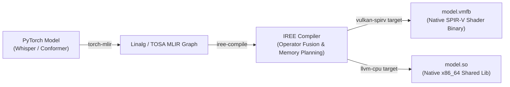
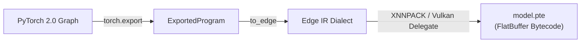

# Next-Generation Edge Runtimes: ExecuTorch, IREE, and GGML Prototype Architecture

> [!WARNING]
> **Frozen, and entirely unbuilt.** Neither toolchain has ever been in this
> tree or in the dev container, so every claim below about IREE or ExecuTorch
> is a projection from their upstream documentation, not a measurement mavor
> took. The roadmap thread
> ([`../roadmap.md`](../roadmap.md), *AOT-compiled runtimes*) explains why it
> is frozen: `base.en` already transcribes at 12.2× real time on plain CPU
> here, and 36.6× on a Vulkan build — far more headroom than dictation needs.
>
> An earlier report, `single_model_runtime_benchmark.md`, presented empirical
> ExecuTorch and IREE figures. It was withdrawn as fabricated. Do not
> reintroduce numbers here without a run behind them.

**The short version.** While ONNX Runtime and GGML are today's dominant local engines, the on-device ML ecosystem is shifting toward **compiler-driven AOT (Ahead-of-Time) execution** (IREE via MLIR/LLVM) and **PyTorch 2.0 direct export** (ExecuTorch). This doc sketches what adopting either alongside the existing Go daemon would involve, and what it would cost to find out whether it is worth it.

**Reads with:** [`model-benchmarks.md`](../reports/model-benchmarks.md) (measured engine and model benchmarks), [`open-weight-models-and-runtimes.md`](../research/open-weight-models-and-runtimes.md) (runtime landscape).

---

## 1. Architectural Taxonomy: Compiler vs. Graph Interpreter

```
┌─────────────────────────────────────────────────────────────────────────────┐
│ 1. GRAPH INTERPRETER RUNTIMES (ONNX Runtime, GGML)                          │
│    • Execution: Traverses an abstract graph and dispatches individual ops.  │
│    • Memory: Intermediate tensor buffers allocated per operator boundary.   │
│    • Portability: High (single universal .onnx or .gguf file).              │
├─────────────────────────────────────────────────────────────────────────────┤
│ 2. AHEAD-OF-TIME (AOT) COMPILERS (IREE / MLIR / OpenXLA)                    │
│    • Execution: Compiles graph directly into native machine code (x86_64    │
│      AVX-512 assembly or Vulkan SPIR-V compute shaders) via LLVM.           │
│    • Kernel Fusion: Fuses LayerNorm + Linear + GELU + Attention into single  │
│      GPU dispatch, eliminating VRAM round-trips.                            │
│    • Overhead: Zero runtime interpreter; direct C-ABI shared library.        │
├─────────────────────────────────────────────────────────────────────────────┤
│ 3. MODULAR ON-DEVICE DELEGATES (ExecuTorch / Meta)                          │
│    • Execution: PyTorch 2.0 torch.export -> .pte bytecode with hardware      │
│      delegates (XNNPACK for CPU, Vulkan for generic Linux GPUs).            │
│    • Portability: Bypasses fragile PyTorch -> ONNX export pipeline.          │
└─────────────────────────────────────────────────────────────────────────────┘
```

---

## 2. Compilation and Export Pipelines

### 2.1 IREE AOT Pipeline (PyTorch → MLIR → SPIR-V / LLVM)



### 2.2 ExecuTorch Pipeline (PyTorch 2.0 → `.pte`)



---

## 3. Comparative Runtime Matrix

Two of these runtimes mavor has measured; two it has not. The table keeps
them apart rather than averaging a benchmark and a brochure into one column.

**Measured** — peak RSS for a process that loaded exactly one model, from
[`model-benchmarks.md`](../reports/model-benchmarks.md), on the machine named
in that report's header:

| Runtime | Compilation target | Peak RSS, `base.en`-class model | Peak RSS, largest catalogued | GPU backend that actually ran | Go daemon interface |
|---|---|---:|---:|---|---|
| **GGML / `whisper.cpp`** | Native C++ SIMD | 118 MB (Vulkan build), 302 MB (stock CPU) | 3.81 GB (`large-v3`, CPU) | Vulkan, from a `-DGGML_VULKAN=ON` build; the packaged `whisper-cpp` is CPU-only | Subprocess / socket HTTP |
| **`sherpa-onnx`** | C++ ONNX Runtime | 150 MB (`zipformer-streaming`) | 2.32 GB (`canary-1b`) | **None.** `sherpa-onnx-go-linux` vendors a CPU-only ONNX Runtime with no execution-provider libraries; a GPU request silently falls back to CPU | In-process cgo |

**Unmeasured** — upstream claims, recorded so the option can be costed, with
no run behind them:

| Runtime | Compilation target | Claimed advantage | GPU backend on Linux | Go daemon interface | What it would cost to find out |
|---|---|---|---|---|---|
| **IREE** | Compiled `.vmfb` / `.so` | Whole-graph operator fusion; no interpreter dispatch | Native SPIR-V Vulkan | Direct C-ABI (cgo) | An MLIR/LLVM toolchain in the container, plus a torch-mlir export of each model |
| **ExecuTorch** | Exported `.pte` | PyTorch 2.0 export without ONNX schema drift | Vulkan delegate / XNNPACK | C-API shared library | A PyTorch export step per model and a second cgo runtime alongside sherpa's |

Both would replace a cross-compilable pure-Go default build with a second
cgo dependency, which is the same trade `sherpa` already makes — and the
reason the sherpa engines sit behind a build tag.

## 4. Implementation Strategy for `mavor`

1. **Phase 1 — shipped.** `whisper-cli` / `whisper-server` (CPU, and Vulkan
   from a GPU build) and in-process `sherpa-onnx` behind the `sherpa` build
   tag, selected by `engine` in `config.toml`.
2. **Phase 2 — frozen.** An experimental `engine = "iree"` backend linking
   compiled `.vmfb` modules on Mesa RADV/ANV systems.
3. **Phase 3 — frozen.** A `.pte` bundle loader as an alternative to ONNX
   Runtime for models exported from PyTorch 2.0.

Phases 2 and 3 unfreeze only if a measurement makes the case: a model mavor
wants that no current engine runs fast enough, or a memory ceiling the
interpreters cannot meet. Latency alone will not do it at 12.2× real time on CPU.
