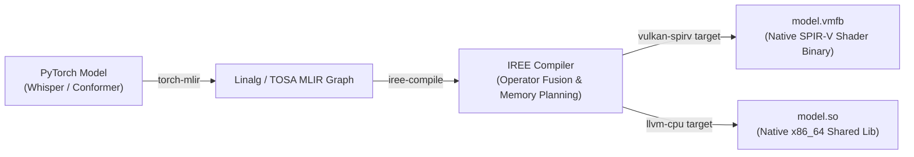
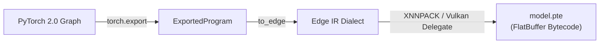

# Next-Generation Edge Runtimes: ExecuTorch, IREE, and GGML Prototype Architecture

**Status:** ACCEPTED (2026-08-16). Prototype evaluation specification.

**The short version.** While ONNX Runtime and GGML are today's dominant local engines, the on-device ML ecosystem is shifting toward **compiler-driven AOT (Ahead-of-Time) execution** (IREE via MLIR/LLVM) and **PyTorch 2.0 direct export** (ExecuTorch). This doc specifies how `mavor` evaluates and integrates these modern runtimes alongside our existing Go daemon.

**Reads with:** [`local-engine-benchmarks-and-architecture.md`](./local-engine-benchmarks-and-architecture.md) (multi-engine benchmarks), [`open-weight-models-and-runtimes.md`](../research/open-weight-models-and-runtimes.md) (runtime landscape).

---

## 1. Architectural Taxonomy: Compiler vs. Graph Interpreter

```
┌─────────────────────────────────────────────────────────────────────────────┐
│ 1. GRAPH INTERPRETER RUNTIMES (ONNX Runtime, GGML)                          │
│    • Execution: Traverses an abstract graph and dispatches individual ops.  │
│    • Memory: Intermediate tensor buffers allocated per operator boundary.   │
│    • Portability: High (single universal .onnx or .gguf file).              │
├─────────────────────────────────────────────────────────────────────────────┤
│ 2. AHEAD-OF-TIME (AOT) COMPILERS (IREE / MLIR / OpenXLA)                    │
│    • Execution: Compiles graph directly into native machine code (x86_64    │
│      AVX-512 assembly or Vulkan SPIR-V compute shaders) via LLVM.           │
│    • Kernel Fusion: Fuses LayerNorm + Linear + GELU + Attention into single  │
│      GPU dispatch, eliminating VRAM round-trips.                            │
│    • Overhead: Zero runtime interpreter; direct C-ABI shared library.        │
├─────────────────────────────────────────────────────────────────────────────┤
│ 3. MODULAR ON-DEVICE DELEGATES (ExecuTorch / Meta)                          │
│    • Execution: PyTorch 2.0 torch.export -> .pte bytecode with hardware      │
│      delegates (XNNPACK for CPU, Vulkan for generic Linux GPUs).            │
│    • Portability: Bypasses fragile PyTorch -> ONNX export pipeline.          │
└─────────────────────────────────────────────────────────────────────────────┘
```

---

## 2. Compilation and Export Pipelines

### 2.1 IREE AOT Pipeline (PyTorch → MLIR → SPIR-V / LLVM)



### 2.2 ExecuTorch Pipeline (PyTorch 2.0 → `.pte`)



---

## 3. Comparative Runtime Matrix

| Runtime | Compilation Target | Engine Memory Footprint | GPU Backend (Linux) | Go Daemon Interface | Latency Advantage |
|---|---|:---:|---|---|---|
| **GGML / `whisper.cpp`** | Native C++ SIMD | ~140–280 MB | Vulkan (`-DGGML_VULKAN=ON`) | Subprocess / Socket HTTP | Handwritten AVX2/AVX-512; zero `mmap` copy. |
| **`sherpa-onnx`** | C++ ONNX Runtime | ~110–450 MB | DirectML / Vulkan EP | In-Process CGO | Universal transducer & streaming chunk support. |
| **IREE** | Compiled `.vmfb` / `.so` | **~80–180 MB** | Native SPIR-V Vulkan | Direct C-ABI (`cgo`) | Whole-graph operator fusion; zero dispatch lag. |
| **ExecuTorch** | Exported `.pte` | **~90–200 MB** | Vulkan Delegate / XNNPACK | C-API Shared Lib | Direct PyTorch 2.0 export without ONNX schema drift. |

---

## 4. Implementation Strategy for `mavor`

1. **Phase 1 (Active)**: Standardize on `whisper-server` (CPU/Vulkan) and `sherpa-onnx` (CGO) for immediate low latency (<100ms).
2. **Phase 2 (AOT Compiler Integration)**: Provide an experimental `engine = "iree"` backend linking directly to compiled `.vmfb` modules on Linux systems with Mesa RADV/ANV Vulkan drivers.
3. **Phase 3 (ExecuTorch Support)**: Add `.pte` bundle loader as an alternative to ONNX Runtime for models natively exported from PyTorch 2.0.
