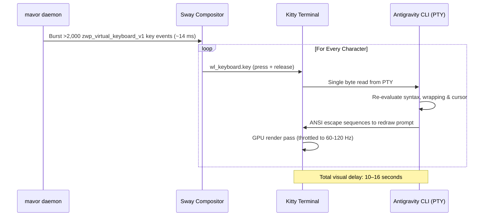

# Paste-Based Output Dispatch & Wayland Selection Architecture

**Status:** IN-REVIEW (2026-09-18). Design specification for replacing or augmenting virtual keystroke injection with native paste dispatch in Wayland environments, resolving terminal redraw lag, and managing clipboard/primary selection preservation.

**The short version.** `mavor` currently emits transcripts exclusively through synthetic keyboard events via `zwp_virtual_keyboard_v1`. For long utterances ($1,000+$ characters), sending thousands of sequential keydown/keyup events into a terminal running an interactive CLI (such as Antigravity in Kitty) forces the line editor to re-evaluate syntax, cursor wrapping, and line layouts on every single keystroke. At 60–120 FPS, this creates a 10–16 second visual "inching" delay. Emitting text via a paste chord wrapped in terminal **Bracketed Paste** renders the entire transcript in a single frame ($<15\text{ ms}$). However, a universal paste driver faces two complications: terminal emulators and GUI apps use conflicting paste chords (`Ctrl+Shift+V` vs. `Ctrl+V`), and Wayland maintains two distinct selection buffers (`CLIPBOARD` vs. `PRIMARY`). In Kitty, `Shift+Insert` defaults to pasting from `PRIMARY` while `Ctrl+Shift+V` pastes from `CLIPBOARD`. This document specifies active-application detection via Sway IPC, clipboard/primary restoration semantics, and diagnostic checks in `mavor doctor`.

**Reads with:** [`llm-oriented-model-selection.md`](./llm-oriented-model-selection.md) (model selection for agent prompts), [`how-mavor-works.md`](../reference/how-mavor-works.md) (internal daemon architecture), [`wayland-dictation-stack.md`](../research/wayland-dictation-stack.md) (Wayland input protocols).

---

## 1. The Output Problem: Synthetic Keystrokes vs. Terminal TUIs

In [`internal/output/native.go`](../../internal/output/native.go), `mavor` types text into the focused window through Wayland's `zwp_virtual_keyboard_v1` protocol:



### Why Pasting Eliminates the Delay
Terminal emulators support **Bracketed Paste Mode** (`\e[200~` ... `\e[201~`). When text is pasted:
1. The terminal emulator reads the clipboard buffer.
2. It wraps the entire block in bracketed paste markers and writes it to the PTY in a single chunk.
3. The interactive CLI detects the bracketed paste escape sequence, disables per-keystroke rendering, ingests the string, and triggers **a single screen redraw**.
4. The entire 1,000-character block appears on screen in $<15\text{ ms}$.

---

## 2. The Selection Landscape: Clipboard vs. Primary in Wayland

### Does Primary Selection Exist in Wayland?
Yes. While early Wayland specifications omitted the X11 primary selection, modern Wayland compositors (wlroots, Sway, Hyprland, and GNOME via `mutter`) implement the **`zwp_primary_selection_v1`** protocol.

In Wayland today, two independent buffers coexist:
- **`CLIPBOARD` Selection:** Populated by explicit user copy actions (`Ctrl+C`, `wl-copy`).
- **`PRIMARY` Selection:** Populated automatically whenever text is selected/highlighted with the cursor (`wl-copy --primary`).

### The Kitty Discrepancy: Why `Shift+Insert` Failed
A user attempting to paste `mavor`'s transcript in Kitty found that `Ctrl+Shift+V` worked, but `Shift+Insert` pasted stale text or nothing.

In Kitty's default key configuration:
- `ctrl+shift+v` $\to$ **`paste_from_clipboard`** (reads `CLIPBOARD`).
- `shift+insert` $\to$ **`paste_from_selection`** (reads `PRIMARY`).

`mavor`'s clipboard helper runs `wl-copy <text>`, which populates **`CLIPBOARD`** only. In GUI applications (browsers, editors), `Shift+Insert` is aliased to clipboard paste. In Kitty, it reads `PRIMARY`, which held whatever text was last selected with the mouse.

---

## 3. Preservation & Restoration of Existing Selections

A critical requirement when using clipboard-based paste dispatch is **playing nice with what the user already had copied**:
- A user dictating a prompt might be holding a sensitive URL or code snippet in their clipboard.
- Overwriting their clipboard or primary selection destructively on every utterance destroys that context.

### The Restoration Race Condition
As analyzed in [`wayland-dictation-stack.md`](../research/wayland-dictation-stack.md#16-clipboard-then-paste), restoring clipboard state has an inherent race condition:
1. Read existing selection ($S_{\text{old}}$).
2. Write transcript ($S_{\text{transcript}}$).
3. Inject paste chord.
4. Restore previous selection ($S_{\text{old}}$).

Because Wayland selection transfers are asynchronous and demand-driven (the target application requests data via a pipe only after receiving the paste chord), restoring $S_{\text{old}}$ too quickly can overwrite $S_{\text{transcript}}$ *before* the target application finishes reading it.

### The Dual-Invocation Challenge with `--paste-once`

When emitting to both `CLIPBOARD` and `PRIMARY` simultaneously, `--paste-once` encounters an **asymmetric consumption** problem:
- An application only consumes from **one** selection buffer per paste.
- In Kitty, `Shift+Insert` consumes `PRIMARY`. The `PRIMARY` instance of `wl-copy -o` serves the text and exits.
- The `CLIPBOARD` instance never receives a paste request. Without intervention, it would linger in the background indefinitely.
- Conversely, in a GUI browser, `Shift+Insert` consumes `CLIPBOARD`, leaving the `PRIMARY` instance orphaned.

### The "First-Exit Wins" Supervisor Pattern
`mavor` resolves this by running both invocations as foreground child processes (`-f -o`) under a concurrent supervisor:

```go
// Spawn both selection holders in the foreground with --paste-once:
cmdClip := exec.Command("wl-copy", "--foreground", "--paste-once", text)
cmdPrim := exec.Command("wl-copy", "--primary", "--foreground", "--paste-once", text)

done := make(chan string, 2)
go func() { cmdClip.Run(); done <- "clipboard" }()
go func() { cmdPrim.Run(); done <- "primary" }()

// Synthesize the paste chord:
virtualKeyboard.TypeChord("shift+insert")

// Wait for whichever buffer is consumed first:
select {
case winner := <-done:
    // One buffer was consumed; terminate the lingering sibling immediately:
    if winner == "clipboard" {
        _ = cmdPrim.Process.Kill()
    } else {
        _ = cmdClip.Process.Kill()
    }
case <-time.After(1 * time.Second):
    // Fallback timeout if window did not accept paste:
    _ = cmdClip.Process.Kill()
    _ = cmdPrim.Process.Kill()
}

// Restore pre-existing user selections:
restoreSelections(oldClipboard, oldPrimary)
```

This pattern ensures that:
1. Whichever buffer the target window reads, the data is delivered cleanly.
2. The unconsumed sibling process is terminated immediately with `SIGKILL`.
3. Pre-existing user selections are restored as soon as consumption finishes.
4. If a focused window ignores the chord, the 1-second timeout prevents indefinite hangs.

---

## 4. Universal Paste Architecture: Dual-Buffer Copy + `Shift+Insert`

Rather than requiring complex window sniffing upfront, `mavor`'s core paste strategy relies on a robust universal default:

1. **Default Paste Chord (`Shift+Insert`):**
   `Shift+Insert` is recognized natively across X11 and Wayland toolkits (GTK, Qt, Chromium, Electron, terminal emulators).
2. **Dual-Buffer Emission (`CLIPBOARD` + `PRIMARY`):**
   When paste dispatch is enabled, `mavor` copies the transcript to **both** selections using the First-Exit Wins supervisor above. Because `PRIMARY` is populated alongside `CLIPBOARD`, `Shift+Insert` in Kitty immediately receives the transcript without requiring the user to remap `kitty.conf`. In GUI applications, `Shift+Insert` reads `CLIPBOARD` and also succeeds.
3. **Contextual Routing Deferred:**
   Dynamic per-application detection (e.g. sniffing `app_id` via Sway IPC to choose between `Ctrl+Shift+V` and `Ctrl+V`, bypassing the dual-process supervisor entirely) is detailed in a dedicated specification: [`active-application-output-routing.md`](./active-application-output-routing.md).

---

## 5. Configuration Surface for Paste Dispatch

Users can configure the output driver, the paste chord, and the underlying copy utility:

```toml
[output]
# Output dispatch strategy: "typing" (default) | "paste"
driver = "paste"

# Keystroke chord synthesized to trigger a paste (default: "shift+insert")
paste_chord = "shift+insert"

# Custom copying command. Defaults to wl-copy with dual buffer support.
# Supports custom tools (e.g. xclip, pbcopy, custom scripts).
copy_command = ["wl-copy", "--type", "text/plain"]

# Automatically restore previous clipboard/primary selections after paste
restore_selection = true

# Also maintain transcription on clipboard after typing (legacy setting)
clipboard = true
```

---

## 6. Diagnostic Verification in `mavor doctor`

`mavor doctor` verifies the paste environment and warns about potential misconfigurations:

### Doctor Diagnostic Checks
1. **Wayland Selection Utilities:**
   - Checks that `wl-copy` and `wl-paste` exist on `PATH`.
   - Probes the compositor connection for `zwp_primary_selection_v1` protocol support.
2. **Terminal Configuration Check (Kitty):**
   - If Kitty is detected, inspects `~/.config/kitty/kitty.conf`.
   - Verifies whether `shift+insert` is bound to `paste_from_selection` (default) or `paste_from_clipboard`.
   - Notes that dual-buffer emission ensures compatibility even if unmapped.
3. **Single-Paste Consumption Test:**
   - Verifies that `wl-copy --paste-once` functions without blocking indefinitely.

---

## 7. Open Questions & Decision Ledger

### Open Questions

1. 💬 **OQ-PST1: Output driver configuration.** Should `mavor` introduce an explicit `driver` setting under `[output]`?

   <!-- vantage: oq id=OQ-PST1 leaning="Yes — support driver = 'typing' | 'paste' in config.toml, defaulting to 'typing' initially, with 'paste' opt-in." -->

   _Leaning:_ Yes — support `driver = "typing" | "paste"` in `config.toml`, defaulting to `"typing"` initially, with `"paste"` opt-in.

   **Answer:**
   > _(empty — fill in when decided)_

2. 💬 **OQ-PST2: Default clipboard restoration.** Should selection restoration (restoring what was previously copied after a paste) be enabled by default?

   <!-- vantage: oq id=OQ-PST2 leaning="Yes — preserving user clipboard state prevents dictation from destroying in-flight user data." -->

   _Leaning:_ Yes — preserving user clipboard state prevents dictation from destroying in-flight user data.

   **Answer:**
   > _(empty — fill in when decided)_

3. 💬 **OQ-PST3: Dual buffer population.** When `driver = "paste"`, should `mavor` populate both `CLIPBOARD` and `PRIMARY` simultaneously by default?

   <!-- vantage: oq id=OQ-PST3 leaning="Yes — populating both buffers makes Shift+Insert work universally in Kitty without requiring manual terminal remapping." -->

   _Leaning:_ Yes — populating both buffers makes `Shift+Insert` work universally in Kitty without requiring manual terminal remapping.

   **Answer:**
   > _(empty — fill in when decided)_

