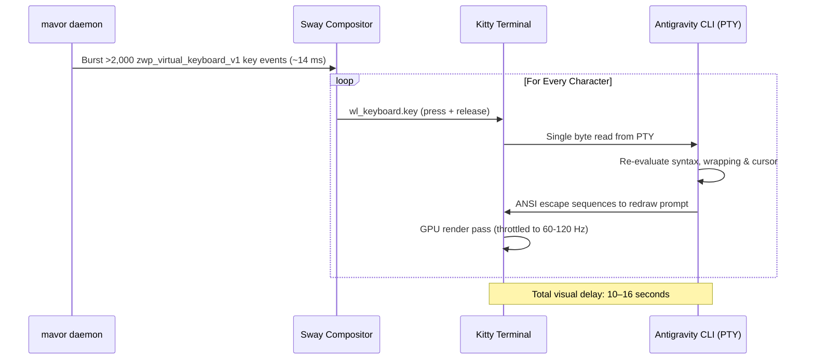
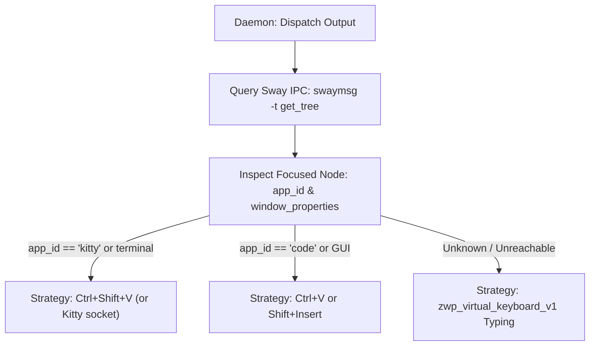

# Paste-Based Output Dispatch & Wayland Selection Architecture

**Status:** IN-REVIEW (2026-09-18). Design specification for replacing or augmenting virtual keystroke injection with native paste dispatch in Wayland environments, resolving terminal redraw lag, and managing clipboard/primary selection preservation.

**The short version.** `mavor` currently emits transcripts exclusively through synthetic keyboard events via `zwp_virtual_keyboard_v1`. For long utterances ($1,000+$ characters), sending thousands of sequential keydown/keyup events into a terminal running an interactive CLI (such as Antigravity in Kitty) forces the line editor to re-evaluate syntax, cursor wrapping, and line layouts on every single keystroke. At 60–120 FPS, this creates a 10–16 second visual "inching" delay. Emitting text via a paste chord wrapped in terminal **Bracketed Paste** renders the entire transcript in a single frame ($<15\text{ ms}$). However, a universal paste driver faces two complications: terminal emulators and GUI apps use conflicting paste chords (`Ctrl+Shift+V` vs. `Ctrl+V`), and Wayland maintains two distinct selection buffers (`CLIPBOARD` vs. `PRIMARY`). In Kitty, `Shift+Insert` defaults to pasting from `PRIMARY` while `Ctrl+Shift+V` pastes from `CLIPBOARD`. This document specifies active-application detection via Sway IPC, clipboard/primary restoration semantics, and diagnostic checks in `mavor doctor`.

**Reads with:** [`llm-oriented-model-selection.md`](./llm-oriented-model-selection.md) (model selection for agent prompts), [`how-mavor-works.md`](../reference/how-mavor-works.md) (internal daemon architecture), [`wayland-dictation-stack.md`](../research/wayland-dictation-stack.md) (Wayland input protocols).

---

## 1. The Output Problem: Synthetic Keystrokes vs. Terminal TUIs

In [`internal/output/native.go`](../../internal/output/native.go), `mavor` types text into the focused window through Wayland's `zwp_virtual_keyboard_v1` protocol:



### Why Pasting Eliminates the Delay
Terminal emulators support **Bracketed Paste Mode** (`\e[200~` ... `\e[201~`). When text is pasted:
1. The terminal emulator reads the clipboard buffer.
2. It wraps the entire block in bracketed paste markers and writes it to the PTY in a single chunk.
3. The interactive CLI detects the bracketed paste escape sequence, disables per-keystroke rendering, ingests the string, and triggers **a single screen redraw**.
4. The entire 1,000-character block appears on screen in $<15\text{ ms}$.

---

## 2. The Selection Landscape: Clipboard vs. Primary in Wayland

### Does Primary Selection Exist in Wayland?
Yes. While early Wayland specifications omitted the X11 primary selection, modern Wayland compositors (wlroots, Sway, Hyprland, and GNOME via `mutter`) implement the **`zwp_primary_selection_v1`** protocol.

In Wayland today, two independent buffers coexist:
- **`CLIPBOARD` Selection:** Populated by explicit user copy actions (`Ctrl+C`, `wl-copy`).
- **`PRIMARY` Selection:** Populated automatically whenever text is selected/highlighted with the cursor (`wl-copy --primary`).

### The Kitty Discrepancy: Why `Shift+Insert` Failed
A user attempting to paste `mavor`'s transcript in Kitty found that `Ctrl+Shift+V` worked, but `Shift+Insert` pasted stale text or nothing.

In Kitty's default key configuration:
- `ctrl+shift+v` $\to$ **`paste_from_clipboard`** (reads `CLIPBOARD`).
- `shift+insert` $\to$ **`paste_from_selection`** (reads `PRIMARY`).

`mavor`'s clipboard helper runs `wl-copy <text>`, which populates **`CLIPBOARD`** only. In GUI applications (browsers, editors), `Shift+Insert` is aliased to clipboard paste. In Kitty, it reads `PRIMARY`, which held whatever text was last selected with the mouse.

---

## 3. Preservation & Restoration of Existing Selections

A critical requirement when using clipboard-based paste dispatch is **playing nice with what the user already had copied**:
- A user dictating a prompt might be holding a sensitive URL or code snippet in their clipboard.
- Overwriting their clipboard or primary selection destructively on every utterance destroys that context.

### The Restoration Race Condition
As analyzed in [`wayland-dictation-stack.md`](../research/wayland-dictation-stack.md#16-clipboard-then-paste), restoring clipboard state has an inherent race condition:
1. Read existing selection ($S_{\text{old}}$).
2. Write transcript ($S_{\text{transcript}}$).
3. Inject paste chord.
4. Restore previous selection ($S_{\text{old}}$).

Because Wayland selection transfers are asynchronous and demand-driven (the target application requests data via a pipe only after receiving the paste chord), restoring $S_{\text{old}}$ too quickly can overwrite $S_{\text{transcript}}$ *before* the target application finishes reading it.

### The Fix: Single-Paste Delivery (`wl-copy --paste-once`)
`wl-copy` supports the `--paste-once` (`-o`) flag:
```bash
wl-copy --paste-once --type text/plain <transcript>
```
With `--paste-once`, the `wl-copy` process serves exactly one paste request to the focused window and immediately exits. By launching `wl-copy --paste-once` in a background worker, `mavor` can wait for the process to exit (confirming the paste was consumed) and immediately re-seed the previous selection $S_{\text{old}}$.

For the primary selection:
```bash
# Save existing primary selection:
old_primary=$(wl-paste --primary --no-newline 2>/dev/null)

# Set primary selection once:
wl-copy --primary --paste-once "$text"

# After paste completes, restore old primary selection:
if [ -n "$old_primary" ]; then
    printf "%s" "$old_primary" | wl-copy --primary
fi
```

---

## 4. Active Application Detection via Sway IPC

Because there is no single universal paste chord across all desktop environments (`Ctrl+Shift+V` in Kitty/Foot, `Ctrl+V` in GUI apps, `p` in Vim), `mavor` can query compositor state before dispatching.



### Detection Implementation
`mavor` connects to `$SWAYSOCK` and calls `swaymsg -t get_tree`. Traversal finds the node where `focused == true`:
- If `app_id` matches known terminals (`"kitty"`, `"foot"`, `"alacritty"`, `"wezterm"`):
  The daemon dispatches **`Ctrl+Shift+V`**.
- If `app_id` matches standard desktop apps (`"chromium"`, `"google-chrome"`, `"firefox"`, `"code"`):
  The daemon dispatches **`Ctrl+V`**.
- If the target window is in terminal Vim/Neovim (detectable via window title or process tree), or if compositor IPC fails:
  The daemon safely falls back to native virtual keyboard typing (`output.Native`).

---

## 5. Diagnostic Verification in `mavor doctor`

Rather than silently failing when a terminal or clipboard configuration is incompatible, `mavor doctor` should verify the environment:

### Proposed Doctor Checks
1. **Wayland Selection Protocols:**
   - Verify presence of `wl-copy` and `wl-paste`.
   - Verify `zwp_primary_selection_v1` support on the compositor connection.
2. **Terminal Configuration Check (Kitty):**
   - If Kitty is detected as the active terminal, inspect `~/.config/kitty/kitty.conf`.
   - Check if `shift+insert` is mapped to `paste_from_clipboard`.
   - If unmapped, print a diagnostic hint:
     ```text
     ℹ Terminal (Kitty): Shift+Insert is bound to primary selection by default.
       To paste transcripts with Shift+Insert, add to ~/.config/kitty/kitty.conf:
         map shift+insert paste_from_clipboard
     ```
3. **Clipboard Restoration Health:**
   - Verify that `wl-copy --paste-once` functions without hanging.

---

## 6. Open Questions & Decision Ledger

### Open Questions

1. 💬 **OQ-PST1: Output driver configuration.** Should `mavor` introduce an explicit `driver` setting under `[output]`?

   <!-- vantage: oq id=OQ-PST1 leaning="Yes — support driver = 'auto' | 'paste' | 'typing' in config.toml, defaulting to 'auto' (paste for terminals, typing fallback)." -->

   _Leaning:_ Yes — support `driver = "auto" | "paste" | "typing"` in `config.toml`, defaulting to `"auto"` (paste for terminals, typing fallback).

   **Answer:**
   > _(empty — fill in when decided)_

2. 💬 **OQ-PST2: Default clipboard restoration.** Should selection restoration (restoring what was previously copied after a paste) be enabled by default?

   <!-- vantage: oq id=OQ-PST2 leaning="Yes — preserving user clipboard state prevents dictation from destroying in-flight user data." -->

   _Leaning:_ Yes — preserving user clipboard state prevents dictation from destroying in-flight user data.

   **Answer:**
   > _(empty — fill in when decided)_

3. 💬 **OQ-PST3: Dual buffer population.** When `output.clipboard = true`, should `mavor` populate both `CLIPBOARD` and `PRIMARY` simultaneously?

   <!-- vantage: oq id=OQ-PST3 leaning="Populate both only when driver = 'paste' without active restoration, otherwise keep independent." -->

   _Leaning:_ Populate both only when `driver = "paste"` without active restoration, otherwise keep independent.

   **Answer:**
   > _(empty — fill in when decided)_
