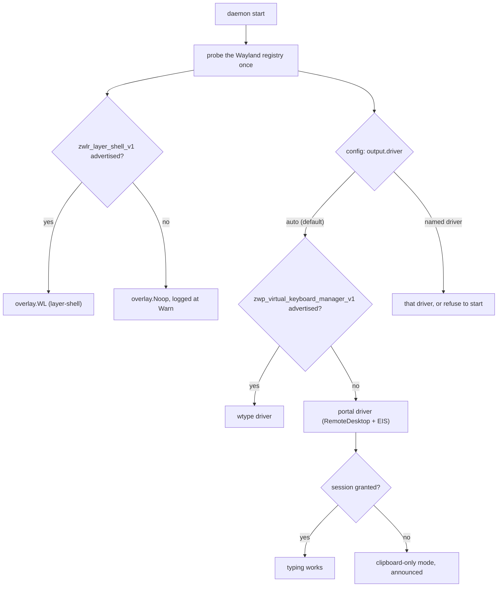

# GNOME is two ports, not one — and only one of them is worth doing

**Status:** DESIGN SKETCH, 2026-09-06. Nothing built. Every claim about mavor's
code was verified against `ca2d8ff` on 2026-09-06; every claim about the outside
world carries a link and the date I checked it.

**The short version.** mavor loses two things off wlroots: the HUD
(`wlr-layer-shell`) and the typing (`virtual-keyboard-v1`, via `wtype`). These
are not one problem — the typing is also missing on KDE, where the HUD works
fine, so the injection port buys two desktops and the HUD port buys one. My
recommendation is to build a second `output.Dispatcher` and **not** a GNOME HUD:
a HUD on GNOME can only be a GNOME Shell extension, which is a JavaScript
artifact on a six-month breakage cadence bought for a decoration. And I would
not start either until [OQ-GN2](#OQ-GN2) is answered, because the standards-blessed
injection route puts an **Allow Remote Interaction** dialog in front of the
user and nobody has shown me it can be made to stop.

**The most important section** is [§3.1](#31-injection--the-port-that-actually-matters):
everything else follows from whether text can be injected without a prompt.

**Reads with:** [`wayland-dictation-stack.md`](../research/wayland-dictation-stack.md)
(the standing research on injection mechanisms, hotkeys and the OSS dictation
field — this doc corrects one of its claims),
[`how-mavor-works.md`](../reference/how-mavor-works.md) (the seams as built, and
the failure-mode table this doc extends).

---

## 1. The verdict

**Do not port the HUD. Do port the typing — but not yet.**

Three facts drove that, in the order I found them.

**The injection problem is not a GNOME problem.** I assumed KDE was the cheap
win: KWin implements `wlr-layer-shell`, so the HUD is free there. It does
**not** implement `virtual-keyboard-unstable-v1` — KDE bug
[497774](https://bugs.kde.org/show_bug.cgi?id=497774) is the open tracker, with
502882 closed as a duplicate, and the reported symptom is `wtype` printing
"compositor does not support the virtual keyboard protocol", which is mavor's
exact failure (checked 2026-09-06). So the typing is broken on *everything that
is not wlroots*, and a second dispatcher is one piece of work that buys KDE and
GNOME together. The HUD, by contrast, is broken on GNOME alone.

**Both shipped GNOME dictation extensions gave up on injection.** Blurt
([extensions.gnome.org #6742](https://extensions.gnome.org/extension/6742/blurt/),
whisper.cpp-based, declares GNOME Shell 49 and lower) puts its transcript on the
clipboard and PRIMARY selection and tells the user to middle-click or press
Ctrl+V; its author says outright that he wanted to avoid simulating input
events. Speech2Text
([#8238](https://extensions.gnome.org/extension/8238/gnome-speech2text/),
declares 46–50) also only "copies the transcribed text into your clipboard".
Two of two, both living *inside the Shell process* where injection is easiest,
both declining to do it.

> [!IMPORTANT]
> Read that as a signal about *willingness*, not about difficulty. The
> mechanism is not hard and it is not missing: `ClutterVirtualInputDevice`
> exposes
> [`notify_keyval(time_us, keyval, key_state)`](https://mutter.gnome.org/clutter/class.VirtualInputDevice.html),
> reached from an extension through
> [`Clutter.Seat.create_virtual_device`](https://mutter.gnome.org/clutter/method.Seat.create_virtual_device.html)
> with a keyboard device type (both verified 2026-09-06). An extension can
> inject real keystrokes into the focused application on GNOME Wayland with no
> per-session prompt. Blurt's author says he *wanted to avoid* simulating input
> events — a design preference, plausibly about focus and safety, not a report
> that he tried and failed. Nobody should read this doc and conclude injection
> on GNOME is impossible. It is possible, it is prompt-free, and
> [§3.1](#31-injection--the-port-that-actually-matters) rates it as working. What it costs is a JavaScript add-on against an API GNOME has
> never promised to keep stable.

This also corrects
[`wayland-dictation-stack.md` §1.8](../research/wayland-dictation-stack.md#18-what-the-field-actually-uses-in-2026),
which lists Blurt as "injects via the Shell, no external tool". It does not.

**Every no-prompt route on GNOME costs something structural.** The portal route
prompts. The `ydotool` route is a root-equivalent, unscoped, unrevocable input
grant wired up by hand. The Shell-extension route asks the user to install a
JavaScript add-on that GNOME has never promised API stability for. The IBus
route changes what dictation *is* — the user selects an input method before
speaking. There is no version of this where the typing half is free.

One thing goes the other way, and it is worth saying before the document turns
gloomy: **push-to-talk is genuinely better on GNOME.** The GlobalShortcuts
portal delivers a real key-release signal, which is what sway's `bindsym
--release` has failed to do reliably since 2021
([§3.3](#33-the-hotkey--where-gnome-is-better-than-sway)). The hold-to-speak
interaction is the one part of the port that improves.

> [!IMPORTANT]
> The cheapest useful work in this whole document is not a port. It is making
> mavor **tell the truth on a desktop it does not support**. Today
> [`mavor doctor`](../../cmd/mavor/doctor.go#L416) checks that
> `$WAYLAND_DISPLAY` is set and that `wtype` is on `$PATH`. Neither is a test
> of what the compositor implements, so on GNOME `doctor` reports every check
> green, the daemon starts, the overlay quietly falls back to `Noop`, and every
> dictation fails to type while the clipboard silently absorbs the evidence.
> That is a bug on the platform mavor already claims, and it is
> [§5.1](#51-the-failure-that-exists-today).

---

## 2. Testing the claim in `AGENTS.md`

[`AGENTS.md`](../../AGENTS.md) says, of `audio.Recorder`, `speech.Transcriber`,
`overlay.Overlay` and `output.Dispatcher`:

> …four independent interfaces, and only the last two are Wayland-specific.
> Porting is a matter of implementing those, not of restructuring.

**Verdict: two-thirds true, and the missing third is the interesting part.**

### 2.1 Where the claim holds

The four interfaces are real, small, and where the claim says they are:

| Interface | Declared at | Wayland in it? |
| :--- | :--- | :--- |
| `audio.Recorder` | [`internal/audio/audio.go#L25`](../../internal/audio/audio.go#L25) | No |
| `speech.Transcriber` | [`internal/speech/speech.go#L22`](../../internal/speech/speech.go#L22) | No |
| `overlay.Overlay` | [`internal/overlay/overlay.go#L41`](../../internal/overlay/overlay.go#L41) | No — `Show`/`SetLevel`/`SetText`/`Close`, no protocol in the signatures |
| `output.Dispatcher` | [`internal/output/output.go#L21`](../../internal/output/output.go#L21) | No — one method, `Emit(ctx, text) error` |

The overlay split is genuinely good work and it is the reason the HUD port is
*small* rather than *absent*: [`internal/overlay/paint.go`](../../internal/overlay/paint.go)
is a pure function from a `Scene` to an RGBA image using `golang.org/x/image`,
with no compositor anywhere in it, and
[`internal/overlay/overlay_wl.go`](../../internal/overlay/overlay_wl.go) is the
only file that speaks the protocol. A second backend inherits the pixels.

`internal/wayland` is Linux-only —
[`shm.go#L22`](../../internal/wayland/shm.go#L22) calls `unix.MemfdCreate` —
but that sits *below* the overlay seam and is irrelevant here: GNOME is Linux.

### 2.2 Where the claim fails — three findings

**Finding 1: the hotkey is not behind any seam, because it is not in the
program.** Push-to-talk is two lines of compositor configuration —
`bindsym $mod+grave exec mavor start` and `bindsym --release $mod+grave exec
mavor stop` ([`README.md`](../../README.md#L151)). The release half is
`sway`-family syntax. GNOME's custom-shortcut system has no release event, so
hold-to-talk — mavor's headline interaction — has *nowhere to be implemented*
by writing a Go interface, because there is no Go interface. It is the one
required capability the four seams do not cover. There is a good answer for it
on GNOME, and it is a new subsystem rather than a new implementation:
[§3.3](#33-the-hotkey--where-gnome-is-better-than-sway).

**Finding 2: there is no backend concept to select between.**
[`overlay.NewDefault`](../../internal/overlay/factory.go#L16) returns `NewWL`
unconditionally, and `runDaemon` constructs `output.NewWayland()` by name
([`cmd/mavor/main.go`](../../cmd/mavor/main.go#L219)). The only runtime choice
today is the overlay's fallback to `Noop` when the connection fails.
Adding a second implementation of two seams means adding the *chooser*, which
does not exist. That is small, but it is restructuring rather than
implementing, and it has to be designed once for both seams — see
[§4.2](#42-selection-per-seam-not-per-desktop).

**Finding 3: `output.Wayland` welds two independent drivers together.**
[`Emit`](../../internal/output/output.go#L64) runs `wtype` **and** `wl-copy` on
every call and joins the errors. On a non-wlroots compositor the first half is
dead and the second half is *degraded*: without `wlr-data-control`,
`wl-clipboard` falls back to briefly mapping a tiny transparent surface, and its
own manual warns that a compositor which does not focus that surface makes
`wl-clipboard` **hang**
([wl-clipboard(1)](https://man.archlinux.org/man/wl-clipboard.1.en), checked
2026-09-06; Mutter has never implemented `wlr-data-control`,
[mutter#524](https://gitlab.gnome.org/GNOME/mutter/-/work_items/524)). A GNOME
dispatcher therefore has to re-implement *both* halves, not swap one. The seam
is in the right place; the implementation behind it is two things wearing one
coat.

### 2.3 Linux, but not GNOME — the assumptions that do not matter here

Four Linux-specific things live below the seams. I checked each, and **none of
them break on GNOME**, because GNOME is Linux. Saying so explicitly is the
point; leaving it silent would let a reader assume the port is larger than it is.

| Assumption | Where | On GNOME |
| :--- | :--- | :--- |
| Ducking shells to `pactl`/`wpctl` | [`internal/audio/ducking.go`](../../internal/audio/ducking.go) | Fine — GNOME runs PipeWire with the same PulseAudio-compatible tooling |
| Capture shells to `parec` | [`internal/audio/audio.go#L50`](../../internal/audio/audio.go#L50) | Fine, same reason |
| A systemd user unit | [`cmd/mavor/service_cmd.go#L10`](../../cmd/mavor/service_cmd.go#L10) | Fine — and better: `PartOf=graphical-session.target` is exactly how GNOME sessions are modelled |
| journald for `mavor logs` | [`cmd/mavor/logs_cmd.go#L47`](../../cmd/mavor/logs_cmd.go#L47) | Fine |
| XDG paths, and `/sys/devices/system/cpu/*/topology/core_id` for the thread default | [`internal/config/config.go#L451`](../../internal/config/config.go#L451) | Fine, and it already degrades to `runtime.NumCPU()` on a kernel that does not publish topology |

The one below-seam item that *is* GNOME-relevant is `wl-copy`, covered in
finding 3 above and in [§5.2](#52-degenerate-cases).

### 2.4 The compositor matrix — who is actually affected

Checked 2026-09-06. This is the table the README's supported list should
eventually become, because "not GNOME" is not the right shape: the two
protocols fail independently.

| Compositor | `wlr-layer-shell` (HUD) | `virtual-keyboard-v1` (typing) | mavor today |
| :--- | :--- | :--- | :--- |
| sway, Hyprland, river, Wayfire, niri, labwc | Yes | Yes | Works |
| COSMIC | Yes | Yes | Should work; nobody has run it |
| **KDE Plasma (KWin)** | **Yes**, via the `layer-shell-qt` implementation ([KDE/layer-shell-qt](https://github.com/KDE/layer-shell-qt)) | **No** ([KDE bug 497774](https://bugs.kde.org/show_bug.cgi?id=497774)) | HUD works; nothing is ever typed |
| **GNOME (Mutter)** | **No** | **No** | Neither |

Mutter's two layer-shell tracking issues are both **closed without adoption**:
[mutter#973](https://gitlab.gnome.org/GNOME/mutter/-/issues/973) (opened
2019-12-14) and
[gnome-shell#1141](https://gitlab.gnome.org/GNOME/gnome-shell/-/issues/1141)
(opened 2019-04-04, last touched 2026-07-30). The would-be upstream successor,
`ext-layer-shell-v1`, is
[wayland-protocols MR !28](https://gitlab.freedesktop.org/wayland/wayland-protocols/-/merge_requests/28)
and is **still marked Draft** with open design questions. I could not read the
closing comments on either GNOME issue or the current state of MR !28 — see
[§8](#8-what-i-could-not-confirm). Plan on this never landing; if it lands, this
whole document becomes a two-week task instead of a product decision.

> [!NOTE]
> One naming drift, noticed while checking: `AGENTS.md` and
> [`how-mavor-works.md`](../reference/how-mavor-works.md) both say
> `output.Dispatcher`, which is the real symbol, but
> [`docs/user-guide.md`](../user-guide.md#L58) still draws `output.Emitter` in
> its architecture diagram. Nothing depends on it; it is worth one character of
> somebody's time.

---

## 3. The three GNOME-shaped problems

### 3.1 Injection — the port that actually matters

Five mechanisms exist. I care about exactly one property: **does the user see a
permission dialog, and how often.** A dictation tool that needs a click before
it can type is a different product from one you hold a key and talk into.

| Mechanism | Prompt | Privilege cost | Reaches arbitrary apps | Verdict |
| :--- | :--- | :--- | :--- | :--- |
| RemoteDesktop portal + libei | **Yes, at least once per session** | None | Yes | The standards answer, and the reason this doc has an open question |
| `ydotool` / `uinput` | Never | Root-equivalent, systemwide, unrevocable | Yes | The escape hatch, opt-in only |
| GNOME Shell extension + Clutter virtual device | Once, at install | Full Shell-process trust | Yes | Works, and drags the HUD port along with it |
| AT-SPI2 `EditableText.InsertText` | Never | None | Only where the widget implements it | Unproven; worth an experiment, not a plan |
| IBus input-method engine | Never after a one-time setup | None | Only apps with an active text-input | Changes the product |

**The portal route.** `org.freedesktop.portal.RemoteDesktop` is at interface
version 2 and carries both `NotifyKeyboardKeysym` and, since v2, `ConnectToEIS`,
which hands back a file descriptor for a
[libei](https://gitlab.freedesktop.org/libinput/libei) session so events stop
going over D-Bus one at a time
([portal docs](https://flatpak.github.io/xdg-desktop-portal/docs/doc-org.freedesktop.portal.RemoteDesktop.html)).
Portal-side libei integration has been in `xdg-desktop-portal` since 1.17
(2023); Mutter shipped emulated-input support in 45 and reworked it after
libei's API moved, with GNOME 46 the practical baseline. libei itself is at
1.6.0 in Arch as of this research.

The permission story is where it comes apart. `SelectDevices` takes a
`persist_mode` — 0 none, 1 while running, 2 until revoked — and a granted
session returns a `restore_token`, which is **single-use**: you must store the
newly-issued token after every restore
([spec](https://github.com/flatpak/xdg-desktop-portal/blob/main/data/org.freedesktop.portal.RemoteDesktop.xml),
[issue 850](https://github.com/flatpak/xdg-desktop-portal/issues/850)). In
practice the token is invalidated when the screen locks, and each locked attempt
burns it, dropping the app back to the dialog. GNOME's own maintainers have said
on [discourse](https://discourse.gnome.org/t/persistent-remote-desktop-access-api/19415)
that the RemoteDesktop portal is designed around a local user approving each
connection and that genuinely persistent access needs a different architecture
entirely — a privileged service and a GDM-authenticated agent, not a portal
flag. The dialog reads **Allow Remote Interaction**, and
[xdg-desktop-portal-gnome#114](https://gitlab.gnome.org/GNOME/xdg-desktop-portal-gnome/-/issues/114)
is an open report of it firing spontaneously and often.

I could not find anyone who has tested the exact case mavor needs — keyboard
only, no screen capture, `persist_mode=2`, surviving a daemon restart and a
lock on a current GNOME. That gap is [OQ-GN2](#OQ-GN2), and it is the closure
question for this whole document.

There is no maintained Go binding. `github.com/bnema/libei-go-bindings` is at
v0.1.0, published 2025-06-15, and is cgo over the C library. Since `7e52f94`
mavor's build is cgo unconditionally (see
[`docs/roadmap.md` §2](../roadmap.md#2-up-next-)), so cgo is no longer the
objection it was when
[`wayland-dictation-stack.md` §1.7](../research/wayland-dictation-stack.md#17-what-an-ime-based-approach-would-actually-buy)
was written — a pre-1.0 third-party binding on the critical path still is.

**`ydotool`.** Works everywhere because it is beneath the compositor: the
kernel's `uinput`. Since v1.0.0 it requires the `ydotoold` daemon, and access is
granted by a udev rule plus `input`-group membership, or by a root daemon with a
loosened socket mode
([upstream README](https://github.com/ReimuNotMoe/ydotool)). Whatever can reach
that socket can synthesize any input on the system, with no scoping and no
revocation — a strictly coarser grant than the dialog it avoids. It also emits
raw evdev scancodes and does not know the active keyboard layout, so a
non-US layout gets wrong characters unless the caller does its own mapping. My
position: ship it as a named, opt-in fallback the user chooses in config, never
as a default, and never as something `mavor setup` wires up for them.

**AT-SPI2.** `EditableText.InsertText` needs no prompt and no privilege, and
the accessibility bus is up on GNOME regardless. What I could not establish is
coverage: which toolkits actually implement `EditableText` rather than read-only
`Text`, and how terminals and Electron behave. The claim that real dictation
tools use it does not survive checking — `nerd-dictation` types via `xdotool`
or `ydotool`, and Talon does not support Wayland at all. GTK's AccessKit
migration does not change the near term: GTK 4.18 has an AccessKit backend but
it supersedes AT-SPI only on Windows and macOS, with Linux still on AT-SPI
([GTK a11y update, 2025-05-12](https://blogs.gnome.org/gtk/2025/05/12/an-accessibility-update/)).
Treat this as a cheap experiment — insert into ten apps, count — not a design.

**IBus.** Real and shipping: Vocalinux and
[IBus-Speech-To-Text](https://github.com/PhilippeRo/IBus-Speech-To-Text) both
register an engine and use `commit_text`, which is atomic and dodges every
keystroke-garbling problem. The cost is that the user selects mavor as their
input method to dictate and switches away to type normally, and a user with a
CJK IME cannot have both. That is a different product; I am not proposing it,
and I am recording it so the option is re-openable.

**Dead ends, for the record.** `org.gnome.Shell.Eval` has been gated behind
Mutter's `unsafe-mode` since GNOME 42 and is not available to a normal session.

### 3.2 The HUD — the port I do not think is worth doing

On GNOME a Wayland client cannot position its own window, full stop. Asked
directly whether a GTK4 window can be made always-on-top programmatically, a
GNOME developer's answer was *"No: there isn't a programmatic way to manipulate
the window stack, by design"*
([discourse](https://discourse.gnome.org/t/any-way-to-set-window-always-on-top-programmatically/31579)).
`gtk4-layer-shell` does not help — its own README lists GNOME-on-Wayland as
unsupported, because it is a binding over the protocol Mutter does not have.
Notifications cannot substitute: GNOME Shell's developers state plainly that
apps cannot update the content of a notification they already sent
([shell-dev, 2024-04-23](https://blogs.gnome.org/shell-dev/2024/04/23/notifications-46-and-beyond/)),
and the Shell keeps only an app's three most recent, so a waveform is not merely
impractical, it is unexpressible.

That leaves two things people actually do.

**The fullscreen-transparent-window hack.** Ulauncher does this on GNOME: map a
full-screen transparent toplevel and draw the real UI centered inside it. Their
own [discussion](https://github.com/Ulauncher/Ulauncher/discussions/1350)
records the costs — it blocks scrolling the windows underneath and it trips
dash-to-dock's autohide. For a launcher that is on screen for two seconds while
you type at it, that is survivable. mavor's HUD is on screen *while you dictate
into another window* and must never take focus or eat input. A fullscreen
surface is the exact opposite of that requirement. **Rejected.**

**A GNOME Shell extension.** This is the pattern that ships. Extensions run
inside the Shell process on its own Clutter scene graph, which is how GNOME
draws its own OSD and how third parties draw things like the
[Screen Share Warning](https://extensions.gnome.org/extension/9196/screen-share-warning/)
banner. It works, it never steals focus, and — the reason it keeps coming up —
the same extension can also inject text via
[`Clutter.Seat.create_virtual_device`](https://mutter.gnome.org/clutter/method.Seat.create_virtual_device.html),
which is the mechanism GNOME's own on-screen keyboard uses. One artifact solves
both problems with no portal and no prompt.

The price is a JavaScript component with its own release train. GNOME ships
every March and September
([handbook](https://handbook.gnome.org/release-planning.html)); GNOME 50 is
current as of this writing and 51 is due within weeks. Review guidelines forbid
claiming support for unreleased Shell versions, so every release is a
resubmission at minimum. GNOME 45's move to ES modules broke *every* pre-45
extension outright ([GNOME's own post](https://blogs.gnome.org/shell-dev/2023/09/02/extensions-in-gnome-45/));
46 through 50 have mostly been metadata bumps, but "mostly" is doing work there
and no stable extension API is promised. Review rules also shape the design:
D-Bus is the sanctioned way for an extension to talk to a background process,
spawning binaries is "strongly discouraged", and `Gtk`/`Adw` cannot be imported
inside the Shell — so none of mavor's Go painting code can be reused. The HUD
would be **redrawn in JavaScript against St/Clutter**, and
[`paint.go`](../../internal/overlay/paint.go) — the thing that made the HUD port
look cheap — buys nothing.

That is the whole argument. A second painter, in a second language, on somebody
else's six-month cadence, for a status indicator. **My recommendation: on GNOME,
mavor ships with `overlay.Noop` and says so.** Dictation works without a HUD;
that is already the documented fallback when layer-shell is missing
([`factory.go`](../../internal/overlay/factory.go#L13-L15)). If an extension is
built anyway it should be built for injection, with the HUD as a bonus that
rides along — not the reverse.

### 3.3 The hotkey — where GNOME is better than sway

Push-to-talk is the one capability that is not behind any of the four
interfaces, because mavor has no hotkey code at all: the compositor's config
execs `mavor start` and `mavor stop`, and `--release` is `sway`-family syntax.

GNOME's own keybinding system cannot do it. Custom shortcuts live in
`org.gnome.settings-daemon.plugins.media-keys.custom-keybinding` and fire a
command on **press only**; the open request for a release trigger is
[gnome-shell#2838](https://gitlab.gnome.org/GNOME/gnome-shell/-/issues/2838),
whose reporter wants exactly push-to-talk, and it has not shipped.

But the portal can, and this is the one place where the port makes mavor
*better*. `org.freedesktop.portal.GlobalShortcuts` emits **`Activated` on key
down and `Deactivated` on key up**
([spec](https://flatpak.github.io/xdg-desktop-portal/docs/doc-org.freedesktop.portal.GlobalShortcuts.html)),
which is hold-to-talk expressed properly at the protocol level. Compare what
mavor asks sway users to live with: `bindsym --release` has been unreliable
since 2021 — press any other key before releasing and the stop binding never
fires, which for dictation is a common accident, not an exotic one
([`wayland-dictation-stack.md` §3.1](../research/wayland-dictation-stack.md#31-sway-does-give-you-key-release--the-premise-needs-correcting)).
A portal `Deactivated` signal has no such failure mode.

| | `bindsym --release` (today) | GlobalShortcuts portal |
| :--- | :--- | :--- |
| Available on | wlroots compositors | GNOME 48+ (March 2025), KDE Plasma 6+, Hyprland's own backend — **not** `xdg-desktop-portal-wlr` ([issue 240](https://github.com/emersion/xdg-desktop-portal-wlr/issues/240)) |
| Press and release | Yes, with a known race | Yes, `Activated` / `Deactivated` |
| Who picks the key | The user, in a text file | The user, in Settings → Apps → mavor → Global Shortcuts |
| Survives a daemon restart | N/A — the compositor holds it | The session does not; the app re-binds each start. The **user's key assignment does** persist, keyed by app id and shortcut id |
| Permission | None | A one-time dialog on first bind, remembered in the portal permission store |

Three consequences worth having in the design rather than discovering:

- **The keybinding leaves the config file.** On GNOME there is no
  `bindsym` line to paste into a README; the app declares a shortcut *id* and a
  description and the user assigns a key in Settings. mavor cannot claim a
  default key. That is a documentation and onboarding change, not a code one,
  and it is the kind of difference that makes this a second product.
- **mavor grows a subsystem it does not have.** Receiving `Activated` and
  `Deactivated` means the daemon becomes a D-Bus portal client with its own
  session, on top of the Unix-socket IPC it already serves. The CLI path stays
  — `mavor start` still works — so this is additive, but it is a fifth external
  surface and it belongs to nobody's interface. See [OQ-GN6](#OQ-GN6).
- **GNOME 50 has a live regression here.** Recent `xdg-desktop-portal` requires
  a non-sandboxed app to call `org.freedesktop.host.portal.Registry.Register`
  with its app id before the portal will talk to it; apps that skipped the
  handshake broke, Electron among them
  ([electron#51875](https://github.com/electron/electron/issues/51875)). mavor
  is a non-sandboxed app, so this is not somebody else's bug — it is a
  requirement to implement, and evidence that the portal client surface moves.

A GNOME Shell extension is the alternative and does not need the portal: Mutter
exposes `META_KEY_BINDING_TRIGGER_RELEASE` on `Meta.KeyBindingFlags`, documented
as notifying on release in addition to press
([reference](https://mutter.gnome.org/meta/flags.KeyBindingFlags.html)). One
more capability that arrives only with the extension, and one more reason the
extension question in [OQ-GN5](#OQ-GN5) is really "does mavor become a GNOME
component".

---

## 4. The shape, if it is built

### 4.1 One backend, or several

**Several — one per seam, chosen independently.** A single "GNOME backend"
object cannot express the matrix in [§2.4](#24-the-compositor-matrix--who-is-actually-affected):
KDE needs the wlroots HUD and a non-wlroots dispatcher *at the same time*. Any
design that couples the two produces a KDE user with a working HUD and no
typing, or forces a KDE-specific third backend for no reason.

So the unit of selection is the seam, and the question each seam asks is about a
capability, never about a desktop name.

**Capability probe** *(coined here)* — a startup test of what this compositor
actually implements, as opposed to what `$XDG_CURRENT_DESKTOP` claims it is. Not
a desktop-environment sniff, and not a `$PATH` check for a helper binary: both
of those are the mistakes `mavor doctor` makes today.

The overlay's probe already exists in all but name.
[`wayland.Connect`](../../internal/wayland/protocol.go#L112) does a registry
roundtrip and returns a named error when `zwlr_layer_shell_v1` is not
advertised. Exposing "which globals did this compositor offer" is the whole
mechanism.

### 4.2 Selection, per seam, not per desktop



The rules the diagram implies, stated so they are not guessed at:

- **Trigger.** Once, at daemon start, before the IPC socket is served. Not
  per dictation, not on a timer. A compositor cannot gain a global mid-session.
- **The probe is the authority, `$XDG_CURRENT_DESKTOP` is not.** A user on a
  patched Mutter, or on something nobody has heard of, gets the right answer.
- **Default: `auto`.** A named driver in config is a *request*, not a hint — the
  same rule the preview model already follows in
  [`how-mavor-works.md`](../reference/how-mavor-works.md) — so a named driver
  that cannot start stops the daemon with an error that names it. `auto` never
  stops the daemon.
- **One writer.** Exactly one dispatcher instance exists for the process
  lifetime, constructed during selection. Nothing re-selects, and nothing else
  may construct one — otherwise two portal sessions race for the same seat.
- **Clipboard is not a driver, it is a floor.** Every dispatcher copies, always,
  as `output.Wayland` does today. "Clipboard-only mode" is the state where the
  injection half is known-absent and mavor says so out loud, not a silent
  degradation.
- **Forbidden:** the daemon must never prompt for permission outside a
  dictation, must never retry a denied portal session automatically, and must
  never enable a `uinput` driver that the user did not name in config.

The configuration surface this implies is one key, and it belongs in the
existing `[advanced]` table rather than a new one — the same table that already
holds the placement overrides:

```toml
[advanced]
# How transcribed text reaches the focused window.
#   "auto"     — probe the compositor, pick wtype or the portal (default)
#   "wtype"    — virtual-keyboard-v1; fails to start where it is absent
#   "portal"   — RemoteDesktop + EIS; consent-gated
#   "uinput"   — ydotool; needs a systemwide input grant you set up yourself
#   "clipboard" — copy only, never inject
output_driver = "auto"
```

Five values, `auto` the default, and no numeric knobs — the only timing value
in the design is the per-emit deadline in [§5.2](#52-degenerate-cases), which is
a constant rather than a setting until somebody produces a machine where 3 s is
wrong.

### 4.3 If the extension is built anyway

Should [OQ-GN5](#OQ-GN5) come back "yes", the shape is constrained by GNOME's
review rules rather than by taste: the extension owns a small D-Bus interface,
the Go daemon is the client, and the extension never spawns anything. The
ownership inversion is worth stating plainly, because it is the thing that makes
this a second product: **the extension owns the pixels and the seat; mavor owns
the audio and the model.** mavor stops being the process that draws and types
and becomes a service the Shell calls into. Its version compatibility is then
GNOME's, not ours.

---

## 5. Failure paths, degenerate cases, and what the user sees

### 5.1 The failure that exists today

On GNOME, right now, at `ca2d8ff`:

1. `mavor doctor` reports every check green. `checkWayland` finds
   `$WAYLAND_DISPLAY`; `checkWtype` finds the binary
   ([`doctor_cmd.go#L416`](../../cmd/mavor/doctor.go#L416),
   [`#L444`](../../cmd/mavor/doctor.go#L444)). Neither asks the compositor
   anything.
2. The daemon starts. `overlay.NewDefault` fails, is caught, and falls back to
   `Noop` with a Warn ([`main.go#L211`](../../cmd/mavor/main.go#L211)). No HUD,
   and no error the user is looking at.
3. Every dictation records, transcribes, and then `wtype` exits non-zero. The
   joined error is logged at **Warn and swallowed** —
   [`daemon.go#L590`](../../internal/daemon/daemon.go#L590) explicitly continues
   the cycle — and `reportError`, the only path that shows the error pill, is
   never reached.

So the user sees nothing: no HUD, no error, no text. The transcript is on the
clipboard and in the history log, which is the design working as intended, but
nothing tells them to look there. **Any GNOME work must fix this first, because
it is also the failure mode of every new dispatcher.** The design rule: a
dispatcher whose injection half fails must reach the user, not only the log —
via the HUD's `Error` visual where a HUD exists, and via a `doctor` check that
tests the compositor's capabilities rather than `$PATH`.

### 5.2 Degenerate cases

- **`wl-copy` hangs.** Under a compositor without `wlr-data-control`,
  `wl-clipboard`'s transparent-surface fallback can hang if the surface is not
  focused ([§2.2](#22-where-the-claim-fails--three-findings), finding 3).
  `Emit` is called with the *daemon-lifetime*
  context — there is no per-dictation timeout at
  [`daemon.go#L590`](../../internal/daemon/daemon.go#L590) — and the FSM
  transition to `Idle` happens only after `Emit` returns. A hung `wl-copy`
  therefore wedges the daemon in `Transcribing` until it is killed. **Every
  dispatcher gets a bounded per-emit deadline; my default is 3 s**, on the
  grounds that a successful emit is tens of milliseconds today and anything
  past a second is already a failure the user is staring at.
- **No portal at all.** An old or absent `xdg-desktop-portal` means
  `ConnectToEIS` is missing. Treated as "driver unavailable": under `auto`,
  clipboard-only mode with a Warn; under a named driver, refuse to start.
- **Portal permission denied.** The user clicked Deny. Do **not** retry: enter
  clipboard-only mode for the process lifetime, log once, and say it in
  `mavor status`. Retrying a denied consent dialog is how a tool teaches people
  to hate it.
- **Portal session revoked mid-session.** The token is burned, or the screen
  locked and the session died. The first failing emit demotes to clipboard-only
  and shows the error visual. A new session is requested only when the user
  asks — a `mavor doctor --fix` or a restart — never from the dictation path,
  because a permission dialog appearing while you are talking into another
  window steals the focus the whole design protects.
- **X11 session, or GNOME on Xorg.** Out of scope as a target
  ([§6](#6-non-goals)) and increasingly moot: GNOME 50 dropped the X11 session
  entirely ([release notes](https://release.gnome.org/50/)). The daemon should
  detect `$WAYLAND_DISPLAY` unset and refuse with a message that says X11 is
  not supported, rather than the current "no Wayland session detected", which
  reads like a misconfiguration.
- **Shell extension disabled by a Shell upgrade.** If the extension is the
  dispatcher, the user upgrades GNOME on Tuesday and mavor stops typing on
  Wednesday with no message. The D-Bus name simply does not appear. Selection
  must treat "the name is not on the bus" as a first-class outcome that
  degrades to clipboard-only *and says which extension is missing and which
  Shell version it declared*.
- **Two dispatchers.** Cannot arise: one is constructed at startup and nothing
  re-selects ([§4.2](#42-selection-per-seam-not-per-desktop)).

---

## 6. Non-goals

- **X11 or XWayland as targets.** Not "later" — not at all. GNOME 50 removed
  the X11 session.
- **macOS and Windows.** A sibling document covers macOS.
- **Any change to `audio.Recorder` or `speech.Transcriber`.** They are portable
  and this port does not touch them.
- **Preedit, inline partial text at the cursor, or an IME product.** Recorded in
  [§3.1](#31-injection--the-port-that-actually-matters) and rejected here for
  the same reasons
  [`wayland-dictation-stack.md` §1.7](../research/wayland-dictation-stack.md#17-what-an-ime-based-approach-would-actually-buy)
  rejected it.
- **Shipping anything to `extensions.gnome.org`.** If an extension is written,
  publishing and maintaining a listing there is separate work with a separate
  decision.
- **Patching Mutter.** A community layer-shell patch exists; asking users to run
  a patched compositor is not a port.
- **A generic plugin system.** Two backends per seam is a `switch`, not an
  architecture.

---

## 7. Risks

| # | Risk | Mitigation |
| :--- | :--- | :--- |
| R1 | The portal prompts every session and the product is unusable on GNOME | Answer [OQ-GN2](#OQ-GN2) with an experiment *before* writing a dispatcher. This risk is the reason the sequencing in [§9](#9-what-i-would-build-in-order) starts with a spike |
| R2 | A GNOME release breaks the extension and mavor silently stops typing | Selection treats a missing D-Bus name as a named failure, not silence ([§5.2](#52-degenerate-cases)); pin and test one Shell version per release |
| R3 | The only Go libei binding is v0.1.0 third-party cgo | Prefer D-Bus `NotifyKeyboardKeysym` for a first cut — slower per event, no new dependency — and adopt EIS only if latency demands it |
| R4 | `ydotool` types the wrong characters on a non-US layout | Opt-in only, and `doctor` warns when the driver is `uinput` and the layout is not `us` |
| R5 | `wl-copy` wedges the FSM on a non-wlroots compositor | The per-emit deadline in [§5.2](#52-degenerate-cases). This is a bug on the current platform too |
| R6 | Testing needs a second harness — headless `gnome-shell --headless --virtual-monitor` and a portal screenshot path, since `grim` is `wlr-screencopy` and works nowhere else | Accept a smaller GNOME suite: capability probe and dispatcher behaviour under unit tests, one manual screenshot per release |
| R7 | The extension becomes the product and mavor becomes its backend | Named in [§4.3](#43-if-the-extension-is-built-anyway) so it is chosen rather than discovered |
| R8 | The portal client surface moves under us — GNOME 50 already requires non-sandboxed apps to call `Registry.Register` before portals will answer, which broke apps that skipped it | Implement the registration from the first commit, and treat "the portal refused us" as a named startup outcome rather than an unexpected error |

---

## 8. What I could not confirm

Stated so nobody reads confidence into a gap:

- Whether a keyboard-only RemoteDesktop session with `persist_mode=2` actually
  survives a daemon restart and a screen lock on current GNOME. The signal says
  fragile; I found no clean test either way. This is [OQ-GN2](#OQ-GN2).
- The closing rationale on
  [mutter#973](https://gitlab.gnome.org/GNOME/mutter/-/issues/973) and
  [gnome-shell#1141](https://gitlab.gnome.org/GNOME/gnome-shell/-/issues/1141),
  and what the 2026-07-30 activity on the latter was.
- Whether `ext-layer-shell-v1` has moved since being filed as Draft.
- The exact Plasma version that first shipped layer-shell, and direct
  confirmation from KWin's own tracker that `virtual-keyboard-v1` is still
  absent in 2026 rather than only that the bug is open.
- Which toolkits implement AT-SPI `EditableText` in practice, and whether any
  shipping dictation tool uses it.
- Whether Mutter honours `_NET_WM_STATE_ABOVE` for XWayland clients. Moot for a
  GNOME 50 target, and I did not test it.
- A quantified figure for GNOME 45 extension breakage — the sources say "every
  extension", none give a count.
- Which `xdg-desktop-portal` release first shipped `GlobalShortcuts` as stable
  spec, and which Mutter release introduced `TRIGGER_RELEASE`. The GNOME
  *backend* landing in 48 is well attested; the two version numbers underneath
  it are not.
- Whether GNOME re-shows the one-time GlobalShortcuts consent dialog after a
  Shell restart or a long gap. The permission store is meant to remember it; I
  found no statement of when it forgets.

---

## 9. What I would build, in order

Nothing here is a ticket; it is the order the risk comes off.

**First, and regardless of whether GNOME ever happens: stop lying.** Make the
capability probe real, have `doctor` report what the compositor implements
rather than what is on `$PATH`, surface a failed injection to the user instead
of to the log, and give `Emit` a deadline. That is four small changes to the
platform mavor already supports, it fixes [§5.1](#51-the-failure-that-exists-today),
and every later step needs it.

**Second, a spike, not a feature.** A throwaway program that opens a
RemoteDesktop session with `persist_mode=2`, keyboard only, types a word,
then restarts, locks the screen, and tries again. The answer to
[OQ-GN2](#OQ-GN2) is the gate on everything after this, and it is a day.

**Third, the second dispatcher** — portal-driven, D-Bus keysyms before EIS —
selected by capability. Land it on **KDE first**, where the HUD already works
and the only missing piece is exactly this, so the dispatcher is exercised on a
desktop where success is visible.

**Fourth, GNOME without a HUD.** Same dispatcher, `overlay.Noop`, and the
GlobalShortcuts client so push-to-talk survives the move
([OQ-GN6](#OQ-GN6)) — shipped toggle-only if that question comes back no. This
is the release where GNOME leaves the "not supported" list and enters a
"supported, without the pill" one.

**Only then**, and only if there is demand for it, the extension —
for injection first, with the HUD riding along.

---

## 10. Open Questions

1. 💬 **OQ-GN1: Is GNOME a target at all?** Everything in this document costs a
   second implementation of something. The evidence that the field has given up
   on injection here ([§1](#1-the-verdict)) is strong enough that "no, and say
   so clearly in the README" is a defensible product answer. This decides
   whether anything past step one of [§9](#9-what-i-would-build-in-order)
   happens.

   <!-- vantage: oq id=OQ-GN1 leaning="Not yet — do the truth-telling work on the current platform, then reconsider when someone actually asks for GNOME." -->

   _Leaning:_ Not yet. Step one of [§9](#9-what-i-would-build-in-order) is worth
   doing on its own merits; the rest waits for a person who wants it.

   **Answer:**
   > _(empty — fill in when decided)_

2. 💬 **OQ-GN2: Can the portal be made to stop asking?** Does a keyboard-only
   RemoteDesktop session with `persist_mode=2` survive a daemon restart and a
   screen lock on current GNOME without a second dialog? If yes, the portal
   dispatcher is the whole port. If no, GNOME dictation requires either the
   root-equivalent `uinput` grant or a Shell extension, and the product on that
   desktop is materially different. **This is the closure question** — no other
   decision here is worth making before it.

   <!-- vantage: oq id=OQ-GN2 leaning="Assume no until a spike proves otherwise — GNOME's maintainers say persistent unattended access is out of the portal's scope, and the restore token is invalidated by the screen lock." -->

   _Leaning:_ Assume no. The maintainers' own position and the single-use
   token both point that way, but this is exactly the kind of claim that
   deserves a day of experiment rather than a citation.

   **Answer:**
   > _(empty — fill in when decided)_

3. 💬 **OQ-GN3: Does `uinput` ship as a supported driver?** A `ydotool` driver
   works on every desktop and needs no prompt, at the cost of asking the user to
   grant a systemwide, unrevocable input capability. Shipping it makes GNOME
   work today; shipping it also means mavor's install instructions contain
   `usermod -aG input`. This decides whether [OQ-GN2](#OQ-GN2) coming back "no"
   is fatal or merely ugly.

   <!-- vantage: oq id=OQ-GN3 leaning="Yes, but opt-in only and never wired up by `mavor setup` — the user types the udev rule themselves, having read what it grants." -->

   _Leaning:_ Yes as a named, opt-in driver; no as a default, and `mavor setup`
   never configures it.

   **Answer:**
   > _(empty — fill in when decided)_

4. 💬 **OQ-GN4: On a compositor that cannot type, does the daemon start?**
   Today it starts and silently fails forever. The alternatives are refusing to
   start, or starting in an announced clipboard-only mode. This changes
   behaviour on the *current* platform too, since it is the same code path as a
   missing `wtype`.

   <!-- vantage: oq id=OQ-GN4 leaning="Start, in an announced clipboard-only mode — refusing to start punishes the user for the compositor, and the transcript is still recoverable." -->

   _Leaning:_ Start, but loudly: a startup warning, a `doctor` failure, and the
   mode named in `mavor status`.

   **Answer:**
   > _(empty — fill in when decided)_

5. 💬 **OQ-GN5: Do we own a GNOME Shell extension?** It is the only thing that
   can draw the HUD and the only no-prompt injection path that is not a
   systemwide privilege grant — and it is JavaScript in this repository, on
   GNOME's six-month cadence, with review turnaround outside our control. Says
   whether "GNOME support" ever includes the pill.

   <!-- vantage: oq id=OQ-GN5 leaning="No. A second painter in a second language on someone else's release train, for a status indicator, is the worst trade in this document." -->

   _Leaning:_ No — and if it is ever yes, it is for injection, with the HUD as
   a side effect.

   **Answer:**
   > _(empty — fill in when decided)_

6. 💬 **OQ-GN6: Does mavor grow a hotkey subsystem?** The GlobalShortcuts
   portal is the only way push-to-talk exists on GNOME, and it makes the daemon
   a D-Bus portal client with a session, an app-id registration and a settings
   panel it does not control
   ([§3.3](#33-the-hotkey--where-gnome-is-better-than-sway)). It buys nothing on
   the compositors mavor supports today, because
   `xdg-desktop-portal-wlr` does not implement it. The alternative is accepting
   toggle-only on GNOME and saying so. This decides whether "compositor
   keybindings, not our problem" — the standing position in
   [`wayland-dictation-stack.md` §3.2](../research/wayland-dictation-stack.md#32-the-options-ranked)
   — survives contact with a desktop that has no such keybindings.

   <!-- vantage: oq id=OQ-GN6 leaning="Yes, but only alongside the GNOME dispatcher — and it is opt-in, because it buys nothing on wlroots and the CLI path has to keep working unchanged." -->

   _Leaning:_ Yes, if GNOME happens at all — a dictation tool you have to press
   twice is not the product. But it lands with the dispatcher, not before it,
   and the CLI path stays the only thing wlroots users ever touch.

   **Answer:**
   > _(empty — fill in when decided)_

---

## 11. Decision Ledger

No decisions are settled yet; this document is a sketch and every question above
is live. The table is here so the first ruling has somewhere to land.

| ID | Ruling / Decision | Date | Settled in |
| :--- | :--- | :--- | :--- |
| — | — | — | — |
