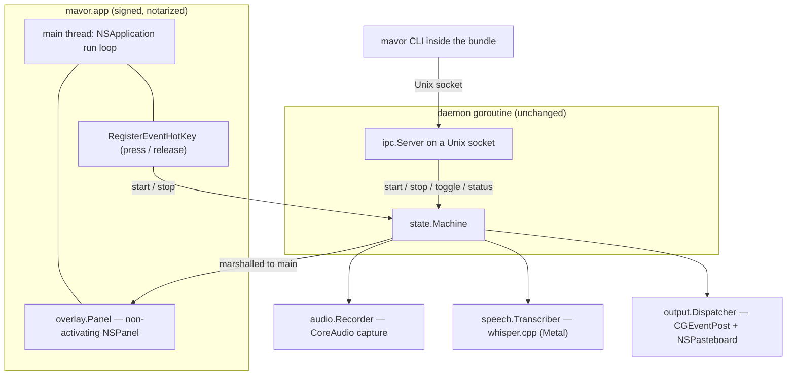

# macOS is not a fifth compositor

**Status:** DESIGN SKETCH, 2026-09-06. Nothing built. Every claim about the
tree was verified against `62db92c` on 2026-09-06; every claim about macOS
carries a link, and [§13](#13-what-i-could-not-confirm) lists what I could not
check because I have no Mac in this container.

**The short version.** [`../../AGENTS.md`](../../AGENTS.md) says porting is "a
matter of implementing those, not of restructuring." For a second wlroots
compositor that is true. **For macOS it is not**, and the reason is not the
seams — it is what sits below and around them. One file (`memfd`) blocks the
build; eight Linux assumptions live below the interfaces with nothing in front
of them; AppKit demands the process's main thread, which the daemon currently
hands to nobody; there is no compositor config file, so the keybind that drives
the whole product has to move *inside* mavor; and macOS keys permission to a
code signature, which on current macOS makes a bare CLI binary effectively
un-grantable. **My verdict: this is a bigger job than it looks, and the honest
shape of it is not "a macOS backend" but "a second product" — a signed,
notarized `.app` that happens to contain the same daemon.** I would not start
it until someone has decided they want to own an Apple Developer Program
membership and a per-release notarization step, forever.

**The most important section is
[§3](#3-three-macos-facts-that-reshape-the-product)** — the three platform
facts that turn this from a port into a repackaging. Everything in
[§4](#4-the-proposed-shape) falls out of them.

**Reads with:**
[`../reference/how-mavor-works.md`](../reference/how-mavor-works.md) (the seams
this doc tests, and the one authority on what mavor is),
[`configuration-surface.md`](configuration-surface.md) (the cgo ruling and the
thread/provider defaults this doc has to re-derive for Apple hardware),
[`../roadmap.md`](../roadmap.md) (where this thread is parked),
[`porting-to-gnome.md`](porting-to-gnome.md) (the sibling port question — a
different desktop, but the same test of the same claim).

---

## 1. The verdict

**P1. The four-interface claim is half true, and the false half is the
expensive half.** Writing `audio.Recorder`, `speech.Transcriber`,
`overlay.Overlay` and `output.Dispatcher` for macOS is real work but ordinary
work — a few thousand lines of cgo against documented Apple APIs. The work that
is *not* ordinary is everything the interfaces do not cover:
[§2.3](#23-below-the-seam-eight-linux-assumptions-with-no-interface-in-front-of-them)
counts eight platform dependencies with no seam in front of them, and
[§3](#3-three-macos-facts-that-reshape-the-product) counts three platform facts
that change the artifact mavor ships as.

**P2. On macOS the artifact is an `.app`, not a binary.** This is the ruling
everything else depends on. macOS's permission subsystem identifies a program
by its code signature and, in the Accessibility case, will not reliably show a
path-identified (non-bundled) program in System Settings at all
([§3.1](#31-tcc-keys-permission-to-a-signature-and-a-bare-binary-is-barely-addressable)).
A dictation tool whose entire job is to type into other applications cannot
ship as something the user is unable to authorize.

**P3. The keybind is a feature now, not a footnote.** On Linux the compositor
owns it: two lines in a sway config, zero code in mavor
([`../quickstart.md`](../quickstart.md)). macOS has no such file. Either mavor
registers a global hotkey itself — new code, a new run loop, a new failure mode
— or it ships without the interaction that defines it
([§3.3](#33-there-is-no-compositor-config-file-the-keybind-moves-inside)).

**P4. Ship whisper.cpp first on macOS, not sherpa.** The default engine's own
dependency contradicts it: the ONNX Runtime vendored for `darwin/arm64` in the
module mavor pins declares a minimum OS of **macOS 26.5**
([§6.2](#62-the-vendored-onnx-runtime-sets-the-macos-floor-at-265-on-apple-silicon)),
which would make mavor's default configuration refuse to launch on every Mac
older than a few months. whisper.cpp has none of that problem and gets Metal by
default.

**P5. Do not start this to "prove the architecture is portable."** It is a real
port with a real recurring cost — a $99/yr membership, a notarization step on
every release, and a permission surface that re-prompts whenever the signature
changes ([§7](#7-distribution-and-what-it-costs-every-release)). Start it
because someone wants to dictate on a Mac.

> [!NOTE]
> **This doc's scope is macOS only.** Whether mavor should support desktops
> that are not wlroots at all is a different question with a different answer,
> because a non-wlroots Linux desktop shares mavor's process model, its paths,
> its packaging and its permission model — none of which macOS shares.

---

## 2. What the code actually says today

Verified 2026-09-06 against `62db92c`, in this container, with the Go toolchain
targeting `darwin/arm64`.

### 2.1 Exactly one file blocks the build

`GOOS=darwin GOARCH=arm64 go vet` over every package except
[`internal/wayland`](../../internal/wayland) is **clean**. The whole failure is
six identifiers in one function:

```console
$ GOOS=darwin GOARCH=arm64 CGO_ENABLED=0 go vet ./internal/wayland/
internal/wayland/shm.go:22:18: undefined: unix.MemfdCreate
internal/wayland/shm.go:22:52: undefined: unix.MFD_CLOEXEC
internal/wayland/shm.go:22:69: undefined: unix.MFD_ALLOW_SEALING
internal/wayland/shm.go:35:47: undefined: unix.F_ADD_SEALS
internal/wayland/shm.go:35:65: undefined: unix.F_SEAL_SHRINK
internal/wayland/shm.go:35:84: undefined: unix.F_SEAL_GROW
```

`allocShared` in
[`internal/wayland/shm.go#L22`](../../internal/wayland/shm.go#L22) uses
`memfd_create` plus file sealing to hand the compositor a buffer it can map. It
is the right call on Linux and it has no darwin analogue.

**This is not the interesting fact, and it is worth saying why.** The tree
carries **no platform build tags at all** — the only `//go:build` lines in
mavor's own source are `integration` and `e2e` on test files. Nothing selects
an implementation by `GOOS`; there is no `_linux.go` suffix anywhere. So the
fix is not "guard `shm.go`". The fix is that a platform axis has to be
introduced to a codebase that has never had one, and every seam listed below
grows a second implementation behind it at the same time.

### 2.2 The five seams, and what each needs on macOS

[`../reference/how-mavor-works.md`](../reference/how-mavor-works.md#the-seams)
names five, not the four in [`../../AGENTS.md`](../../AGENTS.md) —
`audio.Ducker` is a seam too. Line references verified 2026-09-06:

| Seam | Declared at | Linux implementation | What macOS needs |
| :--- | :--- | :--- | :--- |
| `audio.Recorder` | [`internal/audio/audio.go#L25`](../../internal/audio/audio.go#L25) | a `parec` child writing 16 kHz mono s16le WAV | capture plus **a resampler mavor does not have today** — macOS will not hand you 16 kHz ([§5.7](#57-audio-capture-is-not-a-like-for-like-swap)) — and a microphone grant with two different denial behaviors ([§5.1](#51-permission-states-and-the-failure-path-for-each)) |
| `audio.Ducker` | `internal/audio/ducking.go` | `CommandDucker` shelling `pactl`/`wpctl` | **nothing** — macOS exposes no supported per-application volume control; the macOS build gets `NoopDucker` ([§5.2](#52-degenerate-cases-and-what-each-one-does)) |
| `speech.Transcriber` | [`internal/speech/speech.go#L22`](../../internal/speech/speech.go#L22) | `whisper-cli`, supervised `whisper-server`, or in-process sherpa-onnx | mostly portable — see [§6](#6-inference-on-apple-hardware) for the two things that are not |
| `overlay.Overlay` | [`internal/overlay/overlay.go#L41`](../../internal/overlay/overlay.go#L41) | `overlay.WL`, a `wlr-layer-shell` surface | a non-activating `NSPanel`, which brings a main-thread requirement the interface cannot express ([§3.2](#32-appkit-owns-the-main-thread-and-so-does-the-hotkey)) |
| `output.Dispatcher` | [`internal/output/output.go#L21`](../../internal/output/output.go#L21) — the symbol is **`Dispatcher`**, not the `Emitter` [`../../AGENTS.md`](../../AGENTS.md) names | `wtype` then `wl-copy`, always both | `CGEventPost` with a Unicode payload, plus `NSPasteboard` — and the narrow `PostEvent` grant that gates the first half |

Two things about that table are good news and worth stating plainly, because
the rest of this doc is not:

- **The painter is already portable.** `overlay.Render(Scene) (*image.RGBA,
  error)` in [`internal/overlay/paint.go#L281`](../../internal/overlay/paint.go#L281)
  is a pure function with no compositor in it — pill, waveform, preview text,
  fonts, gradients, all of it. A macOS overlay reuses every pixel of it and
  writes only the ~200 lines that put an `*image.RGBA` into a window.
- **The IPC layer is already portable.** [`internal/ipc`](../../internal/ipc)
  is `net.Listen("unix", …)` and JSON. It needs a directory that does not exist
  yet on macOS ([§2.3](#23-below-the-seam-eight-linux-assumptions-with-no-interface-in-front-of-them))
  and nothing else.

**But the seams are not wired as seams.** [`cmd/mavor/main.go#L210-L221`](../../cmd/mavor/main.go#L210-L221)
constructs `audio.NewParecRecorder`, `output.NewWayland()` and
`overlay.NewDefault` **by name**. Only the overlay has a factory
([`internal/overlay/factory.go`](../../internal/overlay/factory.go)), and it
chooses between one backend and a `Noop`. So "implement the interface" is
preceded by "build the selection layer that would let a second implementation
be chosen at all", in four packages.

### 2.3 Below the seam: eight Linux assumptions with no interface in front of them

**Below the seam** *(coined here)* — a platform dependency reached by code that
is not behind one of mavor's five interfaces, and therefore not addressed by
implementing them. Not the same as a *seam implementation*, which is the
tractable half of this port; and not a mere packaging detail, because each of
these changes program behavior rather than build inputs.

| # | Where | The assumption | What macOS wants |
| :--- | :--- | :--- | :--- |
| 1 | [`cmd/mavor/service_cmd.go#L10`](../../cmd/mavor/service_cmd.go#L10) | writes a **systemd** user unit to `~/.config/systemd/user/mavor.service` and drives `systemctl --user` | a launchd `LaunchAgent` plist in `~/Library/LaunchAgents`, with `launchctl bootstrap`/`bootout` — and a hard question about whether launchd is the right owner at all ([§3.1](#31-tcc-keys-permission-to-a-signature-and-a-bare-binary-is-barely-addressable)) |
| 2 | [`cmd/mavor/logs_cmd.go#L47`](../../cmd/mavor/logs_cmd.go#L47) | prefers **journald** via `journalctl`, falling back to the log file | `log show --predicate` against the unified log, or accept the file-only path macOS already falls back to |
| 3 | [`internal/config/config.go#L491`](../../internal/config/config.go#L491) | **XDG** paths throughout: `~/.config`, `~/.cache`, `~/.local/share`, `~/.local/state` | `~/Library/Application Support`, `~/Library/Caches`, `~/Library/Logs` — and a decision about honoring `XDG_*` anyway when set |
| 4 | [`internal/config/config.go#L470`](../../internal/config/config.go#L470) | physical-core count read from `/sys/devices/system/cpu/cpu*/topology/core_id` | `sysctl hw.perflevel0.physicalcpu` — and on Apple Silicon this is a *behavior* change, not a portability nicety ([§6.4](#64-the-thread-default-is-wrong-on-apple-silicon-not-merely-unportable)) |
| 5 | [`internal/config/config.go#L512`](../../internal/config/config.go#L512) | socket lands in `$XDG_RUNTIME_DIR`, else `/tmp/mavor-<uid>` — **and nothing creates that directory** | macOS never sets `XDG_RUNTIME_DIR`, so the first `mavor daemon` on a Mac fails in `net.Listen` on a missing directory. The fix is `$TMPDIR` (per-user on macOS) created `0700`, because `/tmp` is shared and the socket accepts dictation commands and returns transcripts |
| 6 | [`cmd/mavor/gpu.go#L107`](../../cmd/mavor/gpu.go#L107) | probes GPU backends by parsing **`ldd`** output, against markers for `cuda`/`vulkan`/`rocm`/`sycl` | `otool -L`, and a `metal` marker — with no metal entry, `doctor` on a Metal build reports no GPU |
| 7 | [`cmd/mavor/doctor.go#L220-L330`](../../cmd/mavor/doctor.go#L220-L330) | checks `WAYLAND_DISPLAY`, `parec`, `wtype`, `wl-copy`; `--fix` shells `pacman`/`apt`/`dnf` under `sudo` | a wholly different check list — the permission states in [§5.1](#51-permission-states-and-the-failure-path-for-each) are what a macOS `doctor` is *for* — and `brew` |
| 8 | [`cmd/mavor-bench/worker.go#L127`](../../cmd/mavor-bench/worker.go#L127) | `peakKB = int64(ru.Maxrss)` | `Maxrss` is **kilobytes on Linux and bytes on Darwin**. Every peak-memory number in a macOS benchmark run would be 1024× too large, silently, in a generated report. [`cmd/mavor-bench/machine.go#L56`](../../cmd/mavor-bench/machine.go#L56) reads `/proc/cpuinfo` and `/proc/meminfo` and already degrades to empty |

Number 8 is the shape of this whole category: nothing crashes, nothing is
caught by a test, and a published table is wrong by three orders of magnitude.

> [!WARNING]
> Packaging carries the same pattern.
> [`../../scripts/sherpa-libs.sh`](../../scripts/sherpa-libs.sh) hardcodes the
> module `sherpa-onnx-go-linux`, the triple `x86_64-unknown-linux-gnu` and the
> `.so` suffix. [`../../.goreleaser.yaml`](../../.goreleaser.yaml) sets
> `-r $ORIGIN:$ORIGIN/../lib`, which is an ELF `RUNPATH` concept; Mach-O wants
> `@loader_path` and `install_name_tool` — and the sherpa module's own darwin
> build files bake `${SRCDIR}`, the **module cache path on the build machine**,
> in as the rpath, so a binary linked against them starts on no other Mac until
> that is rewritten. The `brews:` block installs `wtype` and `wl-clipboard` as
> dependencies and prints a caveat naming sway. None of that is behind a seam
> either.

---

## 3. Three macOS facts that reshape the product

### 3.1 TCC keys permission to a signature, and a bare binary is barely addressable

**TCC** — Apple's Transparency, Consent and Control subsystem, the database and
daemon that gates microphone, Accessibility, Input Monitoring and similar.
Field-standard Apple terminology; the mechanism is described in
[HackTricks' macOS TCC reference](https://hacktricks.wiki/en/macos-hardening/macos-security-and-privilege-escalation/macos-security-protections/macos-tcc/index.html).

**"Accessibility" is three services wearing one name**, and mavor needs the
narrowest of them. Apple's Developer Technical Support says so directly: posting
events "uses its own privilege… while this privilege shows up in the UI as
System Settings > Privacy & Security > Accessibility, it doesn't give you
complete accessibility access. It's just limited to posting events", and
`tccutil` carries separate `Accessibility`, `ListenEvent` and `PostEvent`
services ([Apple Developer Forums](https://developer.apple.com/forums/thread/789896),
and the [service-name list](https://developer.apple.com/forums/thread/679303)).

| What mavor would do | TCC service | Where the user grants it |
| :--- | :--- | :--- |
| type the transcript (`CGEventPost`) | `PostEvent` | Accessibility — a post-only grant |
| tap keys for a hotkey (`CGEventTap`) | `ListenEvent` | Input Monitoring |
| read the accessibility tree (`AXUIElement*`) | `Accessibility` | Accessibility |

mavor needs the first row. It needs the second **only if** it owns the hotkey
via an event tap ([§3.3](#33-there-is-no-compositor-config-file-the-keybind-moves-inside)),
and it needs the third never. That is worth knowing before writing a `doctor`
check that asks for more than the product uses.

**The microphone is a fourth grant and the strictest of them.**
`NSMicrophoneUsageDescription` is not advisory — Apple says a capture API used
without a reachable usage description means "the system terminates your app"
([requesting authorization to capture
media](https://developer.apple.com/documentation/avfoundation/requesting-authorization-to-capture-and-save-media),
[on macOS](https://developer.apple.com/documentation/bundleresources/requesting-authorization-for-media-capture-on-macos)).
And unlike Accessibility, the Microphone pane has **no "+" button**: an
application appears there only after it has asked, so a program that cannot ask
cannot be granted, and even device management "can't be given in a profile; it
can only be denied"
([Apple's TCC profile schema](https://github.com/apple/device-management/blob/release/mdm/profiles/com.apple.TCC.configuration-profile-policy.yaml)).
There is no manual repair for a microphone grant that never happened.

Three properties of TCC then hurt, in order:

**A grant is attached to an identity, and a bare binary's identity is its
path.** TCC rows carry a `client_type`: `0` for a bundle identifier, `1` for a
file path. A CLI binary gets `1`. On **macOS 26.1**, a path-identified client
that requests Accessibility creates the database row *and does not appear in
System Settings → Privacy & Security → Accessibility*, so the user has no
supported way to approve it; the reported workaround is a third-party `tccutil`
with SIP filesystem protections disabled
([yabai #2688](https://github.com/koekeishiya/yabai/issues/2688) — yabai is the
closest possible analogue: a CLI daemon whose whole function needs
Accessibility). This is the single fact that decides
[P2](#1-the-verdict).

**The grant does not even belong to the process that asked for it.** TCC
attributes a request to the *responsible process*: Apple's stated goal is that
when a helper triggers a prompt, "the app's name and usage description appear in
the alert" and "the user's decision is recorded for the whole app, not that
specific helper tool" ([Apple Developer
Forums](https://developer.apple.com/forums/thread/678819)). For a binary
launched from a terminal, the responsible process is **the terminal** — which is
why CLI tools using these APIs instruct the user to grant Accessibility to
Terminal.app or iTerm rather than to the tool
([`axcli`](https://github.com/andelf/axcli)), and why a Developer ID-signed CLI
with an embedded `Info.plist` can still get `false` from `AXIsProcessTrusted`
when run from a shell ([Apple Developer
Forums](https://developer.apple.com/forums/thread/750905)).

**launchd makes it worse, not better.** A binary started from a LaunchAgent is
seen as bundle-id-less, and reports of daemons denied protected access despite
an approved prompt are long-standing ([Apple Developer Forums: full disk access
from a launchd daemon](https://developer.apple.com/forums/thread/661178), [how
TCC relies on the bundle ID](https://developer.apple.com/forums/thread/698337),
and a practitioner write-up at [TCC launchd
woes](https://nunn.au/2023/11/28/tcc-launchd-woes)); the documented remedy is an
`AssociatedBundleIdentifiers` key pointing the daemon at a bundle. So
[§2.3](#23-below-the-seam-eight-linux-assumptions-with-no-interface-in-front-of-them)
item 1 is not "swap systemd for launchd" — it is "decide whether the daemon is
launched by launchd at all, or by the `.app` as a login item."

**A grant does not survive an identity change.** TCC stores the client's
*designated requirement* beside the grant. For a Developer ID signature that
requirement is built from the identifier and the certificate and is stable
across rebuilds; for an ad-hoc signature there is no team identifier, so it
degrades to the exact code-directory hash, which changes whenever the code does
([Eclectic Light: code signing and privacy
control](https://eclecticlight.co/2019/01/29/code-signing-for-the-concerned-5-signing-and-privacy-control/)).
Apple states the consequence plainly: "if your code is unsigned, or signed ad
hoc… the system can't tell that version N+1 of your code is the same as version
N, and thus you'll encounter excessive prompts" ([Apple Developer
Forums](https://developer.apple.com/forums/thread/678819)). Practically: an
ad-hoc `just install` re-prompts, and if the prompt is the one System Settings
will not show you
([above](#31-tcc-keys-permission-to-a-signature-and-a-bare-binary-is-barely-addressable)),
"re-prompt" means "stops working."

**The ecosystem has already converged on the answer.** `skhd` — a Homebrew
hotkey daemon, the closest analogue to mavor there is — has years of issues
about repeated Accessibility prompts
([#216](https://github.com/koekeishiya/skhd/issues/216),
[#371](https://github.com/koekeishiya/skhd/issues/371)), and its rewrite ships a
`.app` bundle for exactly this reason: "the bundle's stable identifier means TCC
entries persist across rebuilds and `brew upgrade`"
([`skhd.zig`](https://github.com/jackielii/skhd.zig/blob/main/README.md)).
espanso, a text expander with the same permission needs, has the same thread
([#2402](https://github.com/espanso/espanso/issues/2402)). **Signing is not a
distribution concern on macOS — it is a correctness concern, and it reaches the
maintainer's own iteration loop.**

> [!IMPORTANT]
> The consequence for `just install` is not cosmetic. On Linux, rebuilding and
> copying a binary to `~/.local/bin` changes nothing about whether it works. On
> macOS the developer's own iteration loop runs into the permission model on
> every build unless the local build is signed with a stable identity.

### 3.2 AppKit owns the main thread, and so does the hotkey

`overlay.WL` gives its Wayland connection a dedicated goroutine and turns every
public method into a message to it
([`../reference/how-mavor-works.md`](../reference/how-mavor-works.md#the-overlay-and-why-it-does-not-steal-focus)).
That is a clean design and it is the wrong shape for AppKit, which requires
`NSApplication` and window work on the **process's main thread**, driven by a
run loop that never returns. Carbon's `RegisterEventHotKey`
([§3.3](#33-there-is-no-compositor-config-file-the-keybind-moves-inside))
delivers to the same run loop.

So a macOS overlay does not merely implement `overlay.Overlay`. It claims
`main()`. `runDaemon` currently ends in a blocking `Serve`; on macOS the
blocking thing at the bottom of the process has to be the AppKit run loop, with
the daemon's own loop on a goroutine and the overlay's methods marshalled onto
the main thread. In Go the binding is `runtime.LockOSThread` called from an
`init()` — the documentation states that calling it from an init function is
what "cause[s] the main function to be invoked on that thread"
([`runtime`](https://pkg.go.dev/runtime#LockOSThread)) — and it belongs in the
overlay package rather than in every caller. **The `Overlay` interface cannot
express "and I need your main thread," which is precisely the kind of structural
requirement [`../../AGENTS.md`](../../AGENTS.md)'s claim says will not arise.**

> [!IMPORTANT]
> **An unbundled executable is not allowed to create windows at all.** Apple
> documents that the default activation policy for "unbundled executables that
> don't have `Info.plist` files" is `.prohibited`, which "may not create windows
> or be activated"
> ([`NSApplication.ActivationPolicy`](https://developer.apple.com/documentation/appkit/nsapplication/activationpolicy-swift.enum/prohibited)).
> The escape is `setActivationPolicy(.accessory)`, corresponding to
> `LSUIElement`
> ([Apple](https://developer.apple.com/documentation/appkit/nsapplication/activationpolicy-swift.enum/accessory)) —
> which a bundle sets declaratively in its `Info.plist`. This is a second,
> independent reason the artifact is a bundle
> ([P2](#1-the-verdict)): inside one, the question does not arise.

### 3.3 There is no compositor config file: the keybind moves inside

Today mavor is driven from outside. [`../quickstart.md`](../quickstart.md)
tells the user to add two lines to their compositor config:

```text
bindsym $mod+grave exec mavor start
bindsym --release $mod+grave exec mavor stop
```

Push-to-talk is *free* on Linux because the compositor separates press from
release and mavor only has to expose two subcommands. macOS has no
user-editable system keybinding file with that expressiveness, and no
per-application hotkey daemon in the base system.

Three APIs can do it, and they are not interchangeable:

| API | Permission | Key-up | Notes |
| :--- | :--- | :--- | :--- |
| Carbon `RegisterEventHotKey` | **reportedly none** | yes — `kEventHotKeyReleased` | narrow scope: the program asks about one combination and never sees other input |
| `NSEvent.addGlobalMonitorForEvents` | **Accessibility** | unconfirmed | Apple documents the key-event requirement outright, and the monitor can only observe, never consume |
| `CGEventTap` | **Input Monitoring** | yes, header-documented | the only one that can swallow the key; `CGEventTapCreate` returns `NULL` when the mask is refused |

Both Carbon event kinds have existed since Mac OS X 10.0, so **push-to-talk is
directly expressible**: register once, handle `kEventHotKeyPressed` and
`kEventHotKeyReleased`, as [`soffes/HotKey`](https://github.com/soffes/HotKey/blob/main/Sources/HotKey/HotKeysController.swift)
does. Projects migrate *to* Carbon specifically to shed the Accessibility
requirement the other two carry
([electrobun #334](https://github.com/blackboardsh/electrobun/issues/334),
[AeroSpace #1012](https://github.com/nikitabobko/AeroSpace/issues/1012),
and Apple's own note that `NSEvent` global monitors need it
[here](https://developer.apple.com/forums/thread/707680)).

> [!WARNING]
> **"Permission-free" is a community claim, not an Apple statement**, and it is
> the load-bearing reason to prefer Carbon. Apple documents the requirement for
> the two competing APIs and says nothing either way about this one — which is
> suggestive and is not evidence. Test it before the plan depends on it
> ([§13](#13-what-i-could-not-confirm)).

The costs are real and should be stated before someone is surprised by them:

- **The obvious Go library will not help.**
  [`golang.design/x/hotkey`](https://github.com/golang-design/hotkey/blob/main/hotkey_darwin.m)
  moved its darwin backend off Carbon onto a `CGEventTap`, gates registration on
  `AXIsProcessTrusted`, and returns an error telling the user to grant the
  permission. Its own comment records a trap worth keeping either way:
  `CGEventTapCreate` can return a **non-NULL but inert** tap. Taking the
  permission-free path means writing the Carbon cgo shim by hand.
- **It is a new configuration surface.** `config.toml` grows a hotkey key,
  needing a parser, a validation error, and a `doctor` check for a combination
  already claimed — `RegisterEventHotKey` returns `eventHotKeyExistsErr` when
  another application holds it exclusively.
- **It is Carbon**, deprecated for over a decade and still the API every
  shipping Mac app uses for this. It does not support modifier-only chords, so
  a "hold Fn" or "hold right-Option" push-to-talk — a common dictation idiom —
  is not reachable this way, and it only fires when the frontmost application
  does not consume the event.
- **It needs the main thread** ([§3.2](#32-appkit-owns-the-main-thread-and-so-does-the-hotkey)).

The alternative is to keep mavor out of the hotkey business and tell users to
bind `mavor start`/`mavor stop` in a tool they already run — Karabiner-Elements,
Hammerspoon, `skhd`, Raycast. That preserves the Linux architecture exactly,
costs zero code, and pushes an Accessibility-class permission onto a
third-party app the user chose. It is [OQ-MAC3](#OQ-MAC3).

---

## 4. The proposed shape



Four claims that diagram makes, each of which is a decision:

**The `.app` is the artifact; the CLI lives inside it.** `mavor.app/Contents/
MacOS/mavor` is one binary with the same subcommands it has today. `mavor
daemon` brings up AppKit; every other subcommand is an IPC client and never
touches AppKit. A Homebrew formula or the user symlinks the inner binary onto
`PATH` so `mavor status` still works from a terminal. The bundle exists for the
`Info.plist` and the signature, not because mavor grows a GUI.

**The daemon keeps its architecture; only who blocks changes.** `state.Machine`,
`ipc.Server`, the recorder/transcriber/dispatcher wiring and the whole event
loop are unchanged and stay on a goroutine. The main thread runs AppKit and
does nothing else.

**Hotkey and IPC are two producers of the same events.** A hotkey press
produces exactly the request `mavor start` produces. There is no second path
through the state machine — see the one-writer rule in
[§5.4](#54-ordering-and-one-writer).

**The overlay is a window, not a layer.** A borderless, non-activating
`NSPanel` above the menu bar, ignoring mouse events, joining all Spaces, staying
stationary and marked full-screen-auxiliary, ordered in with
`orderFrontRegardless()` and never `makeKeyAndOrderFront`, is the direct
analogue of the layer-shell surface that "requests no exclusive zone and asks
for no keyboard interactivity"
([`../reference/how-mavor-works.md`](../reference/how-mavor-works.md#the-overlay-and-why-it-does-not-steal-focus)).
`paint.Render` supplies the pixels unchanged — blitted into a bitmap context and
set as a layer's contents, so there is no custom `NSView` and no `drawRect:` to
implement.

Two defaults will silently break it, and both are Apple-documented:

- **`hidesOnDeactivate` defaults to `true` on `NSPanel`** and `false` on
  `NSWindow` ([Apple](https://developer.apple.com/documentation/appkit/nswindow/hidesondeactivate)).
  Left alone, the HUD disappears exactly when it is needed — whenever mavor is
  not the frontmost application, which is always.
- **Raising the window level opts the panel into `transient` collection
  behavior**, which hides it from Mission Control. `stationary` undoes that.

Neither produces an error. Both produce a HUD that is missing some of the time,
which reads as flakiness rather than as a wrong constant.

### 4.1 What moves out from below the seams

Not one of these is optional, and none of them is served by adding an
implementation behind an existing interface. Each becomes a small
platform-selected function — the mechanism is the implementer's choice, the
behavior is specified in [§5](#5-behavior-the-implementation-must-get-right).

- **Paths.** One place decides config, cache, state, and runtime directories
  per platform. macOS defaults: `~/Library/Application Support/mavor` for
  config, `~/Library/Caches/mavor/models` for models,
  `~/Library/Logs/mavor/daemon.log` for the log, `$TMPDIR/mavor.sock` for the
  socket. Whether an explicitly set `XDG_*` variable still wins is
  [OQ-MAC6](#OQ-MAC6).
- **Physical cores.** `sysctl hw.perflevel0.physicalcpu` on macOS
  ([§6.4](#64-the-thread-default-is-wrong-on-apple-silicon-not-merely-unportable)).
- **Service management.** launchd instead of systemd, or a login item — see
  [OQ-MAC5](#OQ-MAC5).
- **Logs.** `mavor logs` reads the daemon log file on macOS. `log show` is a
  nice-to-have and not part of the first build.
- **Ducking.** `NoopDucker`, and a ducking key switched on in a config file on
  macOS warns rather than silently doing nothing.
- **`doctor`.** A macOS check list, dominated by permissions
  ([§5.1](#51-permission-states-and-the-failure-path-for-each)).
- **GPU probe.** `otool -L` plus a `metal` marker, or — better — lean entirely
  on the `load_backend:` lines whisper.cpp prints at startup, which
  [`cmd/mavor/gpu.go`](../../cmd/mavor/gpu.go) already calls "the authoritative
  signal" and which is platform-free.
- **Benchmark harness.** `Maxrss` unit conversion by platform, and machine
  facts from `sysctl` instead of `/proc`.

---

## 5. Behavior the implementation must get right

### 5.1 Permission states, and the failure path for each

Three grants matter, and they fail differently. mavor holds a **permission
state** for each — `granted`, `denied`, or `unknown` — refreshed at daemon
start and re-checked at the point of use.

| Grant | Needed for | Checked with | On denial |
| :--- | :--- | :--- | :--- |
| Microphone | any recording at all | `AVCaptureDevice.authorizationStatus` before capture, **and** a non-silence check after it | **Fatal to a dictation cycle.** The FSM goes to `Error`, the overlay shows the error pill, the log names the grant and the System Settings pane, and the daemon keeps running. Do not retry the capture; a denied grant does not become granted by trying again |
| Accessibility (`PostEvent`) | `CGEventPost` typing | `CGPreflightPostEventAccess()` before emitting; `CGRequestPostEventAccess()` to ask | **Degrade, do not fail.** Skip typing, still write the clipboard, still write history, and tell the user once per daemon lifetime rather than once per utterance |
| Hotkey registration | push-to-talk, if mavor owns the hotkey | `RegisterEventHotKey`'s own status | **Degrade.** Log which combination was refused; IPC (`mavor start`) still drives everything. Never exit |

Six rules follow, and each exists because the obvious implementation gets it
wrong:

1. **Pre-flight, do not discover.** `CGEventPost` is declared to return
   **`void`** — there is no error channel, and without the grant it simply
   produces no keystrokes, which is exactly the failure `mavor history` exists
   to recover from (the same silent failure
   [pynput reports](https://github.com/moses-palmer/pynput/issues/389); the
   WindowServer-side gate is described by
   [Objective-See](https://objective-see.org/blog/blog_0x36.html)). Call
   [`CGPreflightPostEventAccess()`](https://developer.apple.com/documentation/coregraphics/cgpreflightposteventaccess())
   *before* emitting — the post-specific check, macOS 10.15 and later — and
   treat `false` as "typing is unavailable". `AXIsProcessTrusted` is the coarser
   fallback and asks for more than mavor uses.
2. **A revoked grant is a mid-session event, not a startup condition.** The
   user can revoke Accessibility or the microphone in System Settings while the
   daemon runs. Every emission re-checks; a state change from `granted` to
   `denied` logs once at `WARN` and degrades from that point on.
3. **The clipboard is the floor.** `output.Wayland` already runs typing and
   copying independently and joins errors
   ([`internal/output/output.go`](../../internal/output/output.go)). Keep that
   exactly: on macOS the clipboard write has no permission gate at all, so it
   is the one thing that always works, and it must never be skipped because
   typing failed.
4. **Never prompt during a dictation.** The system permission dialog steals
   focus, which destroys the text destination mavor was about to type into. All
   prompting happens in `mavor setup` and `mavor doctor`, never inside a
   recording cycle.
5. **A rebuilt binary is indistinguishable from a new program.** After a local
   rebuild with a changed signature, treat `unknown` as `denied` for the
   purpose of user messaging — say "the grant is gone because the binary
   changed", not "permission denied", because the two need different actions.

6. **A denied microphone can look exactly like a quiet room.** Which failure
   you get depends on which capture API you picked, and this is the strongest
   argument for treating the choice as a design decision rather than an
   implementation detail. On the AVFoundation path a missing usage description
   **terminates the process**
   ([§3.1](#31-tcc-keys-permission-to-a-signature-and-a-bare-binary-is-barely-addressable)).
   On the Core Audio path — the direct `parec` analogue, and what the Go
   bindings use — denial is silent: Apple states that until permission is
   granted "the system only vends black video frames and **silent audio
   samples**"
   ([`requestAccess`](https://developer.apple.com/documentation/avfoundation/avcapturedevice/requestaccess(for:completionhandler:))),
   and that a denied app's "audio recordings contain only silence"
   ([`authorizationStatus`](https://developer.apple.com/documentation/avfoundation/avcapturedevice/authorizationstatus(for:))).
   **So: check the authorization status before capturing, and check the samples
   after.** A capture whose peak amplitude is exactly zero for its whole
   duration is reported as a permission problem, not transcribed as silence.
   Without that check mavor would record, transcribe nothing, emit nothing, and
   log no error — a failure with no symptom at all.

> [!WARNING]
> **Synthesizing arbitrary Unicode is not guaranteed to work, by Apple's own
> documentation.** `CGEventKeyboardSetUnicodeString` overrides the string a
> keyboard event carries, and its header says outright that "application
> frameworks may ignore the Unicode string in a keyboard event and do their own
> translation based on the virtual keycode and perceived event state." Apple's
> DTS names the two strategies real macro tools use: per-character event
> synthesis, which "runs into edge cases like this emoji problem", and setting
> the clipboard then synthesizing Cmd-V, which is more reliable for complex text
> and clobbers the clipboard ([Apple Developer
> Forums](https://developer.apple.com/forums/thread/706245)).
>
> mavor is unusually well placed here, because **it already writes the clipboard
> on every emission and treats that as part of the contract**
> ([`internal/output/output.go`](../../internal/output/output.go)). The
> clipboard-and-paste strategy is therefore nearly free for it and destroys
> nothing the user expected to keep. It is not the first choice — it depends on
> synthesizing a modifier chord, and [§13](#13-what-i-could-not-confirm) records
> an unverified report that modifier-bearing posts are the fragile case on
> macOS 26 — but it is the fallback the implementer should reach for when plain
> Unicode injection does not land in some application, rather than re-deriving
> it under pressure.

### 5.2 Degenerate cases, and what each one does

- **No microphone at all** (no built-in, none connected): the recorder's
  `Start` fails; identical handling to a denied grant, different message.
- **Microphone disappears mid-recording** (Bluetooth headset drops): stop the
  capture, transcribe what was captured if it exceeds the minimum utterance
  length, otherwise discard and return to `Idle`. Never hang waiting for a
  device.
- **Intel vs Apple Silicon.** Both are buildable, and cgo cannot cross-compile,
  so both need a native build. See [OQ-MAC4](#OQ-MAC4).
- **macOS older than the floor.** The floor is not a taste decision: see
  [§6.2](#62-the-vendored-onnx-runtime-sets-the-macos-floor-at-265-on-apple-silicon).
  Whatever it lands at, `mavor doctor` states it and `mavor daemon` refuses to
  start below it with that number in the message, rather than failing later in
  `dyld`.
- **No window server** (SSH session, `launchd` daemon context): the `NSPanel`
  cannot be created. The overlay falls back to `Noop` exactly as it does when a
  compositor has no layer-shell
  ([`internal/overlay/factory.go`](../../internal/overlay/factory.go)); this is
  never fatal, because dictation works fine with no indicator.
- **Full-screen application in the foreground.** The panel must still be
  visible over it, which is a `collectionBehavior` choice; a panel that
  disappears over full-screen apps is a bug, not a limitation.
- **Hotkey combination already registered** by another app: registration fails,
  logged by name, IPC still works.
- **Two Macs, one home directory** (network home): out of scope, and the socket
  path lives in `$TMPDIR` rather than the home directory partly for this
  reason.

### 5.3 Defaults, with units

| Knob | Default | Unit / notes |
| :--- | :--- | :--- |
| `advanced.threads` | `sysctl hw.perflevel0.physicalcpu`, clamped to ≥ 1 | threads; **performance cores only**, not `runtime.NumCPU()` ([§6.4](#64-the-thread-default-is-wrong-on-apple-silicon-not-merely-unportable)) |
| hotkey | unset — no hotkey is registered unless configured | the Linux default is also "no keybind until you write one" |
| the ducking switch | `false`, and forced `false` on macOS with a warning when set | boolean |
| socket path | `$TMPDIR/mavor.sock`, directory mode `0700` | `$TMPDIR` is per-user on macOS |
| permission re-check | on every emission, and at daemon start | not a timer; see [§5.1](#51-permission-states-and-the-failure-path-for-each) rule 2 |
| macOS floor | stated by `doctor`, enforced at daemon start | see [OQ-MAC1](#OQ-MAC1) |

### 5.4 Ordering and one writer

- **The FSM stays the only writer of dictation state.** Hotkey events and IPC
  requests are two producers feeding one consumer; they do not get their own
  paths. A hotkey press arriving while a transcription is in flight is
  serialized by the same machinery that serializes a second `mavor start`
  today.
- **The main thread is the only writer of the panel.** The overlay's public
  methods stay callable from any goroutine and marshal onto the main thread,
  which is the same contract `overlay.WL` offers via its channel today.
- **The permission state has one writer**, the daemon goroutine, and is
  published for `doctor` and `status` to read.
- **Key release without a matching press is dropped**, not treated as a stop.
  This actually happens: the hotkey is registered while the key is already
  down, or a modifier is released first.

### 5.5 Forbidden

- **The overlay must never take focus.** This is the product's central
  invariant, not a polish item — a HUD that activates is a HUD that eats the
  dictation.
- **`mavor daemon` must never block on a permission prompt.**
- **Never write the input device's sample rate**
  ([§5.7](#57-audio-capture-is-not-a-like-for-like-swap)). It is writable, and
  it reconfigures audio for every application on the machine.
- **Never transcribe a capture that is uniformly silent.** That is a permission
  report, not a transcript ([§5.1](#51-permission-states-and-the-failure-path-for-each) rule 6).
- **Nothing outside `~/Library/…` and `$TMPDIR` is written**, and no
  transcript ever leaves the machine — the outbound-request rule in
  [`../../AGENTS.md`](../../AGENTS.md) is unchanged by this port.
- **No `sudo`.** `doctor --fix` on macOS installs nothing with elevated
  privileges; it prints what to run.
- **`tccutil`, SIP-disabling workarounds and TCC database edits are never
  suggested by mavor**, in code or in documentation. They are how the yabai
  thread works around
  [§3.1](#31-tcc-keys-permission-to-a-signature-and-a-bare-binary-is-barely-addressable);
  they are not something a dictation tool asks its users to do.

### 5.6 What done looks like

Observable, on a Mac, by a human:

1. A user installs mavor, opens it, is prompted once for the microphone and
   once for Accessibility, and grants both from System Settings without editing
   a database or disabling SIP.
2. Holding the configured hotkey shows the pill with a live waveform over
   whatever application is focused; the focused application does not lose
   focus, and its text cursor does not move.
3. Releasing types the transcript into that application and leaves the same
   text on the clipboard.
4. Denying Accessibility and repeating step 2 still leaves the transcript on
   the clipboard and in `mavor history`, and says once in the log why nothing
   was typed.
5. `mavor doctor` on a Mac with no grants names all three, names the System
   Settings pane for each, and exits non-zero.
6. Quitting and relaunching does not re-prompt. Installing an update signed
   with the same identity does not re-prompt.
7. `mavor status` from a terminal answers, with the daemon running from the
   `.app`.

### 5.7 Audio capture is not a like-for-like swap

`parec` is asked for 16 kHz mono s16le and delivers it
([`internal/audio/audio.go#L50-L58`](../../internal/audio/audio.go#L50-L58)). **macOS
will not do that.** Apple's own technote says the converter behind the HAL
handles "ANY variant of the PCM formats… consequently, the device's sample rate
should match the desired sample rate. If sample rate conversion is needed, it
can be accomplished by buffering the input and converting the data on a separate
thread" ([TN2091](https://developer.apple.com/library/archive/technotes/tn2091/_index.html)),
and `AVAudioInputNode` "doesn't support format conversion" when rendering from a
device
([Apple](https://developer.apple.com/documentation/avfaudio/avaudioinputnode)).
Format and channel count are negotiable; **sample rate is not**.

Two consequences the implementer must not discover on their own:

- **Resampling is part of the recorder's job**, at whatever rate the default
  input device runs (48 kHz on most Macs), down to the 16 kHz every model in the
  catalog expects. Anti-aliasing matters — a naive decimation from 48 kHz feeds
  the model aliased noise and degrades transcription in a way that looks like a
  bad model rather than a bad resampler.
- **Never set the device's sample rate.** `kAudioDevicePropertyNominalSampleRate`
  is writable and it changes the rate **for every application on the machine**,
  not just this one. That is a forbidden behavior in the sense of
  [§5.5](#55-forbidden): a dictation tool must not reconfigure the user's audio
  hardware.

The mechanism is the implementer's, and the two shapes have different costs.
**In-process** (a cgo binding such as `malgo`, which vendors its C and needs no
Homebrew package) keeps everything in one process and resamples for you.
**Subprocess** — `ffmpeg -f avfoundation -i ":0" -ac 1 -ar 16000` — is the true
`parec` analogue and slots directly into the existing injection point at
[`internal/audio/audio.go#L45`](../../internal/audio/audio.go#L45), making the
change the same shape as swapping `parec`'s arguments; the price is a large
GPL-licensed runtime dependency and unmeasured buffering latency. My leaning is
in-process, because cgo is already the status quo
([`configuration-surface.md`](configuration-surface.md#4-the-build-is-cgo-always))
and a dictation daemon should not depend on ffmpeg being installed — but the
seam is genuinely wide enough for either, and this is one of the few places
where I am happy to delegate.

> [!NOTE]
> `ebitengine/oto` is not a candidate whatever the shape: it is a playback
> library with no input API at all. Naming it here so nobody spends an afternoon
> looking.

---

## 6. Inference on Apple hardware

### 6.1 whisper.cpp gets Metal for free; Core ML is opt-in and costs a step

`WHISPER_METAL` no longer exists — whisper.cpp maps it to a deprecation warning
pointing at ggml's `GGML_METAL`, and ggml sets `GGML_METAL_DEFAULT ON` for any
Apple target, with shader embedding on whenever Metal is
([whisper.cpp `CMakeLists.txt`](https://github.com/ggml-org/whisper.cpp/blob/master/CMakeLists.txt),
[ggml `CMakeLists.txt`](https://github.com/ggml-org/ggml/blob/master/CMakeLists.txt)).
In the default embedded configuration there is **no `.metallib` to ship** — the
Metal source is compiled at process start from a `__DATA` section — which
removes an entire packaging hazard.

Homebrew's `whisper-cpp` delegates to a `ggml` formula that disables Metal only
on Intel, so Apple Silicon bottles get Metal
([`ggml.rb`](https://github.com/Homebrew/homebrew-core/blob/master/Formula/g/ggml.rb),
[`whisper-cpp.rb`](https://github.com/Homebrew/homebrew-core/blob/master/Formula/w/whisper-cpp.rb)).
**This is the direct opposite of the Linux situation**, where
[`../roadmap.md`](../roadmap.md) records that distro whisper.cpp builds are
CPU-only and a Vulkan build has to be produced by hand. On macOS the packaged
binary is already accelerated.

Core ML is a separate, opt-in encoder path (`-DWHISPER_COREML=1`) needing a
per-model `.mlmodelc` the user generates locally with Python tooling; published
encoder speedups are 1.9–3.4× on an M1 Pro
([whisper.cpp Core ML support](https://github.com/ggml-org/whisper.cpp#core-ml-support),
[PR #566](https://github.com/ggml-org/whisper.cpp/pull/566)). Homebrew does not
build it. **Out of scope for a first port**: it adds a Python toolchain to a
user's setup path and a multi-second first-run compile, to accelerate a stage
Metal already handles.

### 6.2 The vendored ONNX Runtime sets the macOS floor at 26.5 on Apple Silicon

This is the finding that reorders the plan, and it is checkable without a Mac.
[`../../go.mod`](../../go.mod) pins `sherpa-onnx-go-macos v1.13.7`; that module
ships prebuilt dylibs for both architectures. Reading the Mach-O
`LC_BUILD_VERSION` load command out of each, in this container, 2026-09-06:

| Library | arch | declared minimum macOS |
| :--- | :--- | ---: |
| `libonnxruntime.dylib` | arm64 | **26.5** |
| `libsherpa-onnx-c-api.dylib` | arm64 | 11.0 |
| `libonnxruntime.dylib` | x86_64 | **15.5** |
| `libsherpa-onnx-c-api.dylib` | x86_64 | 10.15 |

`dyld` refuses to load a library whose minimum is newer than the running
system. So mavor's **default** engine, as pinned today, would fail to launch on
any Apple Silicon Mac below macOS 26.5 — and the number looks like a build-host
accident (an ONNX Runtime CI job inheriting its runner's SDK) rather than a
deliberate requirement, which means it can move on any module bump in either
direction. Three ways out, none free: pin a `sherpa-onnx-go-macos` version
whose ORT was built against an older SDK, vendor an ONNX Runtime built
ourselves, or make whisper.cpp the macOS default and treat sherpa as opt-in.
That is [OQ-MAC1](#OQ-MAC1), and my leaning is the third.

### 6.3 The `provider = "cpu"` hardcode is a Linux fact stated as a universal one

[`internal/speech/sherpa.go#L765-L769`](../../internal/speech/sherpa.go#L765-L769)
sets `provider := "cpu"` unconditionally, with a comment reading "The ONNX
Runtime vendored by the sherpa-onnx Go binding is a CPU-only build shipping no
execution-provider libraries" —
[`configuration-surface.md`](configuration-surface.md#9-chosen-for-you-threads-gpu-and-the-sherpa-provider)
records the same, verified against `sherpa-onnx-go-linux` on 2026-09-05, and
[`internal/speech/sherpa_test.go#L320`](../../internal/speech/sherpa_test.go#L320)
asserts it with the comment "the vendored ONNX Runtime has no other."

**On macOS that is false.** Verified 2026-09-06 against the pinned module:
`libonnxruntime.dylib` (ORT 1.28.1) contains the CoreML execution provider —
its source paths, its diagnostics, and a link to
`/System/Library/Frameworks/CoreML.framework` — and `libsherpa-onnx-c-api.dylib`
carries an import binding for `OrtSessionOptionsAppendExecutionProvider_CoreML`,
so it was built without `SHERPA_ONNX_DISABLE_COREML`. sherpa-onnx accepts
`provider="coreml"` and takes that branch on Apple platforms with
`ORT_API_VERSION >= 15`
([`provider.cc`](https://github.com/k2-fsa/sherpa-onnx/blob/master/sherpa-onnx/csrc/provider.cc),
[`session.cc`](https://github.com/k2-fsa/sherpa-onnx/blob/master/sherpa-onnx/csrc/session.cc)).

> [!WARNING]
> Available is not the same as faster. The only measurement I found is one user
> reporting CoreML **10% slower than CPU** for an offline model on an M2 Max
> ([sherpa-onnx #2910](https://github.com/k2-fsa/sherpa-onnx/issues/2910), open
> with no maintainer reply). The ORT CoreML EP partitions unsupported operators
> back to the CPU, and the transfers can cost more than the accelerator saves.
> Do not restore a `provider` config key on the strength of the capability
> alone — restore it when a benchmark on Apple hardware says it earns its
> place. Until then the honest macOS value is still `cpu`, for a different
> reason than the Linux one, and the comment and the test both have to say so.

### 6.4 The thread default is wrong on Apple Silicon, not merely unportable

`PhysicalCores` ([`internal/config/config.go#L455`](../../internal/config/config.go#L455))
degrades to `runtime.NumCPU()` when `/sys` is unreadable, so a macOS build
compiles and runs — and produces the wrong number twice over.

On an Intel Mac, `NumCPU` counts hyperthreads, so the default is roughly double
the physical cores the benchmark curve says to use
([`configuration-surface.md`](configuration-surface.md#9-chosen-for-you-threads-gpu-and-the-sherpa-provider)).
On Apple Silicon there is no SMT, so `NumCPU` equals the physical count — but
that count includes **efficiency cores**, and scheduling inference threads onto
them is slower than not having them. macOS publishes the split:
`hw.perflevel0.physicalcpu` is the performance-core count and
`hw.perflevel1.physicalcpu` the efficiency-core count
([Apple Developer Forums](https://developer.apple.com/forums/thread/692671),
[Eclectic Light on sysctl](https://eclecticlight.co/sysctl-information/)).
**`hw.perflevel0.physicalcpu` is the macOS equivalent of counting distinct
`core_id` values, and `hw.physicalcpu` is not.**

---

## 7. Distribution, and what it costs every release

**Signing and notarization stop being optional the moment
[§3.1](#31-tcc-keys-permission-to-a-signature-and-a-bare-binary-is-barely-addressable)
is true.** Notarization requires a Developer ID certificate, which requires
Apple Developer Program membership at **99 USD per membership year**
([enrollment](https://developer.apple.com/programs/enroll/)); notarization is
listed as a paid-membership feature and is not available to free accounts
([membership comparison](https://developer.apple.com/support/compare-memberships/)).

The recurring costs, stated so nobody discovers them later:

| Cost | Cadence | Notes |
| :--- | :--- | :--- |
| Developer Program membership | annual, 99 USD | lapses silently; an expired membership does not revoke shipped software but does stop the next release |
| Notarize + staple | **every release** | a network round trip to Apple in the release pipeline, with its own failure modes and latency |
| A macOS runner | every release | for the **build**: cgo cannot cross-compile, so darwin is native — the same wall [`../../.goreleaser.yaml`](../../.goreleaser.yaml) already documents for linux/arm64. Not for notarization ([below](#7-distribution-and-what-it-costs-every-release)). GitHub's `macos-latest` is arm64 and free on public repositories, so the money cost here is zero and the cost is pipeline complexity |
| Two architectures | every release | Intel and Apple Silicon are separate native builds ([OQ-MAC4](#OQ-MAC4)) |
| Re-prompting on identity change | whenever signing changes | including for the maintainer's own local builds ([§3.1](#31-tcc-keys-permission-to-a-signature-and-a-bare-binary-is-barely-addressable)) |

**A bare binary cannot be notarized the way it is built, and cannot be stapled
at all.** `notarytool submit` accepts only disk images, signed flat installer
packages, and zip archives; and Apple states that "although tickets are created
for standalone binaries, it's not currently possible to staple tickets to them"
([customizing the notarization
workflow](https://developer.apple.com/documentation/security/customizing-the-notarization-workflow)).
An unstapled artifact needs an online Gatekeeper lookup at first launch, so a
user with no network at that moment is blocked. **A bundle inside a signed
installer package can be stapled**, which is the third independent reason the
artifact is not a loose binary. Note also that `altool` was decommissioned on
2023-11-01 — the tool is `notarytool`.

**Notarization does not need a macOS runner.** Apple ships a web Notary API
whose stated purpose is to "avoid a macOS dependency when uploading your app to
the notary service" ([Notary API](https://developer.apple.com/documentation/NotaryAPI)).
`codesign` still does, or a non-Apple reimplementation does the signing off-Mac.
Since the darwin build needs a Mac anyway for cgo, this changes little here —
but it means "notarization forces a macOS runner" is not a reason for anything.

**Homebrew is a partial escape hatch and worth understanding precisely.**
Homebrew quarantines **casks** and not **formulae** — the quarantine code exists
only on the cask path
([`cask/quarantine.rb`](https://github.com/Homebrew/brew/blob/main/Library/Homebrew/cask/quarantine.rb)) —
so a formula-installed binary is never evaluated by Gatekeeper.
But Gatekeeper was never the obstacle — **TCC is**, and TCC wants a stable
signed identity regardless of how the bits arrived. A brew-installed
ad-hoc-signed mavor still lands in
[§3.1](#31-tcc-keys-permission-to-a-signature-and-a-bare-binary-is-barely-addressable)'s
trap; `skhd.zig` ships a bundle explicitly so its grants "persist across
rebuilds and `brew upgrade`"
([README](https://github.com/jackielii/skhd.zig/blob/main/README.md)). So
Homebrew changes the distribution story and not the permission story.

The existing `brews:` block in [`../../.goreleaser.yaml`](../../.goreleaser.yaml)
carries a deliberate comment that casks are macOS-only and mavor is Linux-only.
A macOS port inverts that: a **cask** delivering a signed `.app` is the natural
macOS artifact, and the formula stays for Linux. That route is now
unconditional about signing — Homebrew has ended support for casks that fail
Gatekeeper checks
([Homebrew #20755](https://github.com/Homebrew/brew/issues/20755)), and removed
the `--no-quarantine` flag that used to be the way around it. There is no
half-measure left: ship a notarized cask, or do not ship a cask.

> [!NOTE]
> Gatekeeper's UX moved too. macOS 15 removed the Control-click override, so an
> unsigned artifact now sends the user to System Settings > Privacy & Security
> to allow it ([Apple](https://developer.apple.com/news/?id=saqachfa)). Any
> install instructions mavor writes have to match the macOS the reader is on.

---

## 8. Alternatives considered

**Ship a bare CLI binary and tell users to grant Accessibility to their
terminal.** This is not a workaround so much as what already happens: TCC
attributes the request to the responsible process, which for a shell-launched
binary is the terminal
([§3.1](#31-tcc-keys-permission-to-a-signature-and-a-bare-binary-is-barely-addressable)),
and CLI tools in this space instruct exactly that
([`axcli`](https://github.com/andelf/axcli)). It needs no bundle, no signing and
no membership — and it means every program the user ever runs in that terminal
can synthesize keystrokes, the daemon dies with the terminal window, and the
instructions amount to "please weaken your machine." **Rejected.** It is a
development expedient, not a distribution story; it is fine for the maintainer
during a spike and must not reach a README.

**Do not port the overlay; ship dictation with no HUD.** Cuts the AppKit
main-thread problem entirely: no `NSPanel`, no run loop inversion, `Noop`
overlay. Tempting, and it is genuinely the smallest thing that could work.
**Rejected for the shipped product, accepted as a milestone.** The overlay is
how a user knows mavor is listening, and a dictation tool with no listening
indicator is a different, worse product — but it makes an excellent step 3 in
[§11](#11-what-i-would-build-in-order).

**Use the Accessibility API instead of synthesizing keystrokes.** Two shapes,
both rejected. `AXUIElementPostKeyboardEvent` has been deprecated since macOS
10.9 and takes a `CGCharCode` — an 8-bit character — so it cannot carry
arbitrary Unicode at all
([`AXUIElement.h`](https://github.com/phracker/MacOSX-SDKs/blob/master/MacOSX10.13.sdk/System/Library/Frameworks/ApplicationServices.framework/Versions/A/Frameworks/HIServices.framework/Versions/A/Headers/AXUIElement.h)).
Setting the focused element's text value directly would avoid events entirely,
but needs the *full* `Accessibility` grant rather than the narrow `PostEvent`
one ([§3.1](#31-tcc-keys-permission-to-a-signature-and-a-bare-binary-is-barely-addressable)),
works only where an application implements the accessibility text protocols
properly — excluding most terminals, editors and Electron apps, which is
precisely mavor's audience — and fails silently where it does not.
**Rejected**, and I did not research the second shape far enough to rule it out
on evidence rather than on shape ([§13](#13-what-i-could-not-confirm)).

**Clipboard-and-paste instead of per-character injection.** Set `NSPasteboard`,
synthesize Cmd-V, restore. Apple's DTS names it as one of the two strategies
macro tools actually use, and the more reliable one for complex text
([Apple Developer Forums](https://developer.apple.com/forums/thread/706245)).
**Not rejected — held in reserve**, for the reasons in the warning in
[§5.1](#51-permission-states-and-the-failure-path-for-each). It is the fallback,
not the default, because it depends on a modifier chord landing.

**Let a third-party hotkey tool drive `mavor start`/`mavor stop`.** Preserves
the Linux architecture exactly and costs nothing.
**Not rejected — it is [OQ-MAC3](#OQ-MAC3)**, and it is the right first
milestone regardless of the eventual answer, because it unblocks everything
else while the hotkey question is open.

**Ship the macOS build without sherpa, whisper.cpp only.** Deletes the ORT
minimum-OS problem ([§6.2](#62-the-vendored-onnx-runtime-sets-the-macos-floor-at-265-on-apple-silicon)),
deletes the dylib staging and `@loader_path` work, and — because whisper.cpp
gets Metal from Homebrew — probably deletes no performance either.
**Not rejected; it is my leaning on [OQ-MAC1](#OQ-MAC1).** The cost is that
macOS and Linux would ship different default engines, which is a real
divergence in a project whose config surface was just unified.

**Wait.** Do none of this, and revisit when someone actually wants to dictate on
a Mac. **This is the null alternative and it is not obviously wrong** — see
[P5](#1-the-verdict). Nothing in this doc expires; the evidence is dated and
re-checkable.

---

## 9. Risks

| Risk | Mitigation |
| :--- | :--- |
| **R1.** Accessibility cannot be granted to the shipped artifact at all on some macOS version, making typing impossible | Prove it before writing anything else: [§11](#11-what-i-would-build-in-order) step 1 is a spike whose only deliverable is a grant that appears in System Settings and a keystroke that lands |
| **R2.** `CGEventPost` fails silently — it returns `void` — so the daemon reports success and types nothing | Pre-flight `CGPreflightPostEventAccess()`; there is no return value to trust ([§5.1](#51-permission-states-and-the-failure-path-for-each) rule 1). The clipboard path is the floor |
| **R3.** The ORT minimum-OS number moves on any module bump, silently narrowing or widening the supported Mac fleet | Assert it in a test that reads `LC_BUILD_VERSION` out of the vendored dylib and fails when it exceeds the declared floor — the check that found it needs no Mac to run |
| **R4.** `Maxrss` and similar unit differences produce plausible, wrong published numbers | Platform-specific conversion with a unit test per platform; the benchmark harness is the one place in the tree whose output is a document people quote |
| **R5.** Notarization breaks a release at the worst time (expired certificate, Apple-side outage, a new hardened-runtime requirement) | Notarize on every tag from the start, never only on the release the user is waiting for |
| **R6.** The AppKit main-thread inversion destabilizes the Linux daemon during refactoring | The inversion lives entirely in `runDaemon`'s platform-selected entry point; `daemon.Daemon` keeps its current signature and its tests, which do not know a main thread exists |
| **R7.** Carbon hotkey registration turns out to need Accessibility after all, or modifier-bearing synthetic events are dropped on current macOS | Both are unverified claims ([§13](#13-what-i-could-not-confirm)) and both are cheap to test. Fold them into the step-one spike, where a bad answer costs a day rather than a milestone |
| **R8.** The macOS port bit-rots because CI cannot build it | A macOS job that compiles and runs unit tests, from the first commit of the port. Note that [`../roadmap.md`](../roadmap.md) records CI has never run at all — that thread blocks this one |
| **R9.** A denied microphone produces silence rather than an error, so mavor transcribes nothing and reports nothing | The non-silence check in [§5.1](#51-permission-states-and-the-failure-path-for-each) rule 6. This is cheap, and it is the only thing standing between the user and a tool that appears to work and does nothing |

---

## 10. Non-goals

- **The Mac App Store.** Sandboxing forbids `CGEventTap` and complicates
  everything in [§3](#3-three-macos-facts-that-reshape-the-product). Direct
  distribution only.
- **A GUI.** The `.app` bundle exists for the `Info.plist` and the signature.
  No preferences window, no dock icon, no menu bar item in the first build.
- **Windows.** `sherpa-onnx-go-windows` is already in
  [`../../go.mod`](../../go.mod) as an indirect dependency; that is not an
  argument, and none of this doc's analysis carries over.
- **iOS.** The sherpa module's build tags say `!ios` and mean it.
- **Per-application audio ducking on macOS.** I could not find a supported API
  for setting another application's volume, and I am not proposing an
  unsupported one. macOS gets `NoopDucker`.
- **Core ML for whisper.cpp** ([§6.1](#61-whispercpp-gets-metal-for-free-core-ml-is-opt-in-and-costs-a-step)).
- **Changing the Linux backend.** Every platform-selected function this port
  introduces keeps the current Linux behavior byte for byte; a refactor that
  changes what Linux does is a different commit with a different justification.
- **Making `mavor doctor --fix` install anything on macOS.**

---

## 11. What I would build, in order

**One.** A throwaway spike, in whatever language is fastest, answering the four
questions everything else assumes. Build a minimal signed `.app`; request the
post-event grant; confirm the entry appears in System Settings and can be
granted (R1); post a Unicode string into TextEdit and into a terminal (R2);
register a Carbon hotkey and confirm it fires press *and* release with no
permission prompt; post a Cmd-V chord and confirm it lands (R7); and request the
microphone, confirming the bundle's own name — not the terminal's — appears in
the Microphone pane and that captured samples are not all zero. **If the first
of those does not work cleanly, stop** — everything else in this doc is
predicated on it, and the yabai thread is a live report that it may not.

**Two.** Make the tree compile for darwin. Introduce the platform axis: guard
`internal/wayland`, give `internal/overlay` a `Noop` on darwin, split the paths
and the core count out from below the seam
([§4.1](#41-what-moves-out-from-below-the-seams)), create the socket directory,
fix the `Maxrss` units. No new behavior on macOS; no behavior change on Linux.
This is the largest commit and the least interesting one.

**Three.** Audio in, text out, no HUD and no hotkey: a `Recorder` that captures
at the device rate and resamples to 16 kHz
([§5.7](#57-audio-capture-is-not-a-like-for-like-swap)), a
`CGEventPost`+`NSPasteboard` `Dispatcher`, whisper.cpp from Homebrew, driven
entirely by `mavor start`/`mavor stop` over the socket. At the end of this step
mavor dictates on a Mac, badly, from a terminal. It is the first point where
someone can use it.

**Four.** The bundle and the permission surface: `mavor.app`, the `Info.plist`
usage strings, a signed local build, the permission states of
[§5.1](#51-permission-states-and-the-failure-path-for-each), and a macOS
`doctor` that names the three grants and their System Settings panes.

**Five.** The main-thread inversion and the `NSPanel` overlay, reusing
`paint.Render` unchanged. This is where the daemon's entry point grows a
platform-selected shape.

**Six.** The hotkey, whichever way [OQ-MAC3](#OQ-MAC3) lands — toggle first,
then push-to-talk.

**Seven.** Release engineering: a macOS runner, notarization, stapling, a cask.
Last on purpose. Everything before it is usable by the person building it, and
none of it is usable by anyone else.

---

## 12. Open Questions

1. 💬 **OQ-MAC1: Which engine is the macOS default?** The vendored ONNX Runtime
   for `darwin/arm64` declares a minimum of macOS 26.5
   ([§6.2](#62-the-vendored-onnx-runtime-sets-the-macos-floor-at-265-on-apple-silicon)),
   so shipping sherpa as the default puts the macOS floor at a release only
   months old, excluding nearly every Mac in service. This decides the supported
   fleet, whether
   [`../../scripts/sherpa-libs.sh`](../../scripts/sherpa-libs.sh) and the
   `@loader_path` work are in scope at all, and whether macOS and Linux ship
   different defaults.

   <!-- vantage: oq id=OQ-MAC1 leaning="whisper.cpp is the macOS default and sherpa is opt-in — Homebrew's whisper.cpp already has Metal, and it removes the 26.5 floor, the dylib staging and the rpath rewriting in one move. Divergent defaults across platforms is the price." -->

   _Leaning:_ whisper.cpp as the macOS default, sherpa opt-in. It removes the
   floor, the dylib staging and the `@loader_path` work at once, and Homebrew's
   whisper.cpp is already Metal-accelerated. The cost is that the two platforms
   would disagree about the default engine.

   **Answer:**
   > _(empty — fill in when decided)_

2. 💬 **OQ-MAC2: Is someone willing to own an Apple Developer Program
   membership, forever?** 99 USD a year, plus a notarization step on every
   release ([§7](#7-distribution-and-what-it-costs-every-release)). This is the
   closure question: a "no" makes the shipped artifact ad-hoc-signed, which
   walks straight into
   [§3.1](#31-tcc-keys-permission-to-a-signature-and-a-bare-binary-is-barely-addressable),
   and the honest response to a "no" is not to start.

   <!-- vantage: oq id=OQ-MAC2 leaning="Answer this before any code is written. Without a stable signing identity the permission model defeats the product, so a 'no' here is a 'no' to the whole port rather than a smaller version of it." -->

   _Leaning:_ answer it first. Without a stable signing identity the permission
   model defeats the product, so a "no" is a "no" to the port, not to a feature
   of it.

   **Answer:**
   > _(empty — fill in when decided)_

3. 💬 **OQ-MAC3: Does mavor own the global hotkey, or delegate it?**
   `RegisterEventHotKey` is reportedly permission-free and does support press
   and release, but brings Carbon, a config surface, a main-thread run loop, no
   modifier-only chords, and a hand-written cgo shim because the obvious Go
   library now uses an event tap instead ([§3.3](#33-there-is-no-compositor-config-file-the-keybind-moves-inside)).
   Delegating to Karabiner-Elements, Hammerspoon, `skhd` or Raycast costs no
   code and preserves the Linux architecture exactly, at the price of a
   third-party dependency in the setup instructions.

   <!-- vantage: oq id=OQ-MAC3 leaning="Delegate for the first release, then add a built-in hotkey once the rest is proven. Delegation is free, unblocks every earlier step, and the built-in version can arrive later without changing anything the daemon does — which also means the unverified claim that Carbon needs no permission does not have to be settled first." -->

   _Leaning:_ delegate first, build it in later. Delegation costs nothing and
   unblocks steps three through five; the built-in hotkey can arrive afterwards
   without changing anything downstream of the state machine — and it means the
   unverified "Carbon needs no permission" claim does not have to be settled
   before anything else can move.

   **Answer:**
   > _(empty — fill in when decided)_

4. 💬 **OQ-MAC4: Apple Silicon only, or Intel too?** cgo cannot cross-compile,
   so each architecture needs a native build
   ([`../../.goreleaser.yaml`](../../.goreleaser.yaml) already documents the
   same wall for linux/arm64). Intel doubles the release matrix, gets no Metal
   from Homebrew's `ggml` formula
   ([§6.1](#61-whispercpp-gets-metal-for-free-core-ml-is-opt-in-and-costs-a-step)),
   and would run the accurate models slowly enough to be unusable.

   <!-- vantage: oq id=OQ-MAC4 leaning="Apple Silicon only. Intel Macs get no Metal from the packaged ggml, which is exactly where dictation latency comes from, and the second native build doubles release cost for a platform the product would serve badly." -->

   _Leaning:_ Apple Silicon only. Intel gets no Metal from the packaged `ggml`,
   which is where the latency comes from, and a second native build doubles the
   release cost for a platform mavor would serve badly.

   **Answer:**
   > _(empty — fill in when decided)_

5. 💬 **OQ-MAC5: Does a daemon-plus-CLI architecture survive on macOS, or does
   the `.app` become the process?** launchd-launched bare binaries have a
   documented history of TCC trouble
   ([§3.1](#31-tcc-keys-permission-to-a-signature-and-a-bare-binary-is-barely-addressable)),
   and a login-item `.app` that holds the daemon internally sidesteps it — at
   the cost that `mavor service install` means something different on each
   platform, and that quitting the app kills dictation. This decides what
   [`cmd/mavor/service_cmd.go`](../../cmd/mavor/service_cmd.go) becomes.

   <!-- vantage: oq id=OQ-MAC5 leaning="The .app is the process and registers itself as a login item; launchd manages nothing. It is the shape macOS actually supports, and the CLI keeps working because it only ever talks to the socket." -->

   _Leaning:_ the `.app` is the process and registers itself as a login item;
   launchd manages nothing. That is the shape the platform supports, and the
   CLI is unaffected because it only ever talks to the socket.

   **Answer:**
   > _(empty — fill in when decided)_

6. 💬 🤷 **OQ-MAC6: Do XDG environment variables still win on macOS when
   explicitly set?** Honoring them respects users who have deliberately
   arranged their Mac that way; ignoring them makes the platform's behavior
   predictable and the documentation shorter. Low stakes either way, and purely
   a matter of taste about whose expectation to privilege.

   <!-- vantage: oq id=OQ-MAC6 leaning="Honor an explicitly set XDG_* variable on macOS and default to ~/Library otherwise — it costs one conditional and never surprises anyone who did not set the variable. Pure preference; I have no technical argument either way." -->

   _Leaning:_ honor them when explicitly set, default to `~/Library` otherwise.
   Costs one conditional and surprises nobody who did not set the variable. I
   have no technical argument either way.

   **Answer:**
   > _(empty — fill in when decided)_

---

## 13. What I could not confirm

I have no Mac in this container, so nothing below was executed on the platform
it describes. Each of these is a claim someone should check on real hardware
before treating it as settled:

- **Whether a signed, notarized `.app` actually appears in System Settings →
  Accessibility on current macOS.** [§3.1](#31-tcc-keys-permission-to-a-signature-and-a-bare-binary-is-barely-addressable)
  documents the *bare binary* failing there; the bundled case is the assumption
  the whole plan rests on, which is why it is step one of
  [§11](#11-what-i-would-build-in-order) rather than a footnote.
- **Whether `dyld` refuses the arm64 `libonnxruntime.dylib` on a pre-26.5 Mac.**
  The `LC_BUILD_VERSION` minimum is read directly from the file and is not in
  doubt; the enforcement behavior is stated from documented `dyld` behavior, not
  observed.
- **Homebrew's `whisper-cli` reporting Metal on an Apple Silicon Mac.** Read
  from the formula and the ggml CMake defaults, not from running the binary.
- **That Carbon's `RegisterEventHotKey` needs no permission.** Apple documents
  the requirement for the two competing APIs and says nothing either way about
  this one. Every source asserting it is community-written. It is suggestive; it
  is not evidence, and [OQ-MAC3](#OQ-MAC3) leans on it.
- **Whether `RegisterEventHotKey` works from a process with no `.app` bundle.**
  It needs a Carbon event target and a window-server connection. Moot if
  [P2](#1-the-verdict) holds, which is why it is not a risk row.
- **Whether modifier-bearing synthetic events still land on macOS 26.** A single
  uncorroborated report claims they are dropped for daemons without a full
  signature while bare-key posts still work. The underlying gate it names is
  real; the regression is one source. This decides whether the
  clipboard-and-paste fallback in
  [§5.1](#51-permission-states-and-the-failure-path-for-each) exists.
- **Whether writing text through the accessibility tree is viable anywhere
  useful.** Rejected in [§8](#8-alternatives-considered) on shape, not on a
  measurement.
- **Whether an embedded `__TEXT,__info_plist` section gives a bare binary its
  own microphone grant.** An Apple engineer has recommended it; a developer in
  the same thread reports it failing; nobody demonstrates it working for the
  microphone specifically. It is cheap to test and nothing here depends on it,
  because [P2](#1-the-verdict) does not need it to be true.
- **Whether an unbundled process in `.accessory` policy can actually show the
  panel.** Apple documents that the policy permits windows; every unbundled
  example I found sets `.regular` instead. Moot inside a bundle, which is where
  the plan puts it.
- **Whether `AVCaptureAudioDataOutput` honors a 16 kHz `AVSampleRateKey`.** If
  it does, it is the one path that hands mavor its native format with no
  resampler of its own — worth ten minutes before writing one
  ([§5.7](#57-audio-capture-is-not-a-like-for-like-swap)).
- **Whether a LaunchAgent-launched bare binary can prompt for the microphone at
  all.** No source either way. It is the failure mode
  [OQ-MAC5](#OQ-MAC5) exists to avoid.
- **Whether macOS offers any supported per-application volume control.** I
  could not find one, which is why ducking is a non-goal rather than a gap.
- **Every performance claim about CoreML and Metal.** The numbers in
  [§6](#6-inference-on-apple-hardware) are other people's, on other people's
  machines, and none of them came from the model set mavor actually ships.
  [`../reports/model-benchmarks.md`](../reports/model-benchmarks.md) is
  generated from a real run on a named machine; nothing here meets that bar.

---

## Decision Ledger

Nothing has been ruled on. Every decision in this doc is live in
[§12](#12-open-questions).

| ID | Ruling / Decision | Date | Settled in |
| :--- | :--- | :--- | :--- |
| — | _No question answered yet._ | — | — |
