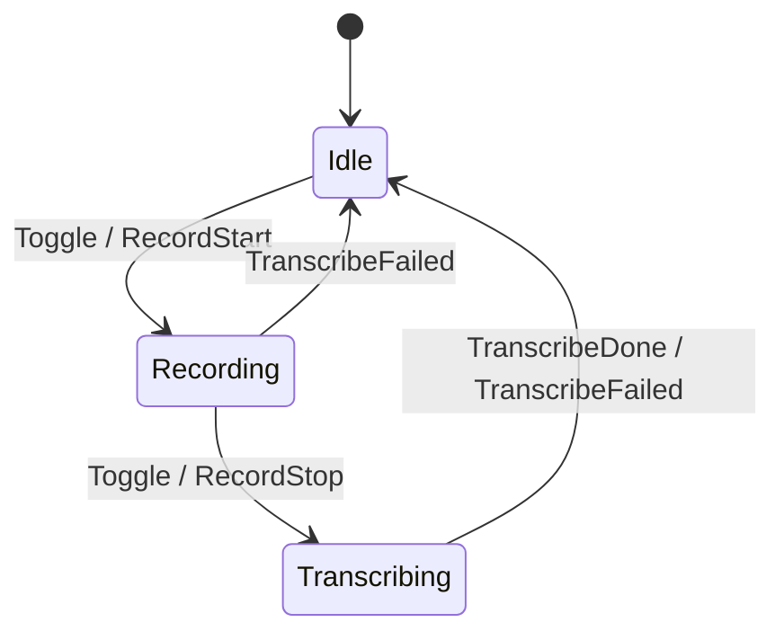
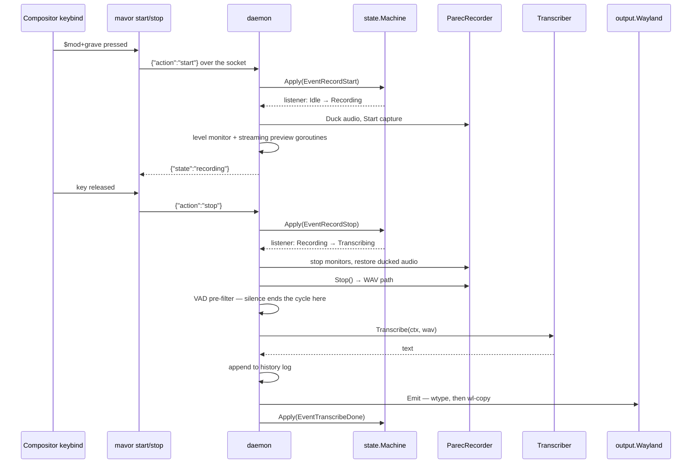

# How `mavor` works

**Status:** CURRENT as of 2026-09-05, verified against `7e52f94`.

`mavor` is one long-lived daemon whose entire shared mutable state is a
three-value enum. A hotkey-launched CLI pokes it over a Unix socket; the enum
advances; a listener fires the side effects. Audio capture, speech recognition,
typing and the on-screen indicator each sit behind an interface, so the daemon's
own tests run in milliseconds with no compositor and no audio server.

| Component | Lives in |
| :--- | :--- |
| The state machine and its listeners | `internal/state` (`Machine`, `State`, `Event`) |
| Side-effect dispatch, the whole pipeline | `internal/daemon` (`Daemon.onTransition`, `Daemon.runTranscription`) |
| Wire protocol between CLI and daemon | `internal/ipc` (`Request`, `Response`, `Send`) |
| Capture, level metering, VAD, ducking | `internal/audio` (`Recorder`, `ParecRecorder`, `Ducker`, `DetectSpeech`) |
| Speech recognition, every runtime | `internal/speech` (`Transcriber`, `StreamTranscriber`, `Resolve`, `Factory`) |
| The model catalog, and the runtime and placement it implies | `internal/models` (`Catalog`, `RuntimeFor`, `Select`) |
| The config file, and the defaults `config init` scaffolds | `internal/config` (`Config`, `Default`, `Resolve`) |
| Typing and clipboard | `internal/output` (`Dispatcher`, `Wayland`) |
| The HUD | `internal/overlay` (`Overlay`, `Visual`, `Scene`) — `paint.go` is pixels, `overlay_wl.go` is the compositor |
| Wayland wire protocol, layer-shell, shm | `internal/wayland` — hand-written, no cgo in this package |
| Transcript recovery log | `internal/history` (`Store`, `Entry`) |
| Process wiring, every subcommand | `cmd/mavor` (`runDaemon` builds the daemon) |

**Reads with:** [`../user-guide.md`](../user-guide.md) (the same system from the
outside), [`../research/`](../research/) (domain notes on whisper.cpp, Wayland
input and audio capture that back these choices).

---

## Principles

These are read out of the code as written, and the IDs are cited elsewhere.

**P1. The FSM is the only shared mutable state.** Every other component is
either stateless or owns state nobody else touches. The one mutex that matters
guards the state word in `state.Machine`.

**P2. Side effects hang off state *transitions*, never off IPC requests.**
`Daemon.handleRequest` only calls `Apply`; all doing happens in the listener.
This is why `status` can never have a side effect, and why an event that
produces no transition produces no work.

**P3. Listeners run off the lock,** which makes the listener re-entrant — it is
allowed to call `Apply` again, and does.

**P4. Every external dependency is behind an interface with a mock in the same
package.** `audio.MockRecorder`, `audio.MockDucker`, `speech.Mock`,
`speech.MockStreamTranscriber`, `output.Mock` and `overlay.Noop` all ship in the
production package, not in `_test.go` files, so any package can drive the
daemon.

**P5. Degrade, don't die.** No compositor, or one without layer-shell → the
`Noop` overlay and dictation still works. `wtype` fails → the clipboard still
gets the text. Output errors → the cycle still completes and the transcript is
already in the history log.

## Invariants and one-writer rules

**I1. `state.Machine` owns the state word, and nothing holds a copy.** `Daemon`
has no state field; it asks the machine. The overlay keeps a `Scene` describing
what it is drawing, but only writes it — it never reads it back to make a
decision.

**I2. Every `Apply` call site is in `internal/daemon`.** `handleRequest` for the
three mutating verbs; `reportError` on any pipeline failure; `runTranscription`
on each of its completion paths. `Apply` is exported and nothing enforces this.

**I3. Listeners run off the lock so the listener may re-enter `Apply`.** Not
incidental: `reportError` calls `Apply` from inside a listener invocation.
Holding the lock across listeners would deadlock on the first failure.

**I4. At most one transcription goroutine exists at a time**, enforced only by
the shape of the FSM: the sole `wg.Add(1)` is on the `Recording → Transcribing`
edge, and `Recording` is unreachable again until that goroutine has driven the
machine back to `Idle`. There is no explicit guard.

**I5. Shutdown order is `Serve` → `wg.Wait` → stop monitors → restore ducking →
close the overlay → close the transcriber.** Each step is load-bearing:
`ipc.Server.Serve` waits on its own connection handlers, so no new `Apply` can
start after it returns; the daemon's `wg.Wait` drains an in-flight
transcription, so nothing is still writing to `wl-copy` after the binary exits;
the overlay closes last because that final transcription's `Apply` triggers a
`Show`, and a closed overlay refuses posts.

**I6. `ParecRecorder` guards its own single-capture invariant** with a mutex and
a nil check, independently of the FSM. Two overlapping guards for the same
property; the recorder's is the backstop, and it is what turns a double-start
into an error rather than two capture processes fighting over one file.

**I7. One daemon per socket path.** Before binding, the server dials an existing
socket file: a successful dial means a live daemon and the new process refuses
to start; a failed dial means a stale file from a crash, which is unlinked.

**I8. The CLI is stateless.** `mavor toggle` re-reads the config on every
invocation and holds nothing between runs. Two rapid keypresses are two
independent processes, and their order at the daemon is the socket accept order.

**I9. The transcript reaches disk before it reaches the screen.**
`runTranscription` appends to the history log *before* calling `Emit`, because a
mis-targeted or swallowed emit is exactly when the user needs the text back.

---

## The state machine

Three states, five events.



| From \ Event | `EventToggle` | `EventRecordStart` | `EventRecordStop` | `EventTranscribeDone` | `EventTranscribeFailed` |
|---|---|---|---|---|---|
| `Idle` | → `Recording` | → `Recording` | — | — | — |
| `Recording` | → `Transcribing` | — | → `Transcribing` | — | → `Idle` |
| `Transcribing` | — | — | — | → `Idle` | → `Idle` |

Three things about this table are load-bearing:

**Events with no edge are absorbed silently.** `Apply` returns
`(currentState, false)`, no listener fires, and the caller gets the unchanged
state back. There is no "invalid transition" signal anywhere, which is what
makes a duplicate `mavor stop` harmless.

**The toggle and the push-to-talk pair are separate vocabularies over the same
edges.** `EventToggle` means "advance"; `EventRecordStart` and `EventRecordStop`
name a direction and are no-ops in the wrong state. A held key that repeats, or
a `stop` that arrives after the compositor already sent one, changes nothing.

**Toggling while transcribing does nothing** — deliberately, and it is the most
consequential product decision in the tree. `Apply` returns `changed=false`, the
CLI prints `transcribing`, and the user's impatient second tap is neither queued
nor treated as a cancel.

> [!WARNING]
> There is no way to abort a transcription short of killing the daemon. The FSM
> has no cancel event and the IPC protocol has no verb for one, and adding
> either needs `Recorder` and `Transcriber` to support abandonment first.

The listener mechanism is a map of IDs to callbacks with a returned unsubscribe
closure. Listeners fire **only on change** and **only off the lock**. The daemon
registers exactly one; nothing else subscribes.

## One dictation cycle



The side effects run **inline on the handler goroutine**: `handleRequest` calls
`Apply`, `Apply` calls the listener, and the listener forks `parec` before the
IPC response is written. So the state in the response is the state after side
effects were attempted, which is what makes the integration tests deterministic
— and what puts a fork/exec inside the client's round-trip budget.

The transcription itself is the exception: the `Recording → Transcribing` edge
spawns a goroutine tracked by the daemon's `WaitGroup`, because model inference
takes seconds and the listener must not hold the handler that long.

**Both temporary files are removed at the end of every cycle** — the captured
WAV and the `.txt` sidecar whisper-cli writes beside it — so a completed
dictation leaves no audio on disk. What survives is the text, in the history
log, and only the text.

## Live preview while you speak

Recording starts two monitor goroutines, both cancelled on the way out of
`Recording`:

- **The level meter** samples `Recorder.Level()` on a fixed tick and pushes it
  to `Overlay.SetLevel`, which is what animates the waveform.
- **The preview** feeds the overlay's subtitle line via `Overlay.SetText`.

Two mechanisms can produce that text, and which one runs is decided **once, at
daemon start**, by `speech.ResolvePreview` — not per recording and not by a type
assertion on the main transcriber:

- **Companion model** — a small streaming recognizer loaded *alongside* the main
  model, fed the same PCM through `StartStream` and then `FeedChunk`, each call
  returning the accumulated partial text. The designated companion is
  `zipformer-streaming-20m`, which is in the catalog for this job: 20M
  parameters, small enough that painting an overlay with it is a fair trade.
- **Phrase mode** — no second model. Frames are accumulated,
  `audio.CalculateRMS` classifies each as speech or silence, and a silence run
  of `preview.pause_ms` following at least `preview.min_phrase_ms` of speech
  cuts a slice, writes it to a temporary WAV, and transcribes that slice with
  the **main** model in the background.

`preview.source = "auto"` resolves in this order:

1. **The main model already decodes incrementally** (the catalog's `Streaming`
   flag — the streaming FastConformer and the streaming zipformers). Its own
   partials are read directly and no second model is loaded.
2. **The companion is installed** — load it and run it alongside.
3. **Otherwise** fall back to phrase mode, warn, and name the model to pull.

An explicit value overrides the order: `"phrases"` forces phrase mode, and a
model name forces that companion. Step 3 is the only case that ever downgrades
— a model *named* in the config and not installed is fatal at daemon start, and
never a quiet substitution. A companion that fails to load for any other reason
(corrupt files, an unreadable directory) degrades to phrase mode with a warning,
because a broken preview must never cost the user dictation.

The companion loads at daemon start rather than lazily at the first recording,
so the first dictation is not the slow one — resident memory traded for
first-use latency, deliberately.

> [!WARNING]
> The preview never emits. Partial text is provisional, and the text the user
> receives always comes from the single final `Transcribe` by the **main** model
> over the whole recording. Do not wire `SetText` into `Emit` to "save a step" —
> the two disagree by construction, and the companion is deliberately the
> smaller, worse model.

Setting `preview.enabled = false` disables the preview entirely; the level meter
is unaffected.

## The IPC protocol

One connection carries one JSON request and one JSON response, then closes. The
protocol is deliberately not an RPC: it exists so a short-lived, hotkey-launched
process can nudge a daemon.

```json
→ {"action":"toggle"}
← {"state":"recording"}
```

Four actions — `toggle`, `start`, `stop`, `status` — of which only the first
three change anything. An unknown action comes back as
`{"error":"unknown action …"}`, and a response always carries exactly one of
`state` or `error`. The socket is a Unix domain socket under
`$XDG_RUNTIME_DIR`, so its permissions are the user's runtime directory's; there
is no authentication and none is needed.

## The seams

Five interfaces stand between the daemon and everything external. Each is
defined in the package that also holds both the production implementation and
the mock, which is why the daemon's unit tests need no Wayland, no audio and no
cgo.

| Interface | Contract | Production implementation |
| :--- | :--- | :--- |
| `audio.Recorder` | `Start`, `Stop() (wavPath, error)`, `Level()` | `ParecRecorder` — a `parec` child writing 16 kHz mono s16le |
| `audio.Ducker` | `Duck`, `Restore` | `CommandDucker` over `wpctl` or `pactl`, auto-detected |
| `speech.Transcriber` | `Transcribe(ctx, wavPath) (string, error)` | chosen by `speech.Factory` — see below |
| `output.Dispatcher` | `Emit(ctx, text) error` | `output.Wayland` — `wtype` then `wl-copy`, always both |
| `overlay.Overlay` | `Show(Visual)`, `SetLevel`, `SetText`, `Close` | `overlay.WL` — a `wlr-layer-shell` surface |

Two optional interfaces are discovered by type assertion, so an implementation
opts in by having the methods: `audio.ChunkReader` (a recorder that can hand
over PCM mid-capture) and `speech.StreamTranscriber` (a transcriber that decodes
incrementally). A transcriber that implements `io.Closer` is closed at shutdown,
and one with a `Start(context.Context) error` method is started before the
daemon serves — that is how the warm whisper-server child is supervised.

**Only the speech seam varies, and it is derived rather than chosen.** The
other four are constructed by name in `runDaemon`; the only decision there is
the overlay's fallback to `Noop` when the compositor has no layer-shell.

### Runtime and placement

Two terms, and keeping them apart is the whole of this seam. Both are defined in
[`configuration-surface.md` §3](../design/configuration-surface.md#3-two-axes-welded-into-one-enum),
which coined them.

**Runtime** — the inference library that executes a model. There are exactly
two: whisper.cpp, and ONNX Runtime reached through sherpa-onnx. **A runtime is
never configured.** It is a property of the model, recorded in the catalog and
read back by `models.RuntimeFor`.

**Placement** — where that runtime executes relative to the daemon process. It
is an independent question that happens to have a different default answer for
each runtime.

| Placement | What it means | Model stays warm |
| :--- | :--- | :--- |
| `in-process` | The runtime is linked into the daemon; the model is resident. **The sherpa default.** | For the life of the daemon |
| `local-server` | mavor starts and supervises a `whisper-server` child and posts audio to it over loopback HTTP. **The whisper default.** | For the life of the child |
| `subprocess` | A fresh `whisper-cli` per utterance. | No |
| `remote` | An HTTP server someone else runs, named by URL in `advanced.server`. | Not mavor's problem |

`models.Select` derives the pair from the model name plus the two `[advanced]`
keys that can influence it, and `speech.Resolve` adds the path the model
occupies on this machine. Only `auto` and `subprocess` can be *asked* for; the
other two are derived. Naming a placement the model's runtime cannot provide —
`subprocess` on a sherpa model, `advanced.server` with a sherpa model — is an
error at daemon start, not something quietly ignored.

One derived placement is then downgraded by the machine it is about to run on.
`speech.AdjustForEnvironment` turns `local-server` into `subprocess` when
neither `whisper-server` nor `whisper-cpp-server` is on `$PATH` — some
distributions package the CLI without the server — and appends a warning saying
the model will reload for every utterance. That is safe precisely because the
user did not ask for `local-server`: it was derived, so falling back costs a
warm model and nothing else. A placement the user *did* write is left alone to
fail loudly. `mavor doctor` calls the same function, so the placement it prints
is the one the daemon will use rather than the one `Select` returned.

There is no endpoint to configure for `local-server`: whisper.cpp's server binds
a host and a port, so the supervisor takes a free loopback port, starts the child
there, and `Supervisor.Endpoint` is how the client finds it. The client discovers
the request path the same way — whisper.cpp serves `/inference`, hosted services
serve `/v1/audio/transcriptions`, and whichever answers first is remembered for
the daemon's life.

### Vocabulary

The runtime-neutral `[vocabulary]` table is the one place a user states the words
the model gets wrong. `speech.LoadVocabulary` unions `words` with the lines of
`file`, and what that list *becomes* is decided by the model:

| Model kind | Mechanism |
| :--- | :--- |
| whisper (any placement) | an initial prompt, rendered once at construction and capped at 224 tokens — mavor truncates at a phrase boundary and warns, because whisper.cpp clips silently |
| transducer (parakeet, zipformer) | a hotwords file, which **forces `modified_beam_search`**: sherpa-onnx ignores hotwords under greedy decoding without complaint |
| CTC, paraformer, moonshine, sensevoice | nothing at all — biasing lives inside transducer beam search only |

The last row is reported by `mavor doctor` rather than being an error. The user
never picks a decoding method; beam search is a consequence of configuring a
vocabulary on a model that can use one.

### What the interfaces foreclose

Real constraints, stated so nobody rediscovers them the hard way:

- **`Transcribe` takes a local filesystem path**, so a network backend reads and
  uploads the file itself.
- **`Transcribe` returns one string** — no segments, no timestamps, no
  confidence. `whisper-cli` is invoked with `-nt`, which strips timestamps at
  the source.
- **Per-call recognition parameters do not exist.** Model, thread count, GPU
  on/off and the vocabulary prompt are fixed when the transcriber is
  constructed; language and temperature are unreachable without changing the
  interface.
- **`Visual` is a closed enum carrying no data.** Elapsed time, an error
  message, or "which model is loading" cannot be expressed; the live text and
  level ride separate methods precisely because `Show` could not carry them.
- **The audio format contract is invisible.** 16 kHz mono s16le is chosen in
  `audio.DefaultCommand` because whisper wants it, but no signature states it. A
  recorder that produced 48 kHz stereo would type-check and fail at runtime.
- **The input device is not a parameter.** `parec` takes it from `PULSE_SOURCE`
  in the ambient environment, which the daemon logs and never sets.

## Failure modes

Every row was traced through the code.

| Failure | What happens | What the user sees |
| :--- | :--- | :--- |
| Capture fails to start (`parec` missing, no audio server) | `reportError`: the error visual, a pause, then `EventTranscribeFailed` → `Idle` | The error pill, then nothing typed |
| Capture starts but records nothing | `Stop` rejects a zero-length WAV; same error path | The error pill |
| A WAV with a header and no samples | Passes the size check, reaches the VAD pre-filter, ends the cycle as silence | Pill vanishes, nothing typed |
| VAD finds no speech | `EventTranscribeDone` without calling the transcriber | Pill vanishes, nothing typed |
| The transcriber errors | `reportError` → `Idle` | The error pill |
| Empty transcript | Logged at Warn, `Emit` never called | Pill vanishes, nothing typed |
| `wtype` fails | `wl-copy` still runs; the joined error is logged at Warn and the cycle completes | Nothing typed — **but the text is on the clipboard and in the history log** |
| Both `wtype` and `wl-copy` fail | Identical to the above from the FSM's side | Nothing typed; recover with `mavor history --copy` |
| No whisper server on `$PATH` under a derived `local-server` placement | `AdjustForEnvironment` downgrades to `subprocess` and warns | The model reloads per utterance — slower, otherwise identical |
| The model named in the config is not installed | `speech.Resolve` fails; the daemon never starts | An error naming the model, the directory searched, and the `models pull` to run |
| `preview.source` names a model that is not installed | `speech.ResolvePreview` fails; the daemon never starts | The same shape of error. A *named* model is a request, never a hint |
| The companion is missing under `source = "auto"` | Warn, fall back to phrase mode, daemon starts | A worse preview, and a `doctor` line naming the model to pull |
| The companion fails to load for any other reason | Warn, fall back to phrase mode, daemon starts | A worse preview; dictation is unaffected |
| A second daemon starts | The live socket is detected, `Serve` errors, the process exits non-zero | An error on stderr |
| Shutdown while recording | The context goroutine SIGINTs `parec` so the WAV is flushed, but `Stop` never runs | An orphaned recording, never transcribed |
| Shutdown while transcribing | The root context kills the transcriber mid-run | **The transcript is lost** — it is written to history only after a successful `Transcribe` |

> [!WARNING]
> Several of these are indistinguishable from success in the moment: the pill
> disappears and nothing is typed. The history log is the tiebreaker — if a
> transcript exists there, recognition worked and delivery is what failed.

> [!WARNING]
> `ipc.ErrAddrInUse` and `daemon.ErrNotRunning` are exported, documented as
> return values, and **never returned by anything**. The real errors are
> `fmt.Errorf` values, so `errors.Is` against either sentinel always reports
> false. Do not build a caller on them without first making them real.

> [!WARNING]
> `Overlay.Show` posts to the render goroutine and returns without waiting, so a
> `nil` means "queued", not "drawn". This is deliberate — it is what stops a
> wedged compositor from wedging the toggle path — but it means a surface that
> has stopped painting reports success on every call, and the error surfaces
> only at `Close`.

> [!WARNING]
> `ParecRecorder.Start` spawns a goroutine that waits on the context so that
> cancellation stops capture, and `Stop` does not cancel it. One such goroutine
> accumulates per recording for the daemon's lifetime. Harmless at a few hundred
> bytes per dictation, and worth knowing before anything makes recordings long
> or frequent.

## The overlay, and why it does not steal focus

The HUD is split so that almost none of it needs a compositor. `paint.go` is a
pure function from a `Scene` to an RGBA image — the pill, the waveform, the
preview text — and is fully unit-tested with no Wayland at all. `overlay_wl.go`
owns the connection and puts that image on a `wlr-layer-shell` surface through
`internal/wayland`, a hand-written protocol client with no cgo behind it.

One goroutine owns the Wayland connection for its whole life, and every public
method is a message to that goroutine, because the connection cannot be driven
from two places at once and the daemon calls `SetLevel` from its audio path.

The surface sits on the `top` layer, **requests no exclusive zone**, and asks
for no keyboard interactivity. Those two choices are the reason the overlay
floats over content instead of resizing windows, and the reason it cannot take
focus away from whatever is being dictated into. A margin configured as
`top_margin` is therefore a gap below whatever bar already reserved space, not
an offset from the screen edge.

## What is not here

The empty space, verified by search rather than assumed:

- **No cancel or abort**, and no queueing of a toggle during transcription.
- **No per-utterance model or language selection.** Both are config, read at
  daemon start; changing either needs a restart.
- **No text post-processing** — no punctuation restoration beyond what the model
  emits, no custom replacement, no filler-word stripping. Whitespace
  normalisation in `output.CleanText` is the only transformation, and it exists
  to stop interior newlines becoming Return keystrokes.
- **No model integrity check.** `models pull` downloads to a `.part` file and
  renames, which makes a partial download visible, but there is no checksum and
  no resume; the daemon's precondition is that the file exists.
- **No metrics or health endpoint.** Structured logs only, though the timings
  are in them.
- **No multi-seat or multi-instance story.** One socket path per user runtime
  directory.
- **No keybinding of its own.** Binding is entirely the compositor's job.
- **No X11 or GNOME support**, and this is architectural: the overlay needs
  `wlr-layer-shell` and typing needs `virtual-keyboard-v1`. Porting means new
  `Overlay` and `Dispatcher` implementations, not a restructuring.

## Testing surfaces

- **Unit** (`just test`): every package, mocks throughout, no Wayland and no
  audio. They do need a C toolchain — `internal/speech` links sherpa-onnx
  unconditionally, so `CGO_ENABLED=0 go test ./internal/daemon/` does not build.
  The daemon tests drive the whole pipeline and assert the exact overlay call
  sequence.
- **Integration** (`just test-int`, `-tags=integration`): a headless wlroots Sway
  with a private D-Bus, optional Waybar, an optional PipeWire null sink, and a
  whisper shim on a prepended PATH. Assertions are pixel bands from `grim`
  screenshots and real clipboard reads through `wl-paste` — which is how "the
  overlay does not overlap Waybar" is checked at all.
- **End to end** (`just test-e2e`, `-tags=e2e`): the same harness driving the
  real `whisper-cli` against a real `tiny.en`, which is what verifies the
  `-otxt` sidecar contract that the mocks would otherwise only assume.
- **Storybook** (`just storybook`): renders every overlay state to a screenshot
  report.

## Current values

Verified at `7e52f94`. The prose above says what each of these is for; this
table is the only place the values themselves are stated.

| Value | Setting | Defined in |
| :--- | :--- | :--- |
| IPC socket | `$XDG_RUNTIME_DIR/mavor.sock` | `config.Default`, `defaultSocket` |
| CLI request timeout | 2s (`doctor` uses 500ms) | `cmd/mavor` call sites of `ipc.Send` |
| Server connection deadline | 5s | `ipc.Server.handle` |
| Liveness dial before binding | 100ms | `ipc.prepareSocket` |
| Error pill duration | 1.5s | `daemon.New` default |
| Level meter and preview tick | 30ms | `daemon.startLevelMonitoring`, `startStreamingMonitoring` |
| Phrase-mode silence threshold | 450ms | `config.DefaultPauseMS`, `preview.pause_ms` |
| Phrase-mode minimum phrase | 600ms | `config.DefaultMinPhraseMS`, `preview.min_phrase_ms` |
| Speech RMS threshold | 0.012 normalized | `audio.SpeechRMSThreshold` |
| Pre-filter minimum speech | 150ms | `daemon.runTranscription` |
| Capture format | 16 kHz mono s16le | `audio.DefaultCommand`, `audio.DefaultSampleRate` |
| VAD frame | 480 samples (30ms) | `audio.FrameSamples` |
| Recording directory | `$TMPDIR/mavor-recordings` | `cmd/mavor.runDaemon` |
| History log | `$XDG_STATE_HOME/mavor/history.jsonl` | `history.DefaultPath` |
| History retention | 500 entries | `history.DefaultMax` |
| Default model | `whisper-base.en` | `config.DefaultModel` |
| Default preview | enabled, `source = "auto"` | `config.Default` |
| Default preview companion | `zipformer-streaming-20m` | `speech.DefaultCompanionModel` |
| Default placement | derived: `local-server` for whisper, `in-process` for sherpa | `models.Select` |
| Default threads | this machine's physical core count | `config.PhysicalCores` |
| Default GPU | `auto` (whisper only; sherpa is CPU-only on this build) | `config.Default`, `config.GPUOff` |
| Vocabulary boost | 1.5 | `config.DefaultBoost` |
| whisper prompt cap | 224 tokens | `speech.WhisperPromptTokenCap` |
| Overlay top margin | 8px | `config.DefaultTopMargin` |

The full config surface is the `toml`-tagged fields of `config.Config` — one
top-level `model` key and the `[preview]`, `[ducking]`, `[vocabulary]`,
`[overlay]`, `[advanced]` and `[paths]` tables. It is not reproduced here, and
neither is the scaffold `mavor config init` writes, because the scaffold is
generated from `config.Default()` and a test asserts the two parse to the same
value.

> [!WARNING]
> The schema was rewritten in place with **no compatibility aliases**. A config
> file written before `6eed074` parses to zero known keys and contributes
> nothing; `config.File.SchemaLooksStale` detects exactly that shape and
> `mavor doctor` says so, pointing at `mavor config init --force`. The same
> applies to model names: `base.en` and the other bare aliases were deleted, not
> redirected.

## Why it's this way

Rulings a maintainer would otherwise undo. The IDs are the ones the design doc
this replaces used.

| ID | Ruling | Why it stays |
| :--- | :--- | :--- |
| OQ-1 | The core contract stays batch: one recording, one `Transcribe`, one string | Streaming arrived as an *optional* interface and a preview channel instead. Whisper is meaningfully worse on short chunks, and keeping the emitted text on the batch path is what lets both runtime families share one pipeline |
| OQ-2 | The error channel is a fourth `Visual`, held briefly, and not a message | `Show` stays data-free, so no failure path can block on rendering text. The detail lives in the log and the history file |
| OQ-3 | Zero audio retention: both temporary files are deleted at the end of every cycle | The directory was an unbounded, personal archive nobody had decided to keep. Recovery is the transcript in the history log, not the audio |
| OQ-4 | The FSM grew `Recording × TranscribeFailed → Idle`, and nothing else | That edge was a real bug — a failed capture start left the overlay claiming RECORDING until two more keypresses cleared it. A cancel event is still deliberately absent |
| OQ-5 | No implementation registry. The model name selects the implementation, by way of the catalog | A plugin architecture for a single-user tool is the wrong trade. The `engine` key this ruling originally referred to is itself gone: it welded *which model* to *where its runtime runs*, and those are now derived separately |
| OQ-6 | Side effects stay synchronous on the handler goroutine | The response then reports the state after side effects were attempted, which is what makes the integration tests deterministic. The cost is a fork/exec inside the client's 2s budget — revisit if a recorder ever grows a slow start |
