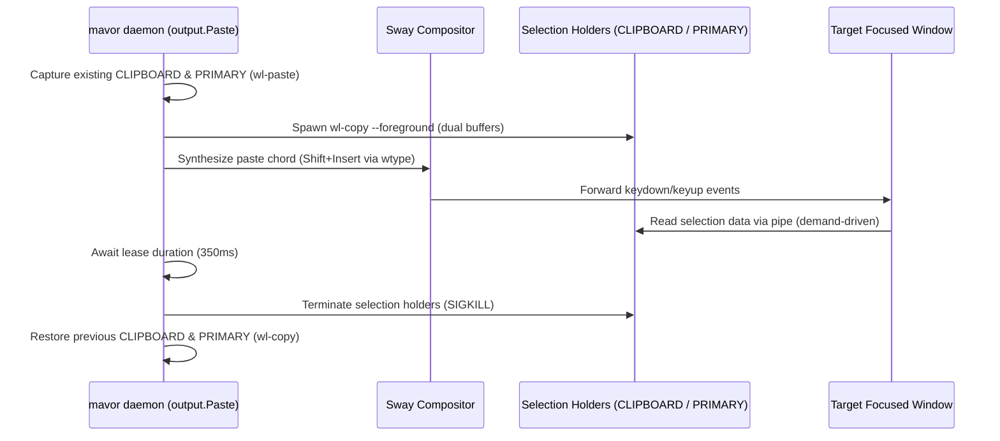

# Paste-based output dispatch and Wayland selection architecture

**Status:** CURRENT as of 2026-09-18, verified against `8b6b929`.

`mavor` delivers completed transcriptions into the focused window either by
synthesizing keystroke sequences or by injecting a paste chord backed by Wayland
selection buffers. Paste dispatch is the default driver because synthetic
keystroke injection incurs heavy terminal redraw latencies on long utterances
($1,000+$ characters).

| Component | Lives in | Key symbols |
| :--- | :--- | :--- |
| Output dispatch interface & typing driver | `internal/output` | `Dispatcher`, `Wayland` |
| Paste driver & Timed Lease supervisor | `internal/output` | `Paste`, `NewPaste`, `ChordToWtypeArgs` |
| Output configuration schema | `internal/config` | `OutputConfig`, `Default()` |
| Environment & doctor diagnostics | `cmd/mavor` | `checkOutput`, `checkKittyShiftInsert`, `checkPasteOnce` |

**Reads with:** [`how-mavor-works.md`](how-mavor-works.md) (internal daemon architecture),
[`../research/wayland-dictation-stack.md`](../research/wayland-dictation-stack.md) (Wayland input protocols).

---

## Principles & Invariants

**P1. Terminal bracketed paste eliminates per-keystroke rendering stalls.**
Sending thousands of sequential `wl_keyboard.key` press-and-release events into an
interactive terminal line editor (such as Antigravity running in Kitty) forces the
line editor to re-evaluate syntax highlighting, cursor wrapping, and prompt
layouts on every keystroke. Throttled by the GPU compositor render cadence (60–120 Hz),
a 1,000-character utterance incurs 10–16 seconds of visual delay. Emitting text via
a paste chord causes the terminal emulator to encapsulate the text in **Bracketed
Paste Mode** (`\e[200~` ... `\e[201~`) and write it as a single chunk to the PTY,
triggering exactly one redraw in $<15\text{ ms}$.

**P2. The Timed Lease supervisor eliminates clipboard-manager race conditions.**
Because Wayland selection transfers are demand-driven and asynchronous, both external clipboard managers (e.g. `cliphist`) and the target window may read selections concurrently. Using `--paste-once` caused single-read race conditions where clipboard managers consumed the selection and terminated the process before the target window could read it. Instead, the Timed Lease supervisor holds persistent foreground selection holders for a deterministic lease window (default 350ms) without `--paste-once`, serving unlimited reads across both buffers, before terminating both child processes and restoring pre-existing user selections.

**P3. User selections are restored without clobbering in-flight transfers.**
Pre-existing user selections in `CLIPBOARD` and `PRIMARY` are preserved prior to
paste dispatch. Restoration executes only after the lease window expires and holders are reaped, preventing the race condition where restored contents overwrite
the transcript before the target window reads it.

---

## How It Works

### The Output Drivers

`internal/output` provides two implementations of the `Dispatcher` interface:

1. **`output.Paste` (Default):** Writes transcript data to Wayland selection
   buffers, synthesizes a paste chord (default `Shift+Insert`), and manages
   selection lifecycle.
2. **`output.Wayland` (`driver = "typing"`):** Translates characters directly into
   virtual keycodes via `zwp_virtual_keyboard_v1` using `wtype`.

### Universal Paste Architecture: Dual-Buffer Copy + `Shift+Insert`

Wayland compositors implement two separate selection buffers:
- **`CLIPBOARD`:** Populated by explicit user copy actions (`Ctrl+C`, `wl-copy`).
- **`PRIMARY`:** Populated by cursor text selection (`wl-copy --primary`).

In standard GUI applications (browsers, editors), `Shift+Insert` pastes from
`CLIPBOARD`. In Kitty terminal, `Shift+Insert` defaults to `paste_from_selection`,
which reads `PRIMARY`.

To achieve zero-configuration universal pasting across both GUI and terminal
windows, `output.Paste` writes the transcript to **both** buffers concurrently
under the Timed Lease supervisor. Kitty reads `PRIMARY` and succeeds; GUI
applications read `CLIPBOARD` and succeed.

### The Supervisor Lease Loop

`output.Paste.Emit` coordinates emission:

1. If `restore_selection` is true, reads current `CLIPBOARD` and `PRIMARY` contents
   using `wl-paste`.
2. Starts two child processes with `--foreground`: one for `CLIPBOARD`
   and one for `PRIMARY` (without `--paste-once` to allow multiple concurrent readers).
3. Waits 20ms for Wayland compositor registration, then synthesizes the configured
   `paste_chord` via `wtype`.
4. Awaits the lease window (`LeaseDuration`, default 350ms):
   - Clipboard managers and target applications can read either buffer as needed.
   - If context is cancelled, terminates immediately.
5. Kills and reaps both selection holder processes.
6. If `restore_selection` is true, settles for `RestoreDelay` (50ms) and restores
   original contents to both buffers.

### Diagnostic Verification in `mavor doctor`

`mavor doctor` verifies the output dispatch environment:

1. **Driver Reporting:** Reports the active output driver (`paste` or `typing`) and
   configured paste chord.
2. **Utility Availability:** Verifies `wl-copy` and `wl-paste` exist on `PATH`.
3. **`--paste-once` Support:** Probes `wl-copy` to verify `--paste-once` is supported
   and does not block.
4. **Kitty Configuration Check:** Inspects `~/.config/kitty/kitty.conf`. If Kitty is
   present, verifies whether `shift+insert` is mapped to `paste_from_selection` or
   `paste_from_clipboard`, explaining how dual-buffer copy maintains compatibility.

---

## Where the Code Lives

| Subsystem | Package / File | Key Types and Entry Points |
| :--- | :--- | :--- |
| Paste Dispatcher | `internal/output/paste.go` | `Paste`, `NewPaste`, `ChordToWtypeArgs` |
| Timed Lease Supervisor | `internal/output/paste.go` | `Paste.Emit` |
| Selection Capture & Restore | `internal/output/paste.go` | `Paste.Emit` |
| Native Keystroke Typing | `internal/output/native.go` | `Wayland`, `Wayland.Emit` |
| Configuration Schema | `internal/config/config.go` | `OutputConfig`, `DefaultOutputDriver`, `DefaultPasteChord` |
| Diagnostics & Verification | `cmd/mavor/doctor.go` | `checkOutput`, `checkKittyShiftInsert`, `checkPasteOnce` |

---

## What Is Not Here

The boundary of this subsystem:

- **No active application routing:** `mavor` does not inspect window classes or
  `app_id` at runtime to choose between paste chords. It uses the universal
  dual-buffer `Shift+Insert` strategy. Dynamic application detection via Sway IPC
  is documented separately in [`../design/active-application-output-routing.md`](../design/active-application-output-routing.md)
  and deferred on the roadmap.
- **No rich-text clipboard formats:** Selection data is strictly plain text
  (`text/plain;charset=utf-8`). HTML or formatting payloads are not handled.
- **No X11 clipboard synchronization:** Selection buffers are managed purely
  through Wayland selection protocols via `wl-copy` and `wl-paste`.

---

## Why It's This Way

Rulings preserved from design deliberation:

- **OQ-PST1: `driver = "paste"` is default.** Synthetic keystroke injection causes
  unacceptable 10–16 second redraw inching in terminal TUIs. Paste dispatch is the
  out-of-the-box default; `driver = "typing"` remains available for environments
  where pasting is undesirable.
- **OQ-PST2: `restore_selection = true` is default.** User clipboard data must not be
  silently clobbered by dictation. Capturing selections before paste and restoring
  them upon supervisor exit preserves user context without race conditions.
- **OQ-PST3: Dual-buffer population is unconditional for paste dispatch.** Emitting to
  both `CLIPBOARD` and `PRIMARY` simultaneously avoids requiring users to manually
  edit `kitty.conf` to remap `Shift+Insert`.

---

## Current Values

Verified at `8b6b929`. Prose above explains what each value is for; this table is
the single place where numbers and defaults are recorded.

| Value | Setting | Defined in |
| :--- | :--- | :--- |
| Default output driver | `"paste"` | `internal/config/config.go` (`DefaultOutputDriver`) |
| Default paste chord | `"shift+insert"` | `internal/config/config.go` (`DefaultPasteChord`) |
| Default restore selection | `true` | `internal/config/config.go` (`DefaultRestoreSelection`) |
| Default lease duration | `350ms` | `internal/output/paste.go` (`LeaseDuration`) |
| Restore settle delay | `50ms` | `internal/output/paste.go` (`RestoreDelay`) |
