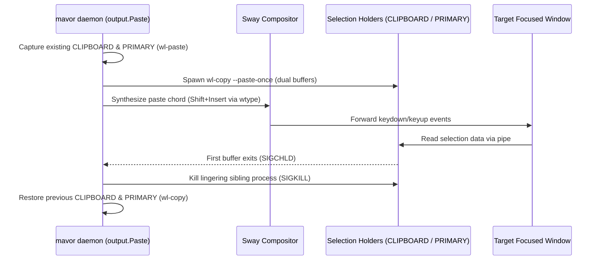

# Paste-based output dispatch and Wayland selection architecture

**Status:** CURRENT as of 2026-09-18, verified against `8b6b929`.

`mavor` delivers completed transcriptions into the focused window either by
synthesizing keystroke sequences or by injecting a paste chord backed by Wayland
selection buffers. Paste dispatch is the default driver because synthetic
keystroke injection incurs heavy terminal redraw latencies on long utterances
($1,000+$ characters).

| Component | Lives in | Key symbols |
| :--- | :--- | :--- |
| Output dispatch interface & typing driver | `internal/output` | `Dispatcher`, `Wayland` |
| Paste driver & First-Exit Wins supervisor | `internal/output` | `Paste`, `NewPasteDispatcher`, `PasteConfig` |
| Output configuration schema | `internal/config` | `OutputConfig`, `Default()` |
| Environment & doctor diagnostics | `cmd/mavor` | `checkOutput`, `checkKittyShiftInsert`, `checkPasteOnce` |

**Reads with:** [`how-mavor-works.md`](how-mavor-works.md) (internal daemon architecture),
[`../research/wayland-dictation-stack.md`](../research/wayland-dictation-stack.md) (Wayland input protocols).

---

## Principles & Invariants

**P1. Terminal bracketed paste eliminates per-keystroke rendering stalls.**
Sending thousands of sequential `wl_keyboard.key` press-and-release events into an
interactive terminal line editor (such as Antigravity running in Kitty) forces the
line editor to re-evaluate syntax highlighting, cursor wrapping, and prompt
layouts on every keystroke. Throttled by the GPU compositor render cadence (60–120 Hz),
a 1,000-character utterance incurs 10–16 seconds of visual delay. Emitting text via
a paste chord causes the terminal emulator to encapsulate the text in **Bracketed
Paste Mode** (`\e[200~` ... `\e[201~`) and write it as a single chunk to the PTY,
triggering exactly one redraw in $<15\text{ ms}$.

**P2. The First-Exit Wins supervisor prevents lingering background child processes.**
Because Wayland selection transfers are demand-driven, an application only requests
data from **one** selection buffer (`CLIPBOARD` or `PRIMARY`). Spawning two
concurrent `wl-copy --paste-once` instances would leave the unconsumed sibling
lingering indefinitely in the background. The supervisor terminates the unconsumed
sibling process with `SIGKILL` as soon as either buffer finishes its transfer.

**P3. User selections are restored without clobbering in-flight transfers.**
Pre-existing user selections in `CLIPBOARD` and `PRIMARY` are preserved prior to
paste dispatch. Restoration executes only after the supervisor detects consumption
of the transcript, preventing the race condition where restored contents overwrite
the transcript before the target window reads it.

---

## How It Works

### The Output Drivers

`internal/output` provides two implementations of the `Dispatcher` interface:

1. **`output.Paste` (Default):** Writes transcript data to Wayland selection
   buffers, synthesizes a paste chord (default `Shift+Insert`), and manages
   selection lifecycle.
2. **`output.Wayland` (`driver = "typing"`):** Translates characters directly into
   virtual keycodes via `zwp_virtual_keyboard_v1` using `wtype`.

### Universal Paste Architecture: Dual-Buffer Copy + `Shift+Insert`

Wayland compositors implement two separate selection buffers:
- **`CLIPBOARD`:** Populated by explicit user copy actions (`Ctrl+C`, `wl-copy`).
- **`PRIMARY`:** Populated by cursor text selection (`wl-copy --primary`).

In standard GUI applications (browsers, editors), `Shift+Insert` pastes from
`CLIPBOARD`. In Kitty terminal, `Shift+Insert` defaults to `paste_from_selection`,
which reads `PRIMARY`.

To achieve zero-configuration universal pasting across both GUI and terminal
windows, `output.Paste` writes the transcript to **both** buffers concurrently
under the First-Exit Wins supervisor. Kitty reads `PRIMARY` and succeeds; GUI
applications read `CLIPBOARD` and succeed.

### The Supervisor Select Loop

`output.Paste.Emit` coordinates emission:

1. If `restore_selection` is true, reads current `CLIPBOARD` and `PRIMARY` contents
   using `wl-paste`.
2. Starts two child processes with `--foreground --paste-once`: one for `CLIPBOARD`
   and one for `PRIMARY`.
3. Synthesizes the configured `paste_chord` via `wtype`.
4. Awaits process completion on a buffered channel:
   - When the first child exits, immediately kills the remaining child process.
   - If neither child exits within the fallback timeout, kills both child processes
     to prevent daemon hangs.
5. If `restore_selection` is true, restores original contents to both buffers.

### Diagnostic Verification in `mavor doctor`

`mavor doctor` verifies the output dispatch environment:

1. **Driver Reporting:** Reports the active output driver (`paste` or `typing`) and
   configured paste chord.
2. **Utility Availability:** Verifies `wl-copy` and `wl-paste` exist on `PATH`.
3. **`--paste-once` Support:** Probes `wl-copy` to verify `--paste-once` is supported
   and does not block.
4. **Kitty Configuration Check:** Inspects `~/.config/kitty/kitty.conf`. If Kitty is
   present, verifies whether `shift+insert` is mapped to `paste_from_selection` or
   `paste_from_clipboard`, explaining how dual-buffer copy maintains compatibility.

---

## Where the Code Lives

| Subsystem | Package / File | Key Types and Entry Points |
| :--- | :--- | :--- |
| Paste Dispatcher | `internal/output/paste.go` | `Paste`, `NewPasteDispatcher`, `PasteConfig.Emit` |
| First-Exit Wins Supervisor | `internal/output/paste.go` | `runSupervisor`, `chordToWtypeArgs` |
| Selection Capture & Restore | `internal/output/paste.go` | `captureSelection`, `restoreSelection` |
| Native Keystroke Typing | `internal/output/native.go` | `Wayland`, `Wayland.Emit` |
| Configuration Schema | `internal/config/config.go` | `OutputConfig`, `DefaultOutputDriver`, `DefaultPasteChord` |
| Diagnostics & Verification | `cmd/mavor/doctor.go` | `checkOutput`, `checkKittyShiftInsert`, `checkPasteOnce` |

---

## What Is Not Here

The boundary of this subsystem:

- **No active application routing:** `mavor` does not inspect window classes or
  `app_id` at runtime to choose between paste chords. It uses the universal
  dual-buffer `Shift+Insert` strategy. Dynamic application detection via Sway IPC
  is documented separately in [`../design/active-application-output-routing.md`](../design/active-application-output-routing.md)
  and deferred on the roadmap.
- **No rich-text clipboard formats:** Selection data is strictly plain text
  (`text/plain;charset=utf-8`). HTML or formatting payloads are not handled.
- **No X11 clipboard synchronization:** Selection buffers are managed purely
  through Wayland selection protocols via `wl-copy` and `wl-paste`.

---

## Why It's This Way

Rulings preserved from design deliberation:

- **OQ-PST1: `driver = "paste"` is default.** Synthetic keystroke injection causes
  unacceptable 10–16 second redraw inching in terminal TUIs. Paste dispatch is the
  out-of-the-box default; `driver = "typing"` remains available for environments
  where pasting is undesirable.
- **OQ-PST2: `restore_selection = true` is default.** User clipboard data must not be
  silently clobbered by dictation. Capturing selections before paste and restoring
  them upon supervisor exit preserves user context without race conditions.
- **OQ-PST3: Dual-buffer population is unconditional for paste dispatch.** Emitting to
  both `CLIPBOARD` and `PRIMARY` simultaneously avoids requiring users to manually
  edit `kitty.conf` to remap `Shift+Insert`.

---

## Current Values

Verified at `8b6b929`. Prose above explains what each value is for; this table is
the single place where numbers and defaults are recorded.

| Value | Setting | Defined in |
| :--- | :--- | :--- |
| Default output driver | `"paste"` | `internal/config/config.go` (`DefaultOutputDriver`) |
| Default paste chord | `"shift+insert"` | `internal/config/config.go` (`DefaultPasteChord`) |
| Default restore selection | `true` | `internal/config/config.go` (`DefaultRestoreSelection`) |
| Supervisor fallback timeout | `1s` | `internal/output/paste.go` (`supervisorTimeout`) |
| Restore settle delay | `50ms` | `internal/output/paste.go` (`restoreDelay`) |
